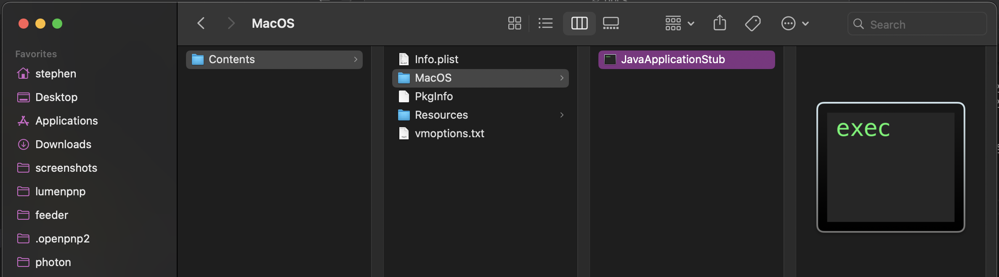

To use OpenPnP with the LumenPnP, you will need to tell the software about your machine's capabilities, such as it's size, how many cameras it has, etc. We've done the basic work for you and put together a starting set of configuration files that will describe your Lumen. To use our defaults, follow the instructions below.

You can also download the most recent builds of OpenPnP that support feeders [here](https://openpnp.org/test-downloads/), but there could be updates or changes that differ from these docs.

If you'd like to start from scratch with your setup, community member Qwertymodo has posted a [very helpful video](https://www.youtube.com/watch?v=vuFalyzcCZA) showing his process of doing calibration on his machine from scratch.

**We highly recommend using Ubuntu Linux as the OS for running OpenPnP due to how well it handles communication with the cameras.**

## Linux ([Ubuntu Install Guide](https://ubuntu.com/tutorials/install-ubuntu-desktop#1-overview))

1. Download and install OpenPnP for Linux. Use the version here to ensure OpenPnP works with the LumenPnP Feeders: ([.deb](https://openpnp.s3-us-west-2.amazonaws.com/test/2023-04-05_08-24-36.0aa4ae8/OpenPnP-linux-test.deb))

2. Go to the [LumenPnP Releases Page](https://github.com/opulo-inc/lumenpnp/releases).

3. Find the latest release that is compatible with your hardware.
    1. If your machine's version begins with `v2`, pick the most recent release starting with `v2`.
    2. If your machine's version begins with `v3`, pick the most recent release starting with `v3`.

4. Download the `LumenPnP-Config-vX.X.X.zip` file for that release, and unzip it.

    !!! info "Older Releases"
        Older releases have the OpenPnP configuration files in the source. If you can't find the OpenPnP config zip in the release, download the `Source Code` from the release, unzip, and open the `openpnp` folder.

5. Inside you'll find the four configuration files you need: `machine.xml`, `packages.xml`, `parts.xml`, and `vision-settings.xml`.

6. To install these files in OpenPnP, you'll need to find its configuration folder. In the Ubuntu file manager (Nautilus), press `CTRL` + `H` to show hidden files, or go to the `View` menu and check `Show Hidden Files`.

7. Next, navigate to: `/home/[username]/.openpnp2`.
  
8. Double check that OpenPnP is closed.

9. In the `.openpnp2` folder you'll find the currently used configuration files, `machine.xml`, `packages.xml`, `parts.xml`, and `vision-settings.xml`. It is a good idea to copy these somewhere as backup whenever you make changes like this.

10. Copy the configuration files from the LumenPnP source files into `.openpnp2` and overwrite the old configuration files. Note that if you've already been using OpenPnP, you may want to only replace your `machine.xml` file, as the other files will overwrite your existing components and vision libraries.

!!! danger "Linux Users"
    Linux requires two quick configuration steps to allow OpenPnP to run:

    1. In order for OpenPnP to communicate to the machine, the user must be added to the `dialout` group. This can be done by entering `sudo adduser [USERNAME] dialout` (where `[USERNAME]` is the user you're logged in as) into terminal and restarting the computer.
    2. OpenPnP requires that Java is installed. This can easily be done by entering `sudo apt-get install default-jdk` into terminal.

    Note that if Java is not installed, OpenPnP will fail silently when you attempt to start by clicking on the icon.

## Windows

1. Download and install OpenPnP for Windows. Use the version here to ensure OpenPnP works with the LumenPnP Feeders: ([32 Bit .exe](https://openpnp.s3-us-west-2.amazonaws.com/test/2023-04-05_08-24-36.0aa4ae8/OpenPnP-windows-x32-test.exe)) ([64 Bit .exe](https://openpnp.s3-us-west-2.amazonaws.com/test/2023-04-05_08-24-36.0aa4ae8/OpenPnP-windows-x64-test.exe))

2. Go to the [LumenPnP Releases Page](https://github.com/opulo-inc/lumenpnp/releases).

3. Find the latest release that is compatible with your hardware.
    1. If your machine's version begins with `v2`, pick the most recent release starting with `v2`.
    2. If your machine's version begins with `v3`, pick the most recent release starting with `v3`.

4. Download the `LumenPnP-Config-vX.X.X.zip` file for that release, and unzip it.

    !!! info "Older Releases"
        Older releases have the OpenPnP configuration files in the source. If you can't find the OpenPnP config zip in the release, download the `Source Code` from the release, unzip, and open the `openpnp` folder. If you have a v2 LumenPnP kit, you can get your `vision-settings.xml` from the [`3.0.0`](https://github.com/opulo-inc/lumenpnp/releases/tag/v3.0.0) release or later, as it wasn't a part of earlier configuration packages.

5. Inside you'll find the four configuration files you need: `machine.xml`, `packages.xml`, `parts.xml`, and `vision-settings.xml`.

6. To install these files in OpenPnP, you'll need to find its configuration folder. First, follow [these instructions](https://support.microsoft.com/en-us/windows/show-hidden-files-0320fe58-0117-fd59-6851-9b7f9840fdb2) to show hidden folders in Windows Explorer.

7. Navigate to:
    - On Windows Vista and newer: `C:\Users\[username]\.openpnp2`.
    - On Windows XP and older: `C:\Documents and Settings\[username]\.openpnp2`.
  
8. Double-check that OpenPnP is closed.

9. In the `.openpnp2` folder you'll find the currently used configuration files, `machine.xml`, `packages.xml`, `parts.xml`, and `vision-settings.xml`. It is a good idea to copy these somewhere as backup whenever you make changes like this.

10. Copy the configuration files from the LumenPnP source files into `.openpnp2` and overwrite the old configuration files. Note that if you've already been using OpenPnP, you may want to only replace your `machine.xml` file, as the other files will overwrite your existing components and vision libraries.

## MacOS

1. Download and install OpenPnP for Mac. Use the version here to ensure OpenPnP works with the LumenPnP Feeders: ([.dmg](https://openpnp.s3-us-west-2.amazonaws.com/test/2023-04-05_08-24-36.0aa4ae8/OpenPnP-macos-test.dmg))

    !!! danger "Mac Users"
        Because of [a bug with how OpenPnP signs their releases](https://github.com/openpnp/openpnp/issues/1559), Mac users with ARM processors might experience a crash on boot. You can still run OpenPnP by navigating to `Applications -> OpenPnP` and right clicking on the OpenPnP app and selecting "Show Package Contents":
        
        Then navigate to `Contents -> MacOS` and double click on `JavaApplicationStub` to run OpenPnP.
        

2. Go to the [LumenPnP Releases Page](https://github.com/opulo-inc/lumenpnp/releases).

3. Find the latest release that is compatible with your hardware.
    1. If your machine's version begins with `v2`, pick the most recent release starting with `v2`.
    2. If your machine's version begins with `v3`, pick the most recent release starting with `v3`.

4. Download the `LumenPnP-Config-vX.X.X.zip` file for that release, and unzip it.

    !!! info "Older Releases"
        Older releases have the OpenPnP configuration files in the source. If you can't find the OpenPnP config zip in the release, download the `Source Code` from the release, unzip, and open the `openpnp` folder.

5. Inside you'll find the four configuration files you need: `machine.xml`, `packages.xml`, `parts.xml`, and `vision-settings.xml`.

6. To install these files in OpenPnP, you'll need to find its configuration folder. First, follow [these instructions](https://www.macworld.com/article/671158/how-to-show-hidden-files-on-a-mac.html) to show hidden folders in Finder.

7. Next, navigate to: `/Users/[username]/.openpnp2`.
  
8. Double check that OpenPnP is closed.

9. In the `.openpnp2` folder you'll find the currently used configuration files, `machine.xml`, `packages.xml`, `parts.xml`, and `vision-settings.xml`. It is a good idea to copy these somewhere as backup whenever you make changes like this.

10. Copy the configuration files from the LumenPnP source files into `.openpnp2` and overwrite the old configuration files. Note that if you've already been using OpenPnP, you may want to only replace your `machine.xml` file, as the other files will overwrite your existing components and vision libraries.

## Next Steps

Our next step is to [Connect To The Machine](../2-connect-to-machine/index.md).
