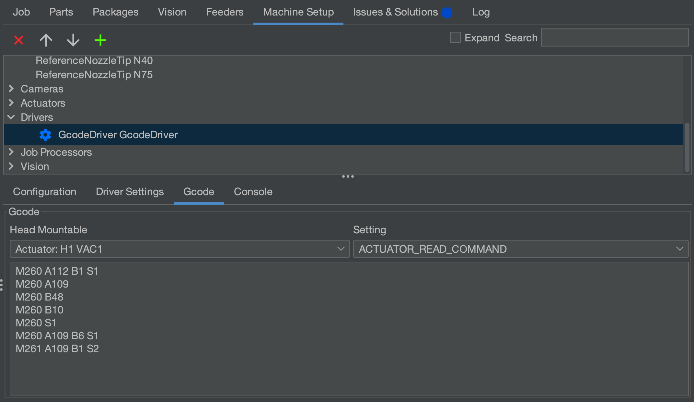

# Vacuum Part Detection

While the bottom camera can detect if a part was successfully picked with reasonable accuracy, you can also use the LumenPnP's vacuum sensors to double check a successful pick. When a part is successfully picked it creates a seal at the end of the nozzle. This seal increases the vacuum pressure in the pneumatic line which is picked up by the vacuum sensors. OpenPnP can use this increase in pressure to detect if a part was successfully picked.

## Actuator Setup

!!! NOTE
    The LumenPnP v2 kit machine has different vacuum sensors than the v3 semi-assembled machine. Make sure to follow the steps for your machine version below.

### LumenPnP v3

1. To enable vacuum part detection for v3 machines, we first need to configure the GCode in OpenPnP. This GCode should already be configured correctly in OpenPnP if you're using the default configuration files.

    !!! info "How It Works"
        The v3 vacuum sensors communicate over I2C. Because they have the same address, we talk to them through an I2C multiplexer. The Gcode commands used to talk to them first tell the multiplexer which device we want to talk to, then we capture a sample of data, then return it back to OpenPnP. The vacuum sensor has three registers holding the sample data, but because OpenPnP only supports raw Gcode commands in these fields, we can only use one byte of data. We capture the most significant bits of the sample as they give us the resolution needed to detect a successful pick. If you'd like to sample the CSB or the LSB byte of data instead, change the second to last command in the commands below to `M260 A109 B7 S1` or `M260 A109 B8 S1` respectively. Read the [datasheet](https://cfsensor.com/wp-content/uploads/2022/11/XGZP6857D-Pressure-Sensor-V2.5.pdf) for more information.

2. In the Machine Setup tab, go to `Drivers > GcodeDriver GcodeDriver`, then under the Gcode tab, select the `H1 VAC1` actuator, and select the `ACTUATOR_READ_COMMAND` setting.
   

3. Make sure the following Gcode is present in the field:
  
    ```gcode
    M260 A112 B1 S1
    M260 A109
    M260 B48
    M260 B10
    M260 S1
    M260 A109 B6 S1
    M261 A109 B1 S2
    ```

4. With the same `H1 VAC1` actuator selected, now choose the `ACTUATOR_READ_REGEX` setting, and make sure the following is present in the field below:

    ```regex
    ^.*data:(?<Value>.*)
    ```

5. Now select the `H1 VAC2` actuator, and select the `ACTUATOR_READ_COMMAND` setting. Make sure the following Gcode is present in the field below:
  
    ```gcode
    M260 A112 B2 S1
    M260 A109
    M260 B48
    M260 B10
    M260 S1
    M260 A109 B6 S1
    M261 A109 B1 S2
    ```

6. With the same `H1 VAC2` actuator selected, now choose the `ACTUATOR_READ_REGEX` setting, and make sure the following is present in the field below:

    ```regex
    ^.*data:(?<Value>.*)
    ```

### LumenPnP v2

!!! note "v2 Interposers"
    If you have a v2 machine, please [check if you have interposer boards installed](../../../misc/maintenance-upgrades/rev3-vac-interposer/index.md).

1. Select your GcodeDriver, then under the Gcode tab, select the `H1 VAC1` actuator, and select the `ACTUATOR_READ_COMMAND` setting.

2. Make sure the following Gcode is present in the field:

    ```gcode
    M3426 G2 C1 I1 A110
    ```

    !!! note "Sensor Address"
        In the above code snippet, the line `M3426 G4 C1 I1 A110` uses `A110` to specify which sensor to read from. Due to the way the sensors are programmed by their manufacturer, the address of the sensor can vary. If `A110` doesn't work for you, try testing each binary value from `0` to `7` (eg `000`, `001`, `010` etc) to see which address is correct for your sensors.

3. With the same `H1 VAC1` actuator selected, now choose the `ACTUATOR_READ_REGEX` setting, and make sure the following is present in the field below:

    ```regex
    ^.*V:(?<Value>\d+).*
    ```

4. Select your GcodeDriver, then under the Gcode tab, select the `H1 VAC2` actuator, and select the `ACTUATOR_READ_COMMAND` setting. Make sure the following Gcode is present in the field:

    ```gcode
    M3426 G2 C2 I1 A110
    ```

5. With the same `H1 VAC2` actuator selected, now choose the `ACTUATOR_READ_REGEX` setting, and make sure the following is present in the field below:

    ```regex
    ^.*V:(?<Value>\d+).*
    ```

### Enabling and Tuning

1. With the actuator configured correctly, the next step is enabling part detection for nozzles tips. Select a nozzle tip that you'd like to enable part detection for, and click on the Part Detection tab. You should see a menu similar to the one below:
  

2. You might need to tweak the values in the `Low Value` and `High Value` fields for both Part On sensing and Part Off sensing. The image shown above has default values for v3 part detection.

3. Thresholds can be determined by opening the `H1:VAC1` or `H1:VAC2` actuator window. Click `On` to turn on your pump and valve, and then click `Read`. You should see a value appear in the `Read Value` text box.
  

4. Cover the nozzle with your finger tip. Hit `Read` again. The detection threshold sits in between these two numbers.

## Next Steps

Next is [the FTP](../../ftp/index.md).
