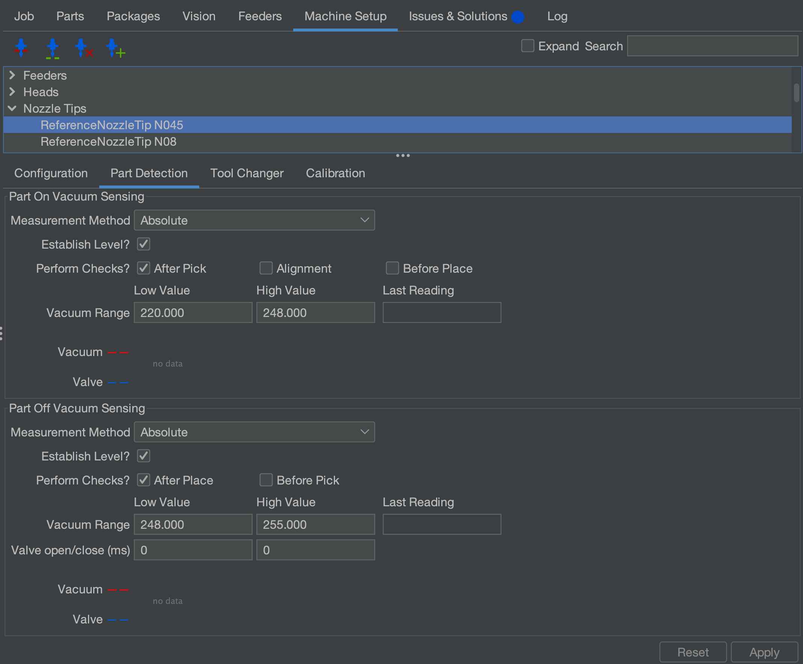
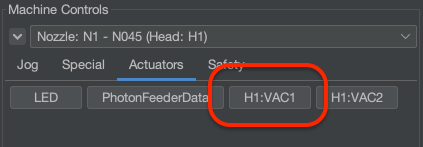
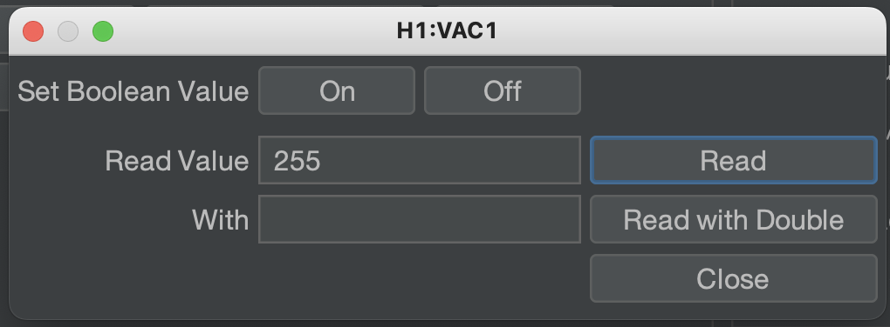
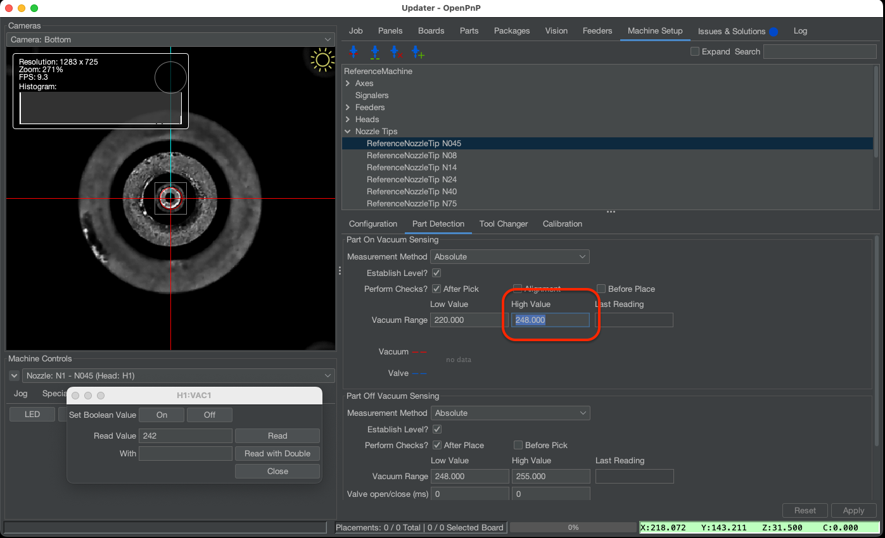

# Vacuum Part Detection ([Video Guide](https://youtu.be/h3mtEQfGMlM?si=eluz16VnR4F9oS9S&t=1956))

While the bottom camera can detect if a part was successfully picked, you can use the LumenPnP's vacuum sensors to check for a successful pick a bit quicker. When a part is successfully picked it creates a seal at the end of the nozzle. This seal increases the vacuum pressure in the pneumatic line which is measured by the vacuum sensors. OpenPnP can use this increase in pressure to detect if a part was successfully picked.

!!! NOTE
    The LumenPnP v2 kit machine has different vacuum sensors than the v3 semi-assembled machine. Make sure to follow the steps for your machine version below.

## LumenPnP v3

1. Ensure there's still an N045 nozzle tip on the N1 nozzle.
2. Navigate to `Machine Setup > Nozzle Tips > ReferenceNozzleTip N045 > Part Detection`.
  

1. Open the `H1:VAC1` actuator window. Click `On` to turn on your pump and valve, and then click `Read`. You should see a value appear in the `Read Value` text box. Take note of this number.

    
    

2. Now, cover the nozzle with your finger tip. Hit `Read` again. Take note of the new number.

3. Split the difference between these numbers. For example, if your readings were `250` and `246`, choose `248`.

4. Enter this value into the `High Value` field in the `Vacuum Range` setting.
   
    

1. Hit "Apply" to save your changes.

5. Perform this step again, but using N2 and the N24 nozzle tip.

## LumenPnP v2

!!! note "v2 Interposers"
    If you have a v2 machine, please [check if you have interposer boards installed](/guides/rev3-vac-interposer).

1. Select your GcodeDriver, then under the Gcode tab, select the `H1 VAC1` actuator, and select the `ACTUATOR_READ_COMMAND` setting.

2. Make sure the following Gcode is present in the field:

    ```gcode
    M3426 G2 C1 I1 A110
    ```

    !!! note "Sensor Address"
        In the above code snippet, the line `M3426 G4 C1 I1 A110` uses `A110` to specify which sensor to read from. Due to the way the sensors are programmed by their manufacturer, the address of the sensor can vary. If `A110` doesn't work for you, try testing each binary value from `0` to `7` (eg `000`, `001`, `010` etc) to see which address is correct for your sensors.

3. With the same `H1 VAC1` actuator selected, now choose the `ACTUATOR_READ_REGEX` setting, and make sure the following is present in the field below:

    ```regex
    ^.*V:(?<Value>\d+).*
    ```

4. Select your GcodeDriver, then under the Gcode tab, select the `H1 VAC2` actuator, and select the `ACTUATOR_READ_COMMAND` setting. Make sure the following Gcode is present in the field:

    ```gcode
    M3426 G2 C2 I1 A110
    ```

5. With the same `H1 VAC2` actuator selected, now choose the `ACTUATOR_READ_REGEX` setting, and make sure the following is present in the field below:

    ```regex
    ^.*V:(?<Value>\d+).*
    ```

## Next Steps

Next is [the FTP](../../ftp/index.md).
