# Connecting to Your Machine

Awesome! Now we've got OpenPnP installed on your computer, and we've got the default configuration loaded up. Our next step is getting connected to the machine and getting familiar with OpenPnP's UI. See also our [setup video](https://youtube.com/watch?v=CSnczX6VJ7M&si=EnSIkaIECMiOmarE&t=102).

1. Connect your LumenPnP to your computer using the included USB cable

2. Open OpenPnP on your computer. You should now see the OpenPnP UI:
  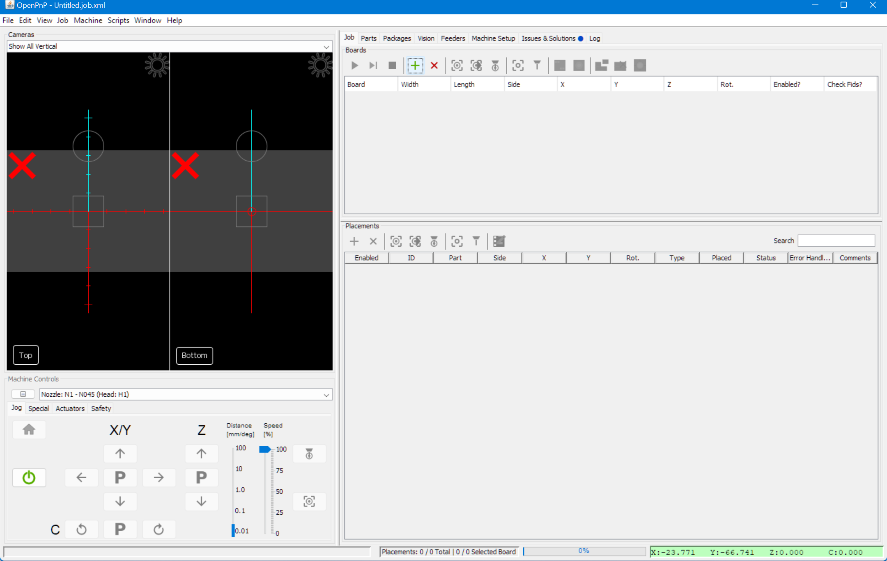

!!! Note "Linux"
    On linux you'll need to join the `dialout` and `video` groups, or provide `udev` rules for the LumenPnP's usb devices.

## Com Port and Baud Rate

Before connecting to the LumenPnP, you need to set which USB port to use for communication in OpenPnP.

1. Click on the `Machine Setup` tab.
  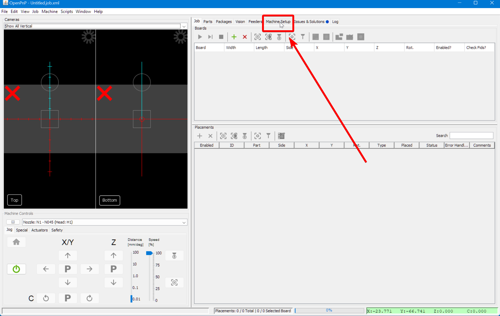

2. Click on the "Expand" checkbox to open all of the features.
  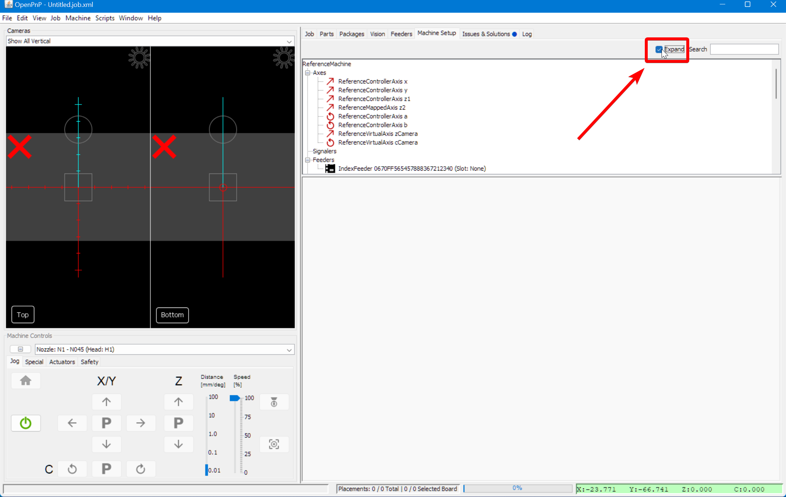

3. Under `Drivers` click on `GcodeDriver GcodeDriver`. Below the list of machine settings you'll find the details of the GcodeDriver.
  
  
4. In the `Configuration` tab, check the `Baud` and `Port` settings.
   1. Set the `Baud` to `115200`
   2. On Windows, Set the `Port` to the option in the format: `COM2`.
   3. On Mac, Set the `Port` to the option in the format: `cu.usbmodem<a-lot-of-numbers>`
   4. On Linux, Set the `Port` to the option in the format: `ttyACM0`.
  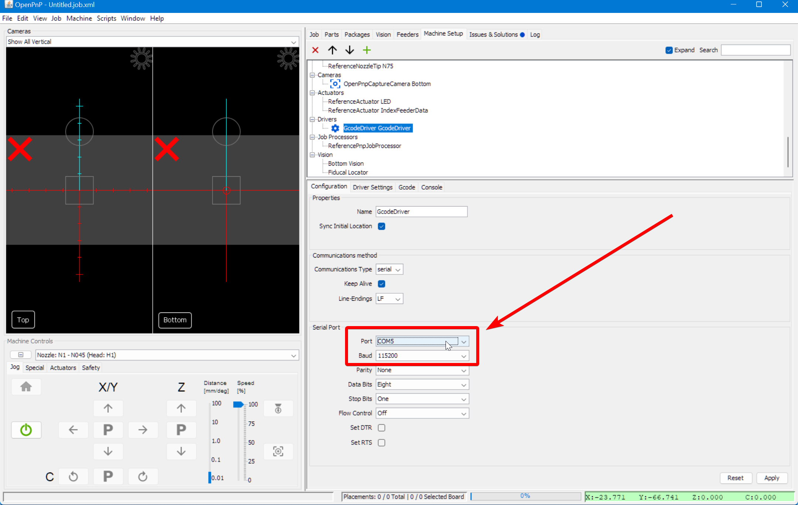

    !!! info "Port Not Found"
        If your machine's port does not show up in the drop down, check that your USB cable is plugged in to both your computer and the LumenPnP. Also check that the motherboard is powered on. If you still cannot find the port, try pressing the reset button on the motherboard and closing and reopening OpenPnP.

5. Click `Apply` in the lower right corner to save your changes.
  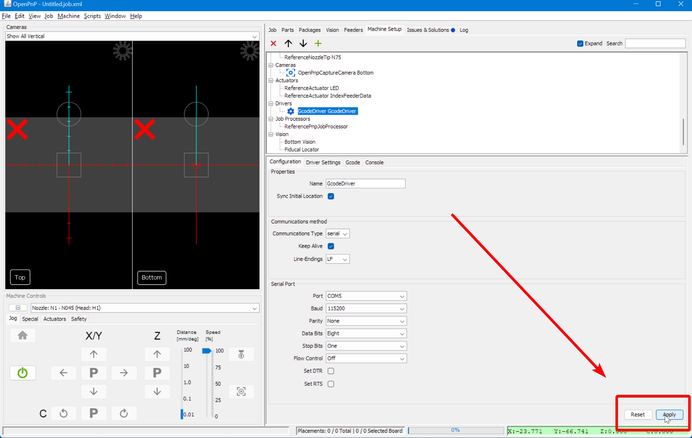

## Bottom Camera Config

Now we'll set up the cameras. The big red "X" in the camera views means that OpenPnP isn't receiving the webcam feed. We'll specify which webcam is which.

!!! danger "Camera Connection Issues (v2 Hardware)"
    Because the motherboard in v2 LumenPnP kit machines has a built in USB hub you can plug both of the webcams into the motherboard, and then connect the motherboard to your computer with a single one USB cable. This keeps cables tidy, but it sends a lot of data through one single USB port on your computer.

    Unfortunately, from reports we've gotten from users, it seems that not all computer manufacturers include high-quality internal USB hubs. The lower quality hubs included in these computers can't handle the bandwidth requirements of two webcams plus the motherboard all on a single USB port. If this is the case for your computer, one or both of the webcams will be missing from the configuration list in OpenPnP or any other camera application.

    If you have this problem, you will need to plug at least one of the webcams directly into your computer via a separate USB port. Occasionally this can cause the webcam's name to be incorrect, but you'll still be able to select it from the drop-down list with a little trial and error.

!!! Note
    More recent LumenPnP machines ship with a more recessed bottom camera, shown below. The images in our setup guides mostly show an older mounting solution. Simply follow the steps normally unless otherwise noted.
    

1. Remove both camera's lens caps. They pull up and off. (They're already removed in the image below)
  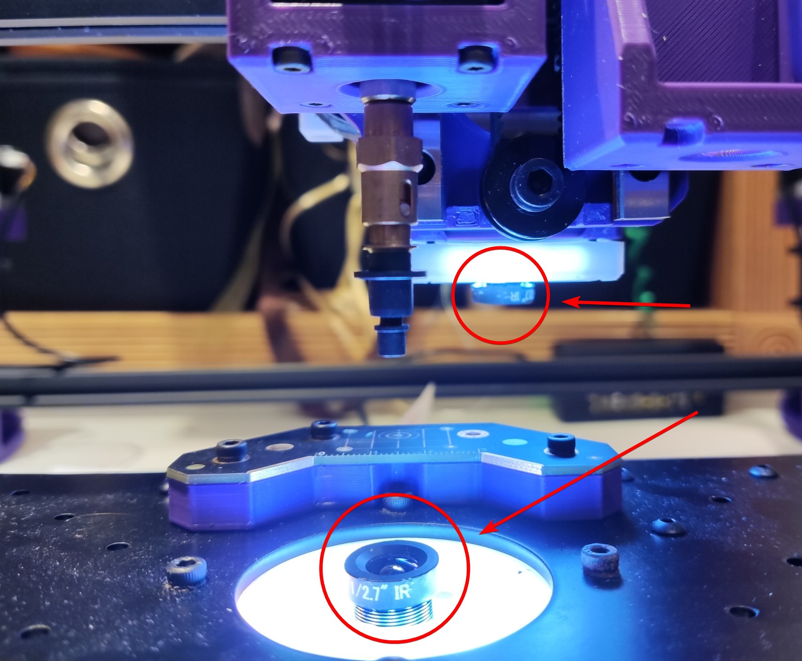

2. In the top-left corner, change the camera view to one of the "Show All" options. You should then see two camera feeds that are black, and have red X's on them.
  

3. Again, navigate to the `Machine Setup` tab.
4. Again, click the "Expand" checkbox if necessary.
5. Click on `Cameras > OpenPnpCaptureCamera Bottom`.
  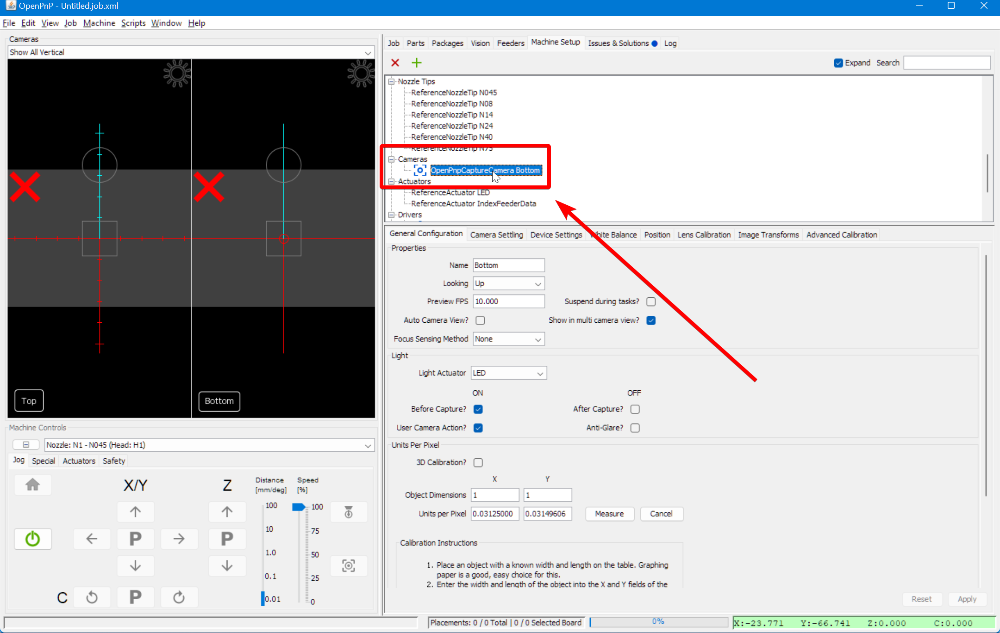

6. In the lower detail pane, switch to the `Device Settings` tab.
  

7. In the `Device` drop-down, choose `PnP Bottom Camera`.
  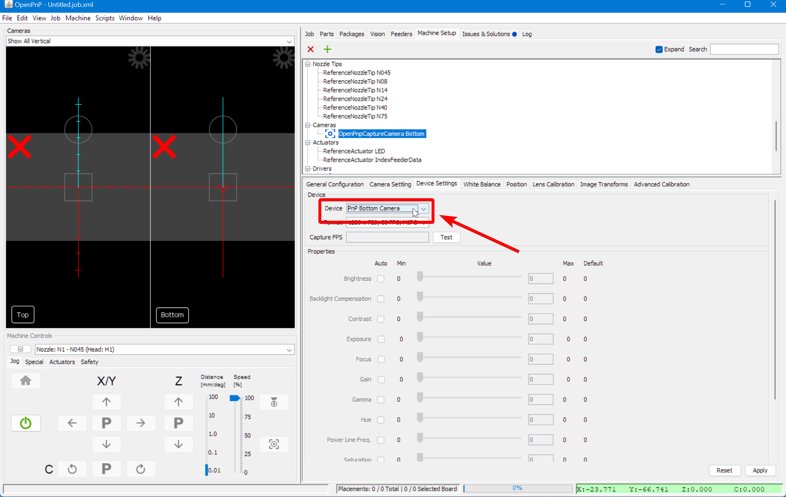

    !!! info "Duplicate Camera Names"
        There have been a few reports of users on Windows seeing two of the same camera name in their Open PnP drop down menu. If this happens to you, use trial and error to identify which camera is which in the list. Sorry for any inconvenience.

8. In the `Format` drop-down, choose the `1280x720 10fps` setting.
  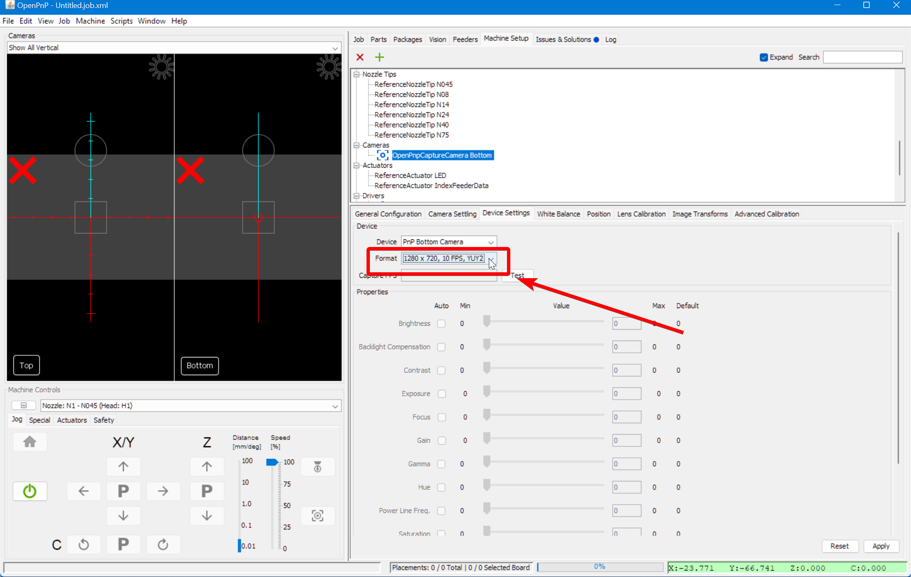

9. Click the `Apply` button in the bottom right. You should then see the camera display start showing the feed from the camera, or at least see the red X disappear. We'll fix the exposure next.
  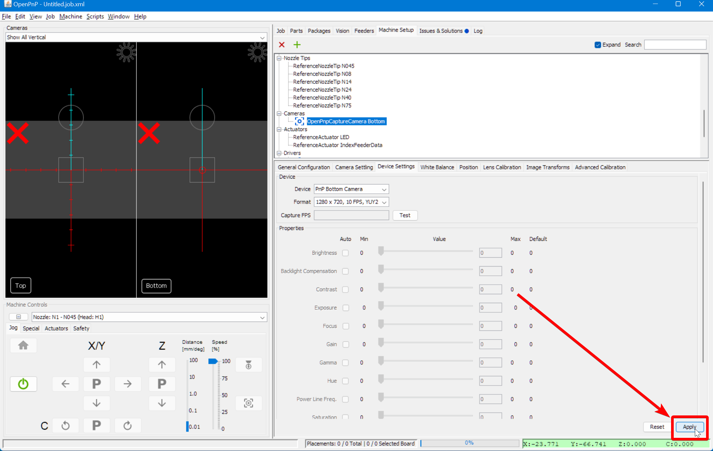
  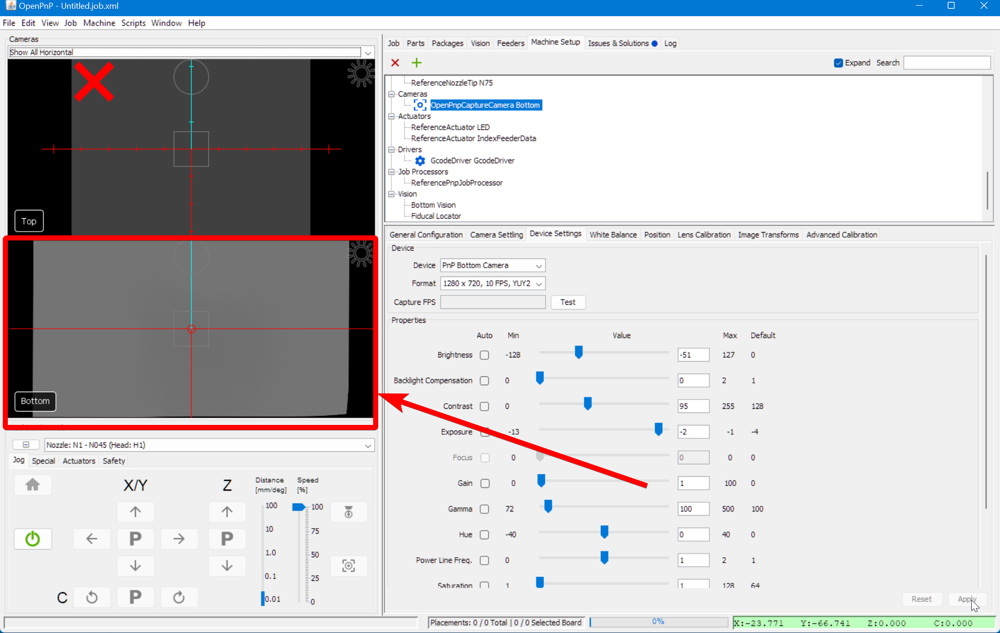

10. Quickly adjust the exposure to make the camera feed more reasonable. On some computers, you can toggle Automatic Exposure on, and then back off again to set it correctly. Do not keep auto exposure turned on. Later on we'll set the exposure more accurately. See also our [setup video](https://youtube.com/watch?v=CSnczX6VJ7M&si=EnSIkaIECMiOmarE&t=867).

    !!! danger "For Mac Users"
        Due to an issue with the camera driver in OpenPnP, some Mac users might notice that the image settings are greyed out for you. There's a fantastic open-source application called [CameraController](https://github.com/Itaybre/CameraController) that can be used to edit these settings.

    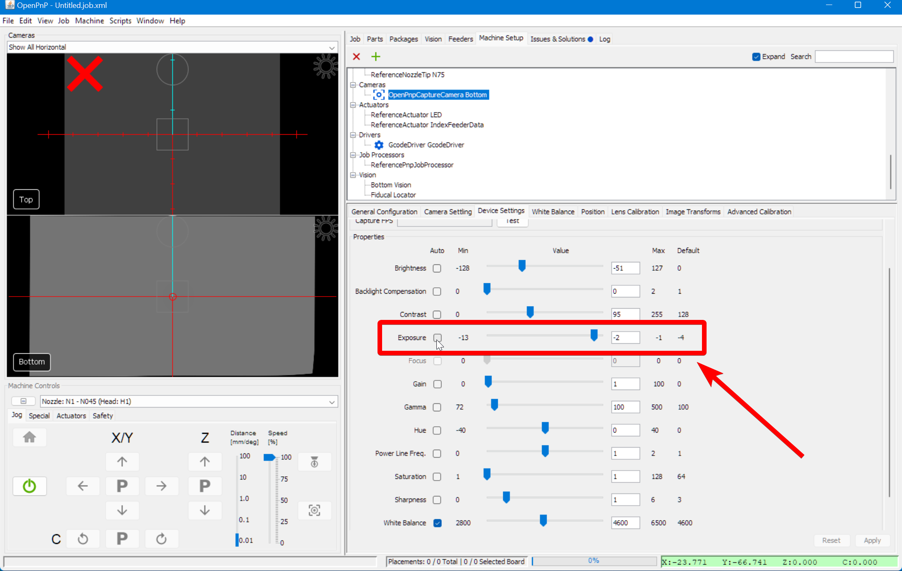

## Top Camera Config

1. Again, navigate to the `Machine Setup` tab.
2. Again, click the "Expand" checkbox if necessary.
3. Navigate to `Heads > ReferenceHead H1 > Cameras > OpenPnPCaptureCamera Top`.
  

4. In the lower detail pane, switch to the `Device Settings` tab.
  

5. In the `Device` drop-down, choose `PnP Top Camera`.
  

6. In the `Format` drop-down, choose the `1280x720 10fps` setting.
  

7. Click the `Apply` button in the bottom right. You should then see the camera display start showing the feed from the camera, or at least see the red X disappear.
  

8. Adjust the exposure to make the camera feed more reasonable. Both cameras should now be working. Again, we'll tune the exposure and other vision settings in the coming steps.
  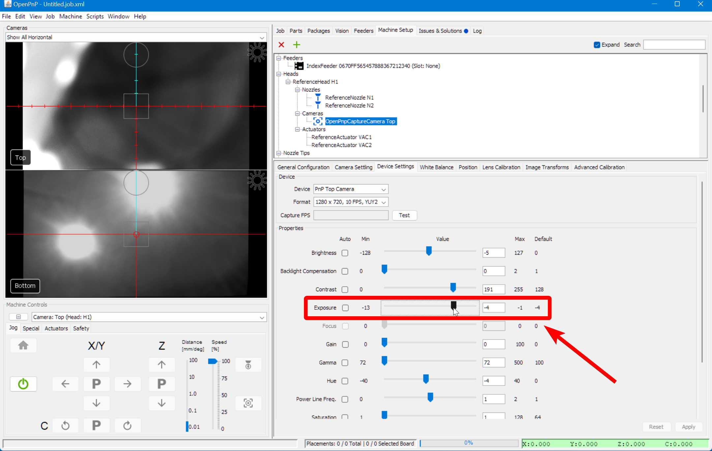

## Connecting to the LumenPnP

1. Click the green power button in the Machine Controls section of the UI to connect to your machine.
  

2. The power button will turn red when OpenPnP has connected to your machine. If this doesn't work, check your [port and baud rate](#com-port-and-baud-rate).
  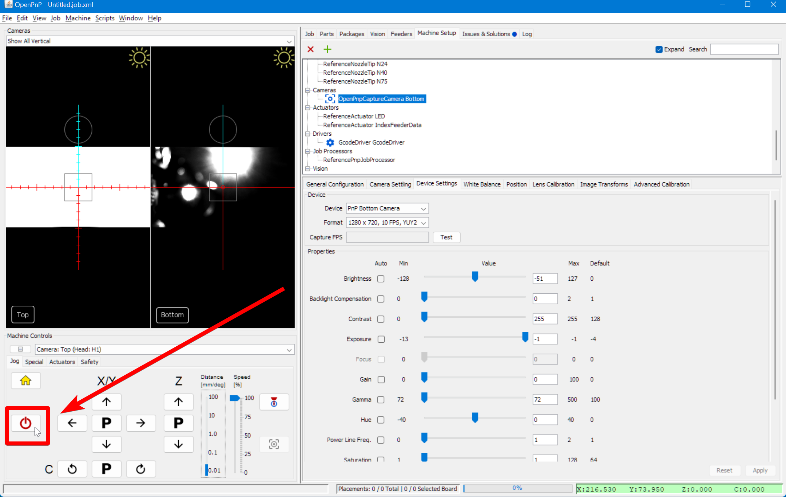

3. Save your OpenPnP settings with `File > Save Configuration`.
  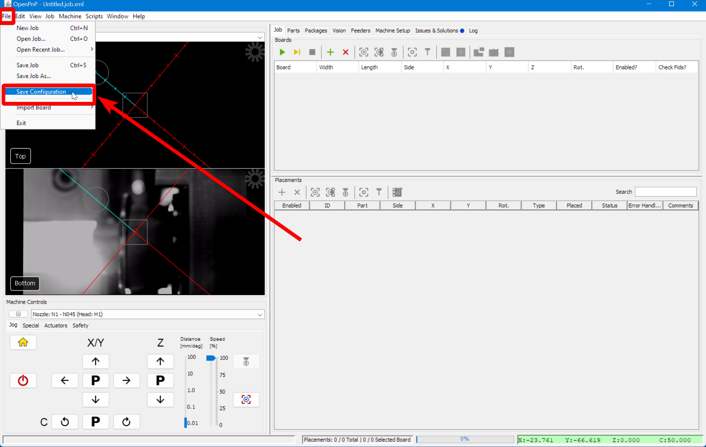

## Next Steps

Next, we'll work on the the camera's [the Homing Fiducials](../4-homing-fiducial/index.md).
