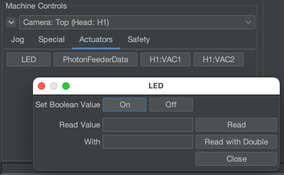
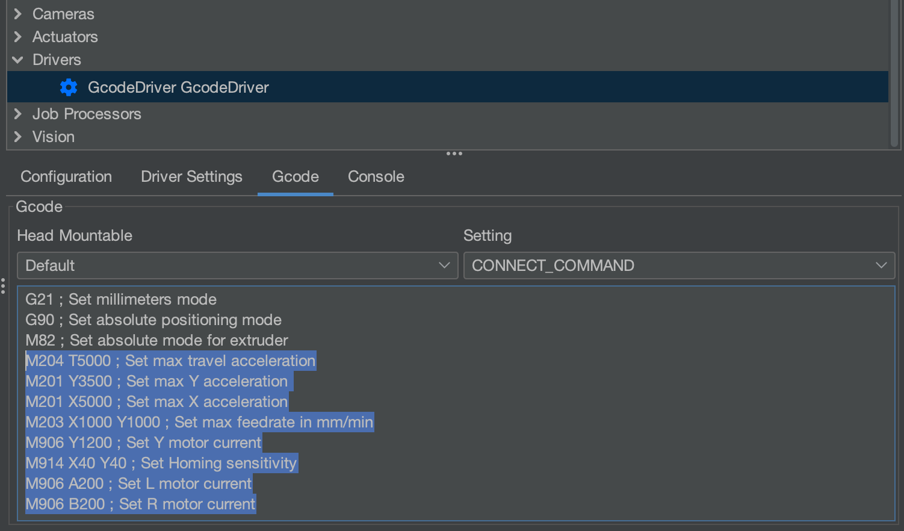

# Connecting to Your Machine

Now we've got OpenPnP installed on your computer, and we've got the default configuration loaded up. Our next step is getting connected to the machine and getting familiar with OpenPnP's UI. See also our [setup video](https://youtube.com/watch?v=CSnczX6VJ7M&si=EnSIkaIECMiOmarE&t=102).

1. Make sure OpenPnP is closed.
2. Plug in your LumenPnP via the barrel jack. It's important you do this before USB is plugged in to ensure the proper power-up sequence.
3. Connect your LumenPnP to your computer using the included USB cable.

4. Connect both cameras to your computer using the USB cables.

    **Use separate USB ports directly into your computer**. The cameras require a lot of USB bandwidth, and many USB hubs aren't capable of handling it. For best results, make sure each camera is plugged into a different USB port directly into your computer, ideally on different interal USB hubs.

5. Open OpenPnP on your computer. You should now see the OpenPnP UI:
  

!!! Note "Linux"
    On Linux you'll need to [join](https://askubuntu.com/questions/112568/how-do-i-allow-a-non-default-user-to-use-serial-device-ttyusb0) the `dialout` and `video` groups, or provide `udev` rules for the LumenPnP's usb devices. 

## Serial Port Configuration

Before connecting to the LumenPnP, you need to set which USB port to use for communication in OpenPnP.

1. Click on the `Machine Setup` tab.
  

2. Click on the "Expand" checkbox to open all of the features.
  

3. Under `Drivers` click on `GcodeDriver GcodeDriver`. Below the list of machine settings you'll find the details of the GcodeDriver.
  
  
1. In the `Configuration` tab, select the `Port` for your LumenPnP.
    1. On Windows, the `Port` will look like `COM2` or `COM3`.
    2. On Mac, the `Port` will be in the format: `cu.usbmodem<a-lot-of-numbers>`
    3. On Linux, Set the `Port` to the option in the format: `ttyACM0`.
    

        !!! info "Port Not Found"
            If your machine's port does not show up in the drop down, check that your USB cable is plugged in to both your computer and the LumenPnP. Also check that the motherboard is powered on. If you still cannot find the port, try pressing the reset button on the motherboard and closing and reopening OpenPnP.

2. Click `Apply` in the lower right corner to save your changes.
  

## Establishing Serial Connection

1. Click the green power button in the Machine Controls section of the UI to connect to your machine.
  

1. The power button will turn red when OpenPnP has connected to your machine. If this doesn't work, check your [serial port](#serial-port-configuration).
  

1. Save your OpenPnP settings with `File > Save Configuration`.
  

1. Turn on your machine's Ring Lights. Click the `LED` button under the `Actuators` tab under `Machine Controls`. Click `On` in the popup.
   

<!-- 
!!! success "v3.1+ Speed Increase"

    If your machine is v3.1 or higher, your machine can move much faster than the default configuration because of the addition of linear rails, and use less current for the L and R motors with the addition of pneumatic rotation couplings.

      1. In the `Gcode` tab under your `GcodeDriver`, select `Default` in the `Head Mountable` dropdown, and `CONNECT_COMMAND` in the `Setting` dropdown. **Overwrite** the existing text in this field with the new settings below. Be sure to hit `Apply` to confirm your changes.

        ```
        G21 ; Set Millimeters Mode
        G90 ; Set absolute positioning mode
        M82 ; Set absolute mode for extruder
        M204 T5000 ; Set max travel acceleration
        M201 Y1500 ; Set max Y acceleration
        M201 X2000 ; Set max X acceleration
        M203 X1000 Y1000 ; Set max feedrate in mm/min
        M906 Y1000 ; Set Y motor current
        M906 X800 ; Set X motor current
        M906 A200 ; Set L motor current
        M906 B200 ; Set R motor current
        M569 S0 X Y ; Switches to SpreadCycle
        ```

        Your settings should look similar like the image below:
       
        

      2. Next, under the `Setting` dropdown, choose the `HOME_COMMAND` option. **Overwrite** the existing text in this field with the new settings below. Be sure to hit `Apply` to confirm your changes.

        ```
        M569 S1 X Y ; Switches to StealthChop
        M201 Y1500 ; Set Max Y Acceleration
        M201 X2000 ; Set Max X Acceleration
        M906 Y400 ; Set Y motor current
        M906 X200 ; Set X motor current
        M914 X50 Y30 ; Set Homing Sensitivity
        G28 ; Home all axis
        M569 S0 X Y ; Switches back to SpreadCycle
        M201 Y2500 ; Set Max Y Acceleration
        M201 X3000 ; Set Max X Acceleration
        M906 Y1000 ; Set Y motor current
        M906 X800 ; Set X motor current
        ```

      3. To tell OpenPnP to take advantage of this speed increase, you can update the `Max Feed Rate` field in the `Driver Settings` tab. Enter `35000` into this field.

      4. If you need to tweak your sensorless homing settings, make sure to adjust the values in the line starting with `M914` under `HOME_COMMAND`, *not* under `CONNECT_COMMAND`. -->

## Bottom Camera Config

Now we'll set up the cameras. The big red "X" in the camera views means that OpenPnP isn't receiving the webcam feed. We'll specify which webcam is which.

!!! Note
    More recent LumenPnP machines ship with a more recessed bottom camera, shown below. The images in our setup guides mostly show an older mounting solution, but either is totally fine.
    

!!! Tip
    You may find it easier to calibrate your cameras if you use the optional [Nozzle Holder Flange 3D prints](https://www.printables.com/model/400068-lumenpnp-v3-cp40-nozzle-holder-flange-40mm).

1. Remove both camera's lens caps. They pull up and off. (They're already removed in the image below)
  

1. In the top-left corner, change the camera view to one of the "Show All" options. You should then see two camera feeds that are black, and have red X's on them.
  

1. Under the `Machine Setup` tab, click on `Cameras > OpenPnpCaptureCamera Bottom`.
  

1. In the lower detail pane, switch to the `Device Settings` tab.
  

1. In the `Device` drop-down, choose `PnP Bottom Camera`.
  

    !!! info "Duplicate Camera Names"
        There have been a few reports of users seeing two of the same camera name in their OpenPnP drop down menu. This is a bug with how OpenPnP enumerates cameras. If the first one you pick is incorrect, use the other option of the same name.

1. In the `Format` drop-down, choose the `1280x720 10fps` setting.
  

1. Click the `Apply` button in the bottom right. You should then see the camera display start showing the feed from the camera, or at least see the red X disappear. We'll fix the exposure next.
  
  

1. Quickly adjust the exposure to make the image visible. By toggling "Automatic Exposure" on, and then back off again, we'll let auto exposure run, then keep it pinned to the settled value. Do not keep auto exposure turned on. You can also adjust the slider manually after toggling "Automatic Exposure" to get a clearer picture. Later on we'll set the exposure more accurately.

    

    !!! danger "For Mac Users"
        Due to an issue with the camera driver in OpenPnP, some Mac users might notice that the image settings are greyed out for you. There's a fantastic open-source application called [CameraController](https://github.com/Itaybre/CameraController) that can be used to edit these settings.

## Top Camera Config

1. Under the `Machine Setup` tab, click on `Heads > ReferenceHead H1 > Cameras > OpenPnpCaptureCamera Top`.
  

4. In the lower detail pane, switch to the `Device Settings` tab.
  

5. In the `Device` drop-down, choose `PnP Top Camera`.
  

1. In the `Format` drop-down, choose the `1280x720 10fps` setting.
  

1. Click the `Apply` button in the bottom right. You should then see the camera display start showing the feed from the camera, or at least see the red X disappear.
  

1. Quickly adjust the exposure to make the image visible like you did for the Bottom Camera. By toggling "Automatic Exposure" on, and then back off again, we'll let auto exposure run, then keep it pinned to the settled value. Do not keep auto exposure turned on. You can also adjust the slider manually after toggling "Automatic Exposure" to get a clearer picture. Later on we'll set the exposure more accurately.
  


## Next Steps

Next, we'll work on the camera's [the Homing Fiducials](../4-homing-fiducial/index.md).
