# Homing Fiducial

Now that fisheye calibration is complete, we can set up the datum board. The datum board is a reference point for everything else you'll do with the machine. The center dot of the datum board will be the most important calibration point for the machine. It'll be used to fine-tune the LumenPnP's XY position after homing to account for any errors in the limit switches. See also our [setup video](https://youtube.com/watch?v=CSnczX6VJ7M&si=EnSIkaIECMiOmarE&t=705).

!!! danger "If Your Machine Is v2"
    If you are setting up a v2 LumenPnP kit, your datum board is not yet mounted to the Staging Plate.

    Use four M3x16mm screws and four M3 nuts to secure the datum board and datum board mount to the staging plate on the rear of the bottom camera, through holes: B18, A19, A21, B22. The the fisheye calibration pattern should be facing down, and the gold grid lines and fiducial in the center of the Opulo logo facing upwards. Tighten this down securely.
    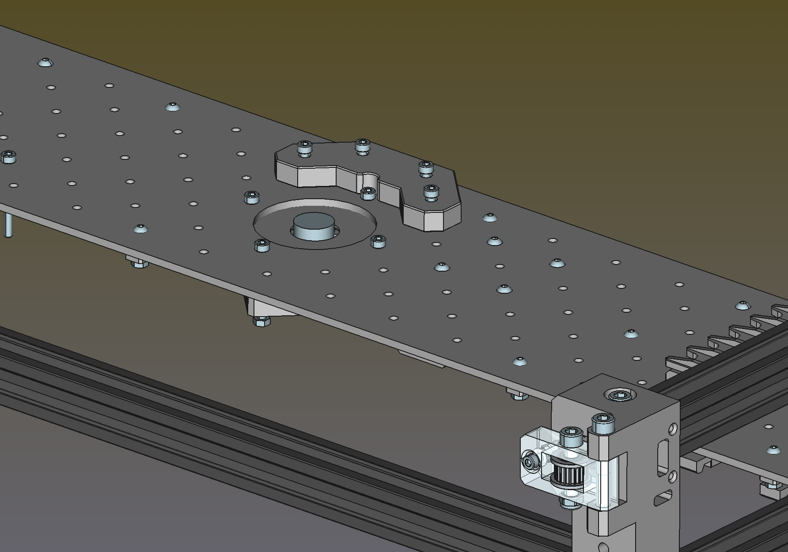

1. In the "Machine Controls" pane in the lower left, connect to the LumenPnP by pressing the power button (if you haven't already).
  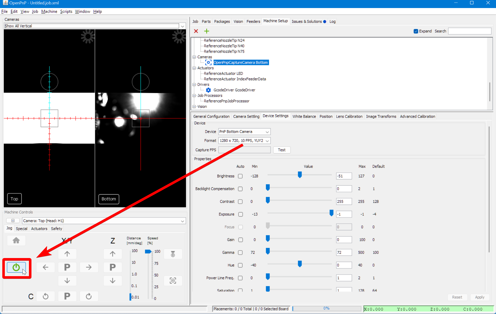

2. Run a rough home routine by pressing the Home button (shaped like a house). The machine will move to the X, Y, and Z zero positions. Note that the home icon will turn yellow, as the LumenPnP has homed to it's end stops, but hasn't completed its full homing routine. You will may still get one of two error messages: `FIDUCIAL-HOME no matches found.` or `Nozzle tip calibration: not enough results from vision. Check pipeline and threshold` This is normal; ignore the errors for now.
  

## Tuning the Homing Fiducial

1. Click on the `Machine Setup` tab in the top right pane.
  

2. Click on the "Expand" checkbox to open all of the features about your machine.
  

3. Click on `Heads > ReferenceHead H1`.
  
  
4. In the bottom right details pane, change the `Homing Method` to `ResetToFiducialLocation`. This will set OpenPnP to use the top camera to look for the homing fiducial to more precisely home the XY gantry, instead of only using the limit switches.
  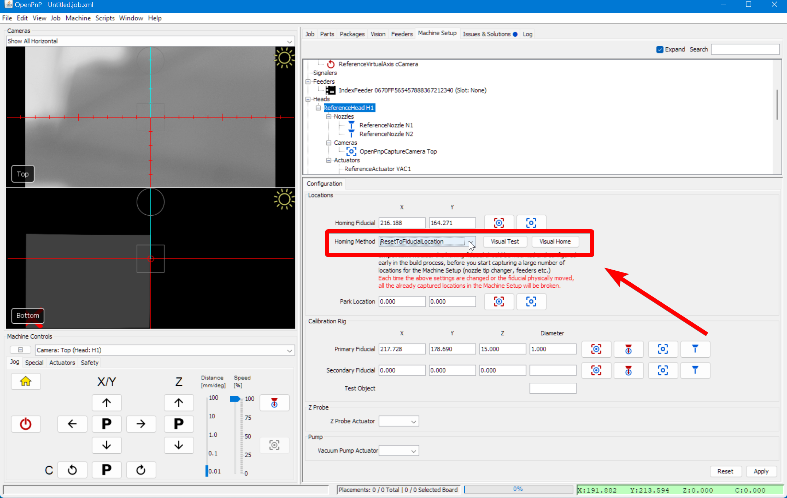

5. Click `Apply` to save this change.
  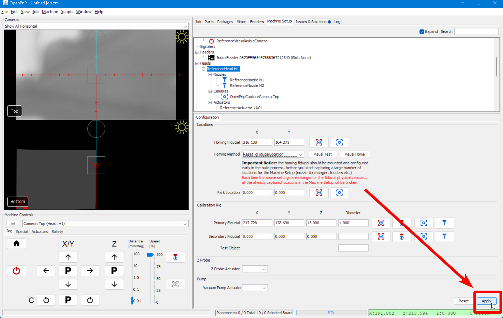

6. Click on the "Position Camera over location" icon button show below. This will move the top camera to approximately where your datum board is mounted.
  

7. In the bottom left Machine Controls pane, Select the `Actuators` tab.
  

8. Turn on the LED ring lights by pressing the `LED` button (if they're not already on).
  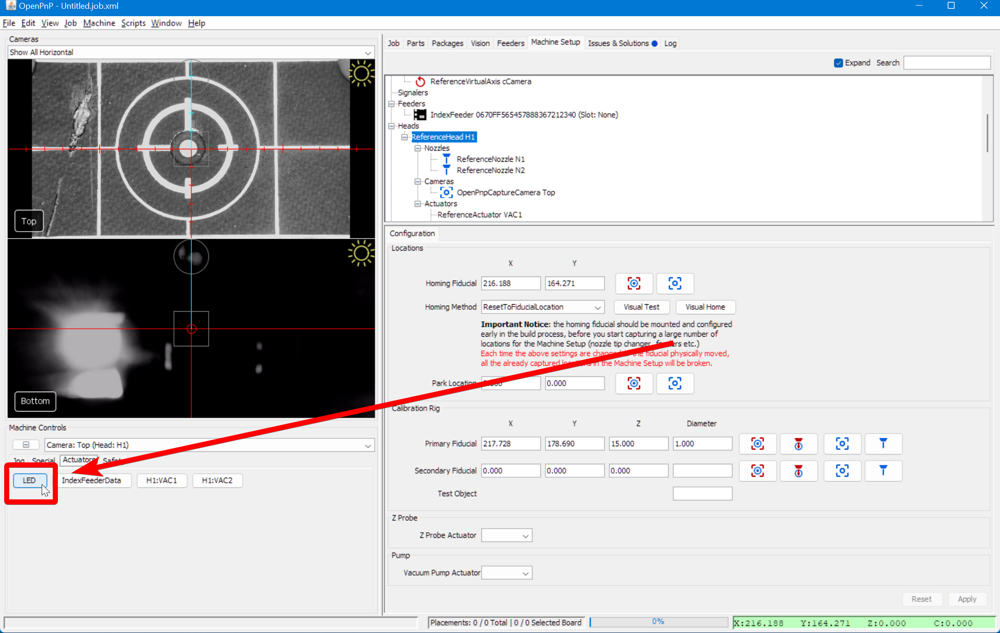

9. Rotate the Top Camera lens until the board is sharply in focus. If you're having trouble, try using the community-created [lens adjustment tool](https://www.printables.com/model/208453-lumen-pnp-lens-adjustment-tool).
  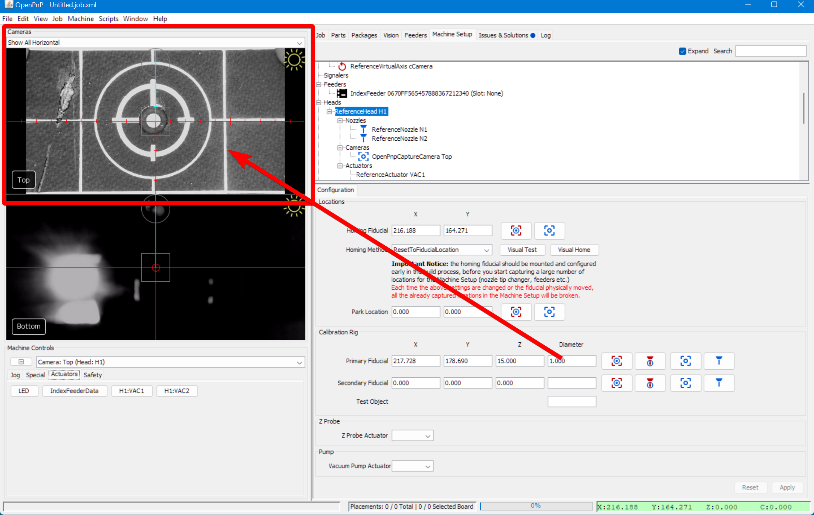

    !!! info "Tip"
        Right click on the camera feed to change the Reticle style to see the center of the camera image. You can also use the scroll wheel to zoom in on the feed for more precision.
        

10. Go back to the `Jog` tab in the "Machine Controls" pane.
  

11. Set the `Distance` slider to `0.1` for more precise movements.
  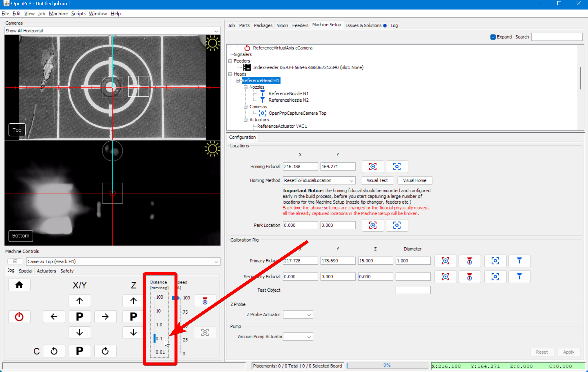

12. Manually jog the head so that the reticle in the center of the Top Camera feed in your top camera view is perfectly centered on the Homing Fiducial in the center of the Opulo logo.
  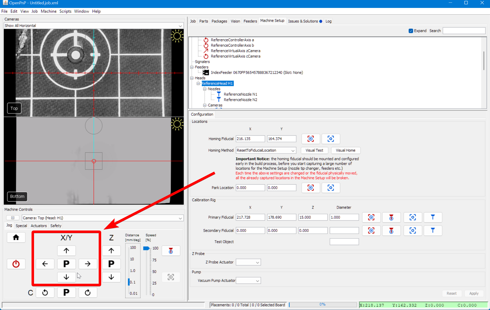
  

## Fine-tune Camera Exposure

In order for OpenPnP to reliably detect the Lumen's homing fiducial, we'll need to set the exposure and camera settings for your top camera correctly. In some cases you can simply check the `Auto` checkbox for `Exposure`, then uncheck it to save the automatically set value. Make sure not to leave any of the settings with the `Auto` checkbox enabled, as that will lead to inconsistent vision results.

See also our [setup video](https://youtube.com/watch?v=CSnczX6VJ7M&si=EnSIkaIECMiOmarE&t=867) if you prefer.

1. Navigate to the `Machine Setup` tab.
  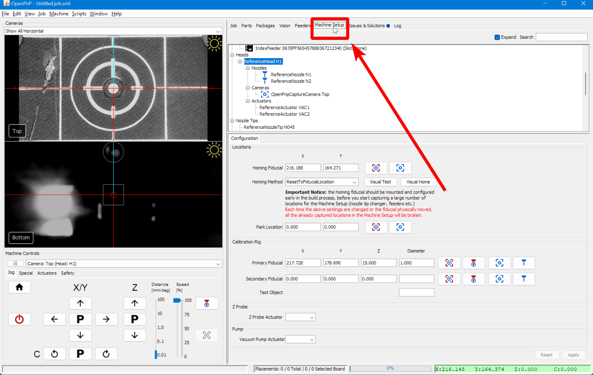

2. Click the "Expand" checkbox if necessary.
  

3. Navigate to `Heads > ReferenceHead H1 > Cameras > OpenPnPCaptureCamera Top`.
  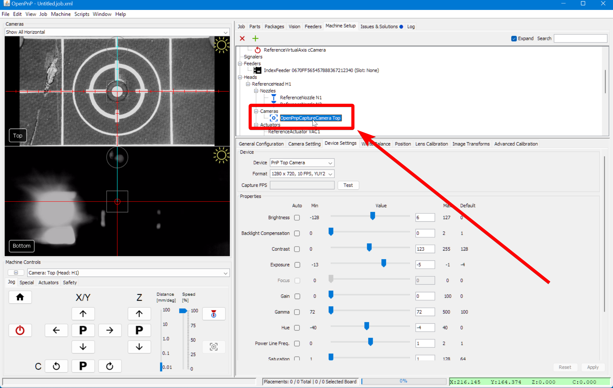

4. In the lower detail pane, switch to the `Device Settings` tab.
  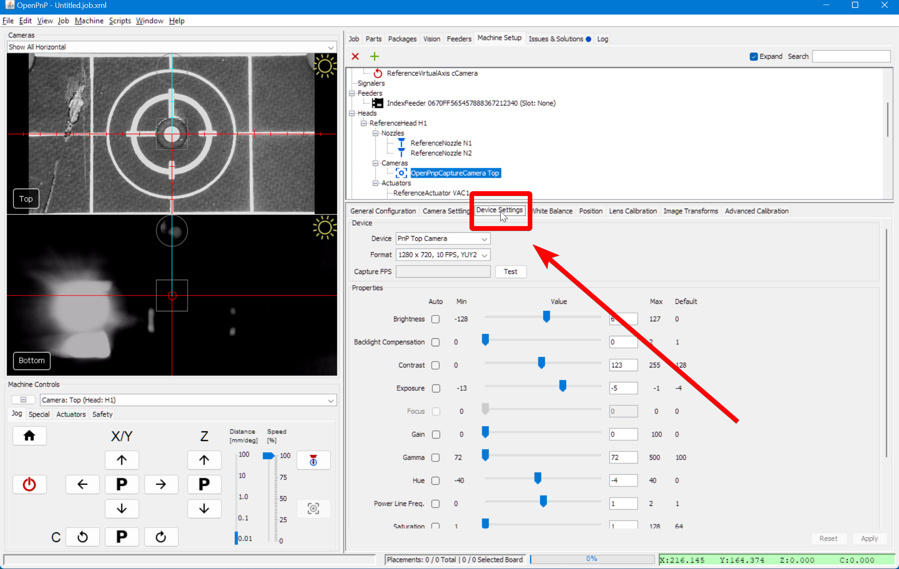

5. Right click on the camera feed to enable the image info card. This will give you the brightness histogram of the image. In the next step, you'll want to tune your exposure and other camera settings so the image isn't too bright or too dark. The histogram can help: make sure the graph isn't going all the way to the edges of the X axis in the histogram, and that will make sure all of the image's details are available for the computer to use when it is looking for the homing fiducial.
  
  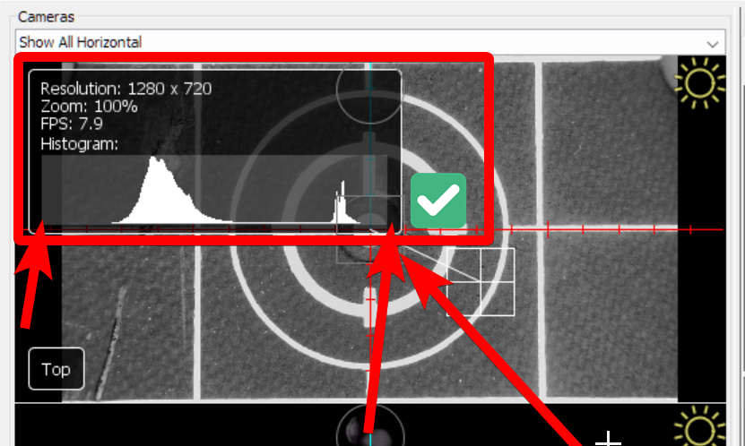
  

6. Adjust the exposure and other camera settings. The goal is to make the image clear and have a lot of contrast, without being too bright or too dark overall.
  

## Apply Homing Fiducial Changes

1. Double-check that:
    * The Homing Fiducial is in the center of the reticle in the camera feed.
    * The camera image is in sharp focus.
    * The camera image is properly exposed.

2. Go back to Machine Setup and select `Heads > ReferenceHead H1`.
  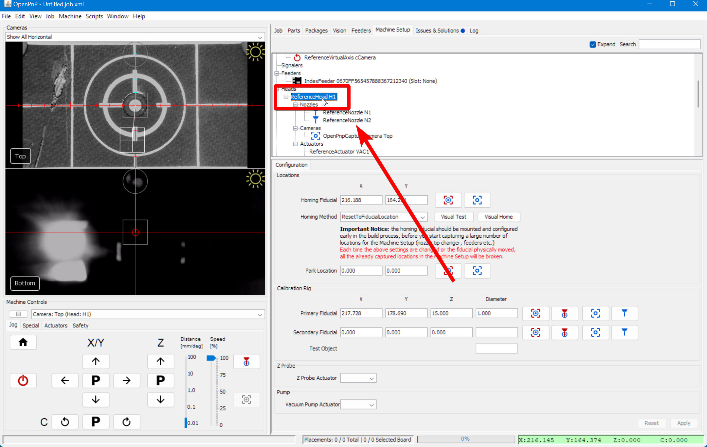

3. Click on the "Capture Location" icon button to save the location where OpenPnP will start searching for the Homing Fiducial.
  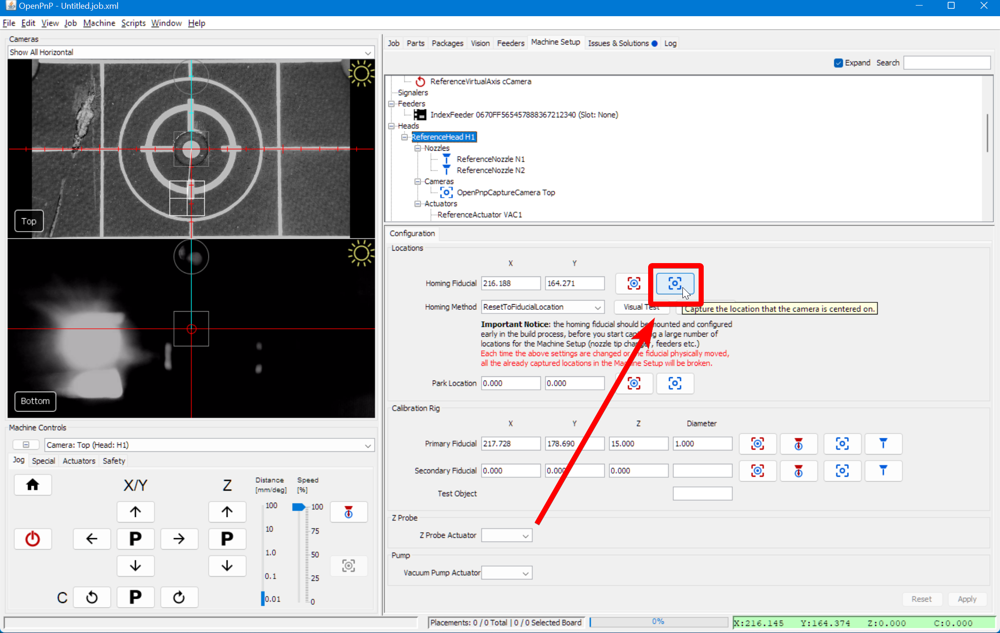

4. Click `Apply` to save your changes.
  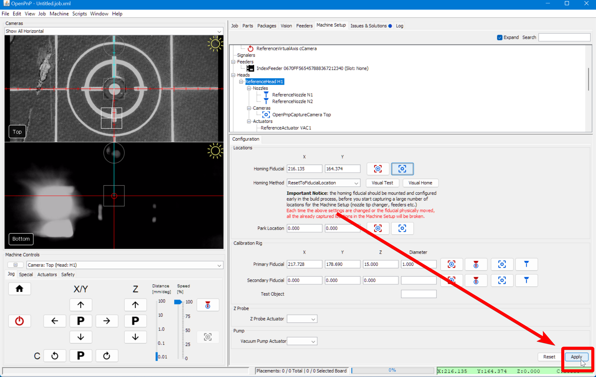

5. Click on the "Home" button in the `Machine Controls Pane > Jog Tab` and watch your machine home using the limit switches, then move the top camera over the homing fiducial and find its exact location.
  

6. If you receive the error: `FIDUCIAL-HOME no matches found.`, OpenPnP was not able to identify your homing fiducial. You'll need to double-check your [exposure settings](#fine-tune-camera-exposure), and then you may need to adjust your [Homing Fiducial Pipeline](../../../openpnp/vision-pipeline-adjustment/2-homing-fiducial-pipeline.md).
  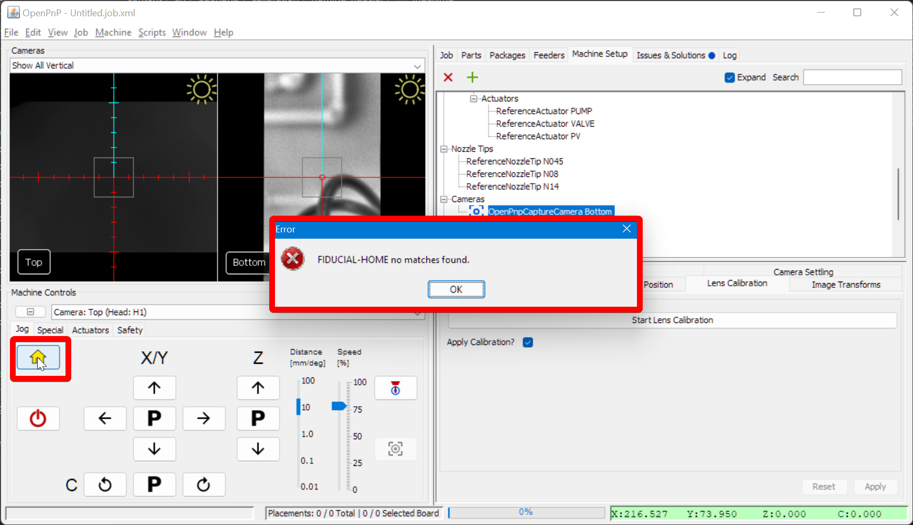

7. Ignore the error for: `Nozzle tip calibration: not enough results from vision. Check pipeline and threshold`. We'll tune those settings next. For now, your homing was successful.
  

## Next Steps

Next is the [MM/Pixel Calibration.](../5-mm-per-pixel/index.md)
