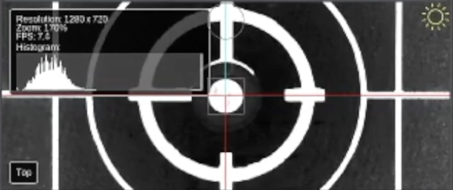

# Homing Fiducial ([Video Guide](https://youtu.be/h3mtEQfGMlM?si=YzBwkxLlAcJWxDJe&t=527))

Now we can set up the datum board. The datum board is a reference point for everything else you'll do with the machine. The center dot of the datum board will be the most important calibration point for the machine. It'll be used to fine-tune the LumenPnP's XY position after homing to account for any errors in the limit switches. See also our [setup video](https://youtube.com/watch?v=CSnczX6VJ7M&si=EnSIkaIECMiOmarE&t=705).

1. Before pressing the homing button (now and every time in the future), make sure that your nozzles are level. OpenPnP is not capable of keeping track of previous homing status per axis and making movement decisions based on that, so it's required to make sure the heads are level first to make sure there is no collision.
  
    

1. Run a rough home routine by pressing the Home button. The machine will move to the X, Y, and Z zero positions.
  
    

!!! danger "If your machine does not move fully to the front left"
    If your LumenPnP does not move all the way to the front left of the machine when you click the Home icon, it could mean that your sensorless homing values need to be adjusted.

    Instructions for tuning this setting are [here](/guides/tuning-sensorless/).

## Setting Homing Fiducial Location

1. Navigate to  `Machine Setup > Heads > ReferenceHead H1`.
  
    
  
1. In the Configuration tab, change the `Homing Method` to `ResetToFiducialLocation`. This will let us adjust Homing Fiducial settings.
  
    

1. Click `Apply` to save this change.
  
    

1. Click on the "Position Camera Over Location" icon button show below. This will move the top camera to *approximately* where your datum board is mounted.
  
    

1. In the bottom left Machine Controls pane, Select the `Actuators` tab.
  
    

1. Turn on the LED ring lights by pressing the `LED` button, then clicking the `On` button in the popup.
  
    

    !!! info "Tip"
          Cameras are pre-adjusted to the correct focus, but if you'd like to tweak it, the community-created [lens adjustment tool](https://www.printables.com/model/208453-lumen-pnp-lens-adjustment-tool) makes this easy. You will also need to loosen the set screw on the side of the camera.

1. Go back to the `Jog` tab in the "Machine Controls" pane.
  
    

1.  Set the `Distance` slider to `0.1` for more precise movements.
  
    

    !!! info "Tip"
          Right click on the camera feed to change the Reticle style to see the center of the camera image. You can also use the scroll wheel to zoom in on the feed for more precision.
          
          

1.  Manually jog the head so that the reticle in the center of the Top Camera feed in your top camera view is perfectly centered on the Homing Fiducial in the center of the Opulo logo.
  
    
  
    

1. Now that we're perfectly centered, capture the exact homing fiducial position using the "Capture Camera Location" button. Also click the "Capture Camera Location" button next to the Primary Fiducial below.

    

## Fine-tune Camera Exposure

In order for OpenPnP to reliably detect the LumenPnP's homing fiducial, we'll need to set the exposure and camera settings for your top camera correctly.

We also detail this process in our [setup video](https://youtube.com/watch?v=CSnczX6VJ7M&si=EnSIkaIECMiOmarE&t=867).

1. Navigate to `Machine Setup > Heads > ReferenceHead H1 > Cameras > OpenPnPCaptureCamera Top`.
  
    

1. In the lower detail pane, switch to the `Device Settings` tab.
  
    

1. Right click on the camera feed and select `Show Image Info?` to enable the image info card. This will give you the brightness histogram of the image.
  
    
  
2. Adjust the exposure using the slider. The goal is to make sure the histogram graph has a sharp peak on the right side, and a cluster near the bottom end. See the image below for reference.

    {: style="width:60%;margin-left:10%;"}

3. Once you've found a good exposure value, **record this value**. OpenPnP does not always reestablish camera settings when reconnecting, so having this value recorded for easily setting your exposure again on boot is important. When doing so, be sure to check, then uncheck the "Auto Exposure" box to put your camera into manual exposure mode, then slide the slider to your recorded value.
  
## Test Fiducial Homing

1. Navigate to `Machine Setup > Heads > ReferenceHead H1`.
  
    

1. Click on the "Home" button in the `Machine Controls Pane > Jog Tab` and watch your machine home using the limit switches, then move the top camera over the homing fiducial and find its exact location.
  
    

1. If you receive the error `FIDUCIAL-HOME no matches found`, OpenPnP was not able to find your homing fiducial. You need to adjust your [Homing Fiducial Pipeline](../../../openpnp/vision-pipeline-adjustment/2-homing-fiducial-pipeline.md).
  
    

## Next Steps

Next is the [MM/Pixel Calibration.](../5-mm-per-pixel/index.md)