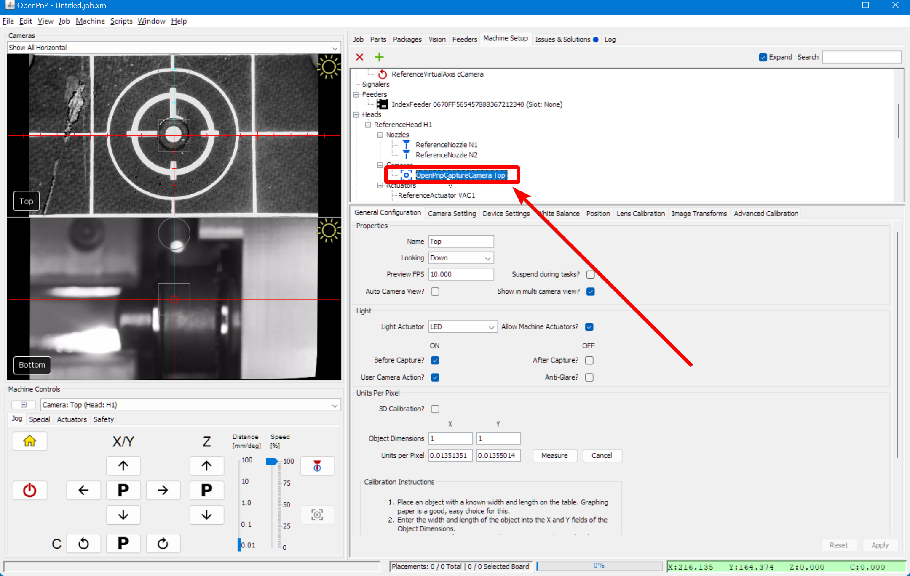
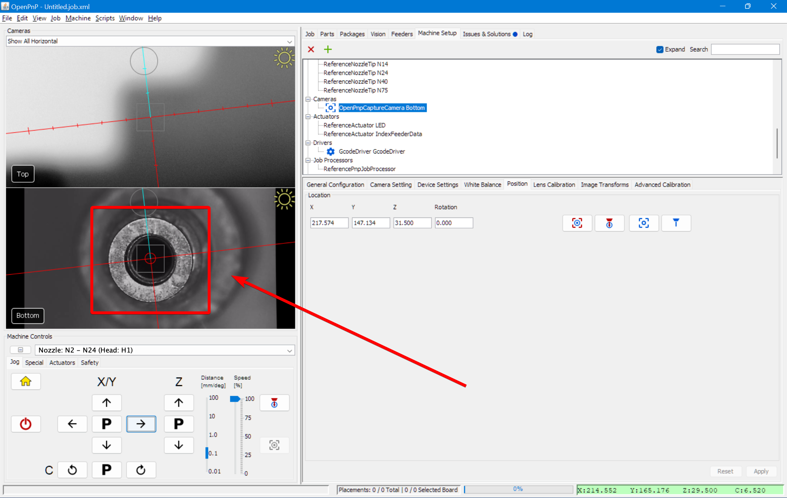

# MM/Pixel ([Video Guide](https://youtu.be/h3mtEQfGMlM?si=WXlOSWQ4RWR7R7zD&t=1002))

This next step calibrates the relationship between pixels and millimeters to make our cameras more accurate. But first, we're going to add some nozzle tips to our nozzles.

## Mounting Nozzle Tips

1. Lubricate both of your brass nozzles using the included packet of SuperLube. We do this before shipping, but adding a bit extra ensures that mounting nozzle tips doesn't damage the rubber O-rings around the holder.

    

1. Identify your machine's nozzle tips. They're mounted in the rack on your staging plate.

    

1. Remove the nozzle tips labeled `N045` and `N24` from the rack.

1. In OpenPnP, navigate to `Machine Setup > Heads > ReferenceHead H1 > Nozzles > ReferenceNozzle N1` and select the `Nozzle Tips` tab, and check the checkbox in the `Loaded?` column for the `N045` row.

    

2. Your machine will jog the head to the front of the machine for easy tip loading. OpenPnP will create a pop up window saying "Task interrupted: ...". This is **not** an error; OpenPnP is just notifying you that it's stopped the job if one is running. You can dismiss this pop up.

    

3. Slide the N045 nozzle tip (the one with the smaller opening) onto the **left** nozzle (using red tubing). Rotate the nozzle tip as you mount it to the brass holder to ensure the grease works its way into the tip and around the O-rings. It should slide on and off easily after working it in.

    

4. Now, navigate to the `ReferenceNozzle N2` and select the `Nozzle Tips` tab. This time, check the checkbox in the `Loaded?` column for the `N24` row.

    

5. Slide the N24 nozzle tip (the one with the larger opening) onto the **right** nozzle (using blue tubing). Rotate the nozzle tip as you mount it to the brass holder to ensure the grease works its way into the tip and around the O-rings. It should slide on and off easily after working it in.

    

!!! Tip
    We mounted these two nozzle tips because these two sizes can pick the vast majority of parts without requiring a nozzle tip swap. Because of this, we highly recommend leaving these two tips mounted by default, and only swapping a tip if these two are unable to pick a part you need (typically very heavy parts).

## Top Camera Calibration

1. Navigate to `Machine Setup > Heads > ReferenceHead H1`.

    

1. Click on the "Position Camera over location" icon button show below. This will move the top camera to where your datum board is mounted.

    

1. Click on `Heads > ReferenceHeadH1 > Cameras > OpenPnPCaptureCamera Top`.

    

1. Go to the `General Configuration` tab.

    

1. Scroll down to `Units Per Pixel`.

    

1. Set the X and Y Object Dimensions to `5`.

    

1. Jog the machine so that one of the golden guideline squares on the datum board are visible in the top camera's view. The whole square must be visible. Zoom out of the camera feed with the scroll wheel if necessary.

    

1.  Then click the `Measure` button.

    

1.  Click and drag in the camera view to create a box. Drag the box so that it lines up with the lines on the datum board; they are exactly 5mm x 5mm. Make sure that you are aligning the bounding box with the **center** of the lines as shown in the image below.

    

    !!! Note "Squareness"
        Don't worry if the square fo the box doesn't perfectly align with the camera image. Any slight skew will be adjusted for duing jobs with fiducial calibration.

1.  Once you have it perfectly outlined, click the `Measure` button again. The new calibration numbers will populate the Units per Pixel fields. They should be relatively close to the default values.

    

1.  Click `Apply` to save the changes.

    

1.  To confirm, drag the reticle on the top camera view to move the machine. The camera center should move exactly where you tell it to. If it's inaccurate, try doing the calibration again or tweaking the values in the fields.

## Bottom Camera Calibration

1. Rehome your machine using the home button.

2. Navigate to `Machine Setup > Cameras > OpenPnPCaptureCamera Bottom`, then select the `Position` tab.

    

1. In the drop down under `Machine Controls` on the left, select `Nozzle: N2` so that for any nozzle commands we run, OpenPnP knows to make them based on N2 and not N1.

    

2. Click on the "Position the tool over the center of the location" button

    

3. Use the jog controls to move the nozzle directly over the center of the bottom camera. Do not adjust the Z-axis.

    

    

    !!! Tip "Adjusting Focus"
        Focus is adjusted before shipping, but if you'd like to fune tune your adjustment, you can twist the lens of the bottom camera. You'll need to loosen the set screw on the side to allow it to turn.

        

4.  Go to the `General Configuration` tab.

    

5.  Scroll down to `Units Per Pixel`.

    

6.  Set the X and Y Object Dimensions to `4`.

    

1.  Then click the `Measure` button.

    

1.  Click and drag in the bottom camera viewfinder to bring up a bounding box. Drag the bounding box around the nozzle tip so that it's perfectly tangent to the edges as shown in the image.

    

1.  Once you have it perfectly outlined, click `Measure` again. New numbers should populate the Units per Pixel fields. They should be relatively close to the default values.

    

1.  Then click `Apply` to save the changes.

    

1.  To confirm, drag the reticle on the bottom camera view to move the machine. The **nozzle tip** should move exactly where you tell it to. If it's inaccurate, try doing the calibration again or tweaking the values in the fields.

## Next Steps

Next is [Nozzle Offset Calibration](../6-nozzle-offset/index.md).
