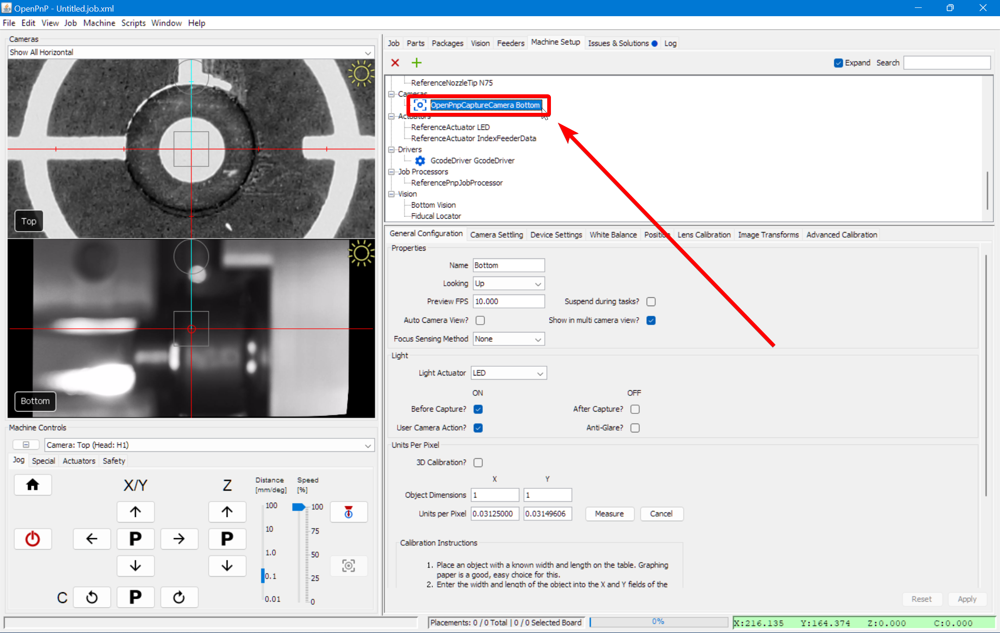
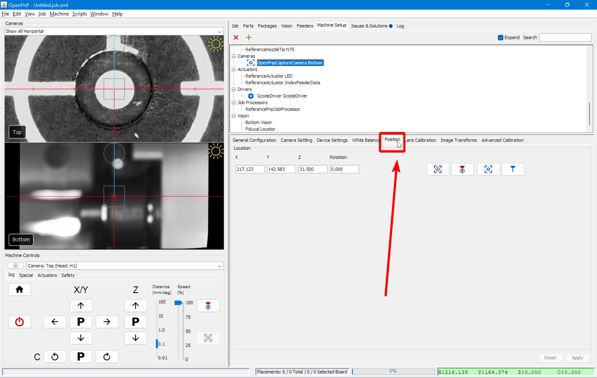
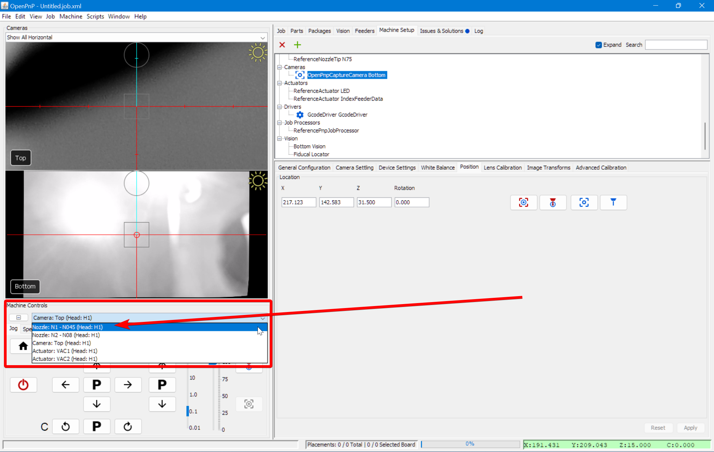
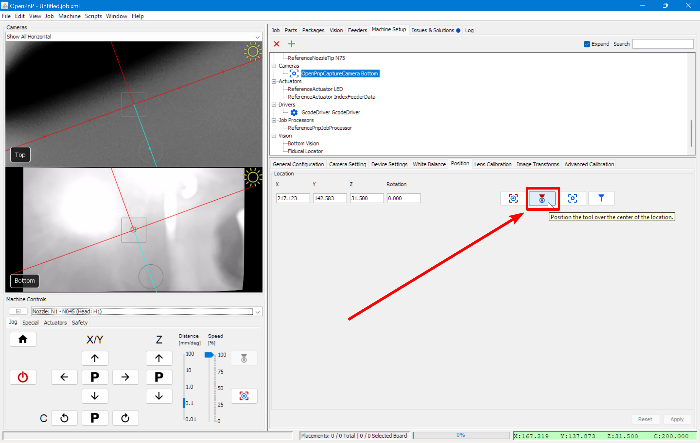
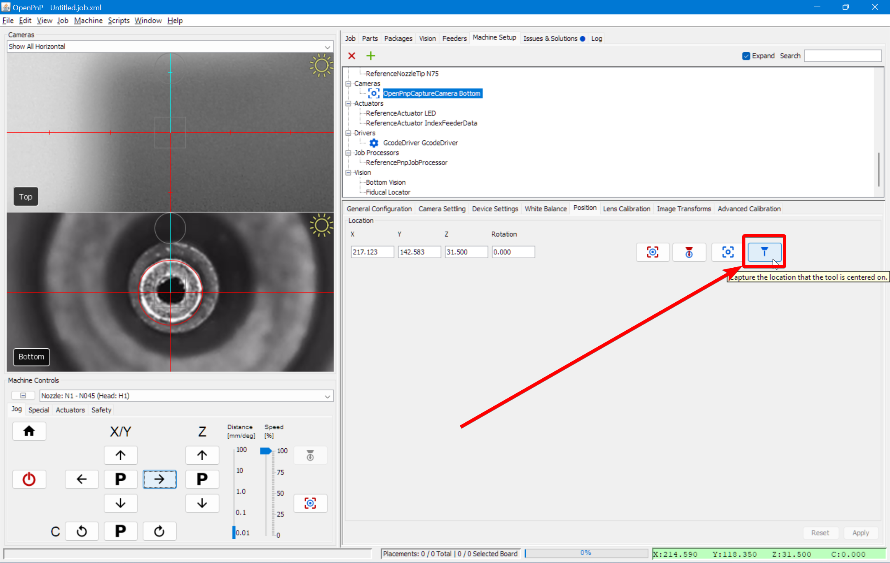
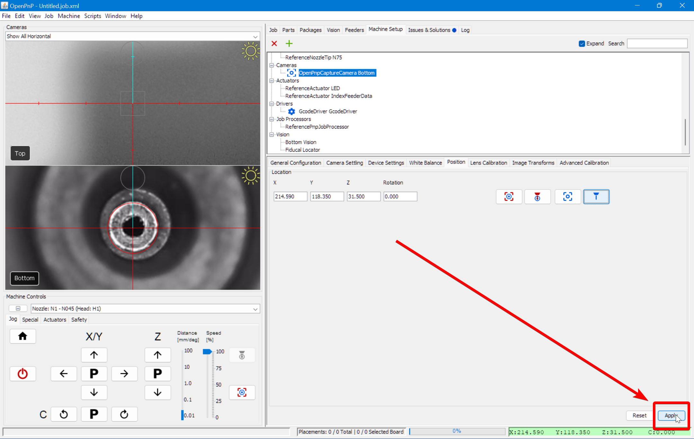

# Bottom Camera Position

Now that we know the offset from the top camera to the nozzle, we can use the nozzle to set our bottom camera position.

!!! danger "Bottom Camera Z Position: v2 and v3 LumenPnP Differences"
    When inspecting the tip of the nozzle and parts that have been picked up, OpenPnP uses a saved Z height to bring the nozzle tip to so that it is in focus.

    Make sure your bottom camera Z position is set correctly based on your machine type and number of nozzles.

    v2 LumenPnP kits only have one tool head. The default Z-height is `61mm`. This is relatively high, and allows the bottom camera to see very large parts. But it is high enough that, if you have a second nozzle installed, the inactive nozzle can collide and cause damage.

    v3 semi-assembled LumenPnP machines come with two tool heads. To more safely accommodate this, the Z height is only `31.5mm`, and the bottom camera is mounted deeper below the Staging Plate. This ensures we can see large parts while preventing collisions with a second nozzle.

    * If you're using one nozzle, set the bottom camera Z Location to `61mm` (Standard for v2 LumenPnP kits).
    * If you're using two nozzles, set the bottom camera Z Location to `31.5mm` (Standard for v3 semi-assembled LumenPnP kits).

1. Click on the `Machine Setup` tab in the top right pane.
  

2. Click on the "Expand" checkbox to open all of the features about your machine.
  

3. Click on `Cameras > OpenPnpCaptureCamera Bottom`.
  

4. Click on the `Position` tab.
  

5. Set the camera's Z-axis location:
    * If you have a v2 LumenPnP **kit** with only one nozzle, set the Z axis value to `61mm`.
    * If you have a v3 **semi-assembled** LumenPnP with two nozzles, set the Z axis value to `31.5mm`.
  

6. Home your LumenPnP to make sure your toolhead's location is accurate. As before, ignore the `Nozzle tip calibration: not enough results from vision. Check pipeline and threshold` error if it appears.
  

7. Jog the toolhead off to the side so that it isn't aligned with any calibration points. This will make it easier to see if the nozzle is lined up with the bottom camera.
  

8. Select the `Nozzle: N1 - N045 (Head:H1)` from the machine controls dropdown.
  

9. Click the "Position tool over location" button to bring the left nozzle very roughly above the bottom camera.
  

10. Jog the toolhead until the left nozzle is directly in the center of the bottom camera's vision.
  

11. If the tip of the nozzle isn't in focus, rotate the bottom camera lens to set it in focus. Re-center the nozzle in the camera view if necessary.
  

12. Click the "Capture Toolhead Location" button to calculate the correct position for the bottom camera.
  

13. Click the `Apply` button to save the new camera position.
  

14. Try homing your machine again. If you get the `Nozzle tip calibration: not enough results from vision. Check pipeline and threshold` error, you will need to tune your [Bottom Camera Vision Pipeline](../../../misc/troubleshooting/vision-pipeline-adjustment/index.md).
  

## Next Steps

Next is [Backlash Compensation](../8-backlash-compensation/index.md).
