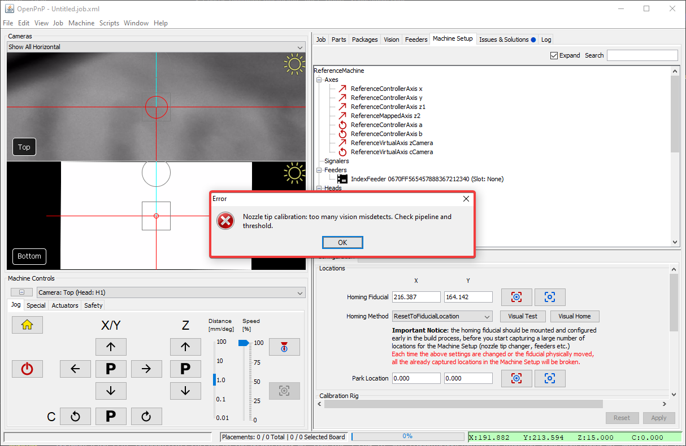
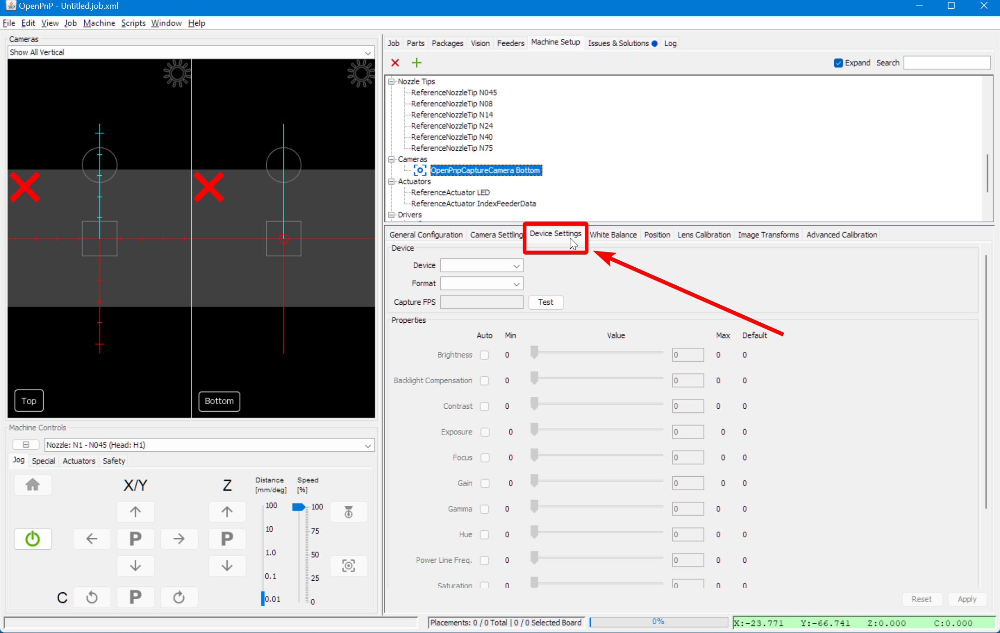
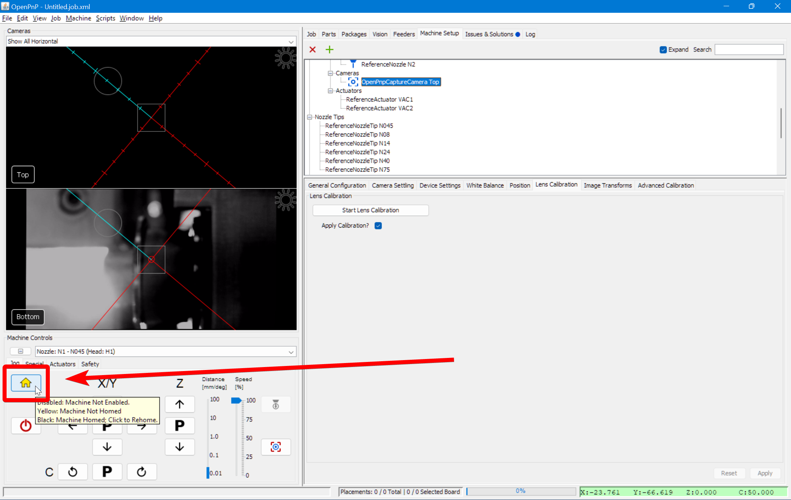
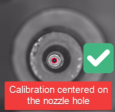

# Nozzle Tip Calibration

Whenever you home your LumenPnP, OpenPnP will double-check the homing fiducial's location, and then it will identify the nozzle tips on each of your nozzles. Up until now you've probably been getting the error message: `Nozzle tip calibration: not enough results from vision. Check pipeline and threshold` because OpenPnP can't identify the tips of your nozzles.

Nozzle Tip Calibration needs to be successful for both toolheads, and for any nozzle tip that you're going to use in your jobs. We recommend starting with the N045 and N14, since they're the most versatile.

See also our [setup video](https://youtube.com/watch?v=CSnczX6VJ7M&si=EnSIkaIECMiOmarE&t=1875).

1. Install an N045 nozzle on the left toolhead. (Or whichever nozzle tip you're going to calibrate, on the correct toolhead)
  

1. Click on the `Machine Setup` tab in the top right pane.
  

1. Click on the "Expand" checkbox to open all of the features about your machine.
  

1. Click on `Cameras > OpenPnPCaptureCamera Bottom`.
  

1. In the lower detail pane, switch to the `Device Settings` tab.
  

1. Do the same [exposure fine-tuning](../4-homing-fiducial/index.md#fine-tune-camera-exposure) as we did for the top camera.
  

1. Click on the "Home" button in the `Machine Controls Pane > Jog Tab`. You should see OpenPnP identify the inner hole of the nozzle tip in several different nozzle rotations.
  
  

1. If you receive the error message `Nozzle tip calibration: not enough results from vision. Check pipeline and threshold` when homing your LumenPnP, you need to [adjust your nozzle tip calibration pipeline](../../vision-pipeline-adjustment/4-nozzle-calibration-pipeline.md).

Next is configuring the [vacuum sensor](../10-vacuum-sensor/index.md).
