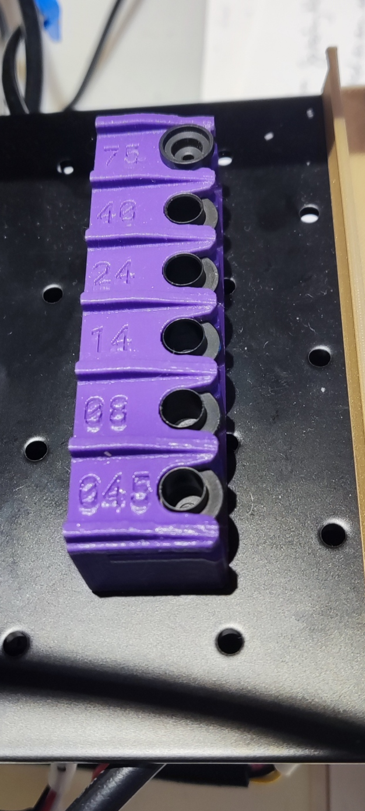
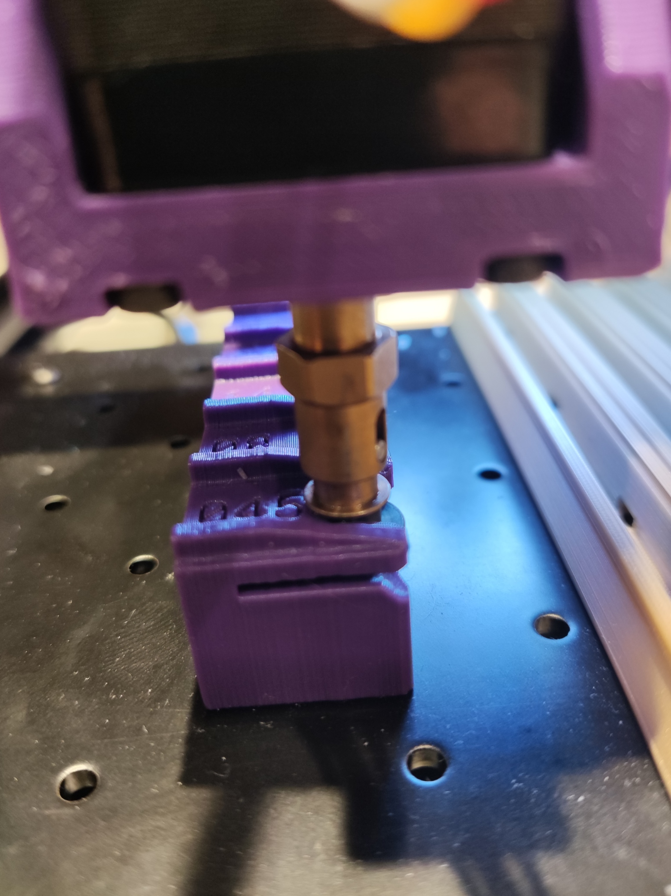
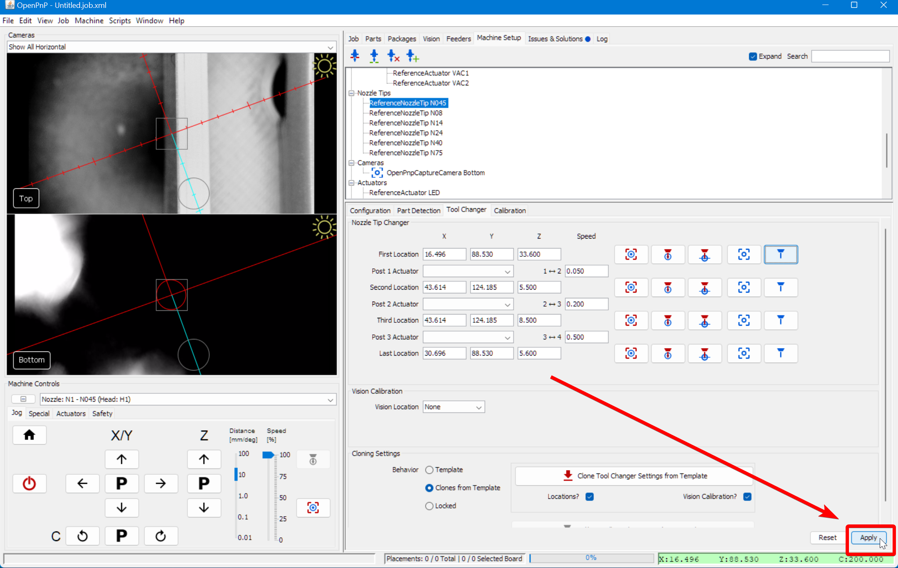
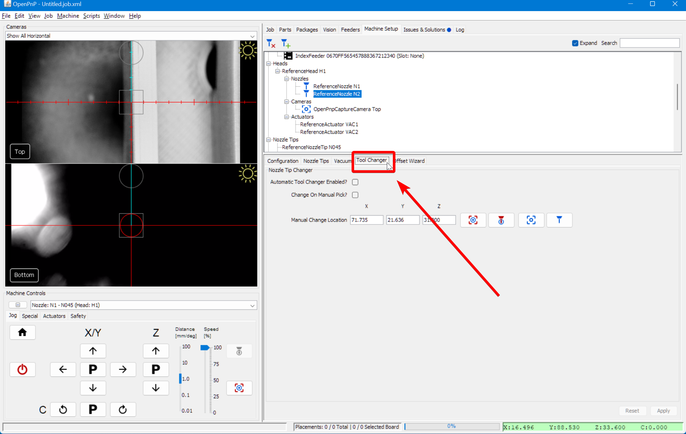

Throughout the course of a job, you will find that you need multiple different size nozzle tips to pick different sized components. By default OpenPnP will pause a job and wait for you to manually change a nozzle tip, but it can be more efficient to set up automatic tool changing. Perform the following optional steps for each of the nozzle tips you'll be switching between. We recommend reading the [OpenPnP Wiki page](https://github.com/openpnp/openpnp/wiki/Nozzle-Tip-Changer) about this as well.

1. Insert the labeled nozzle tips into the holder in their respectively labeled slots.
  

2. Apply some lubricant to the end of your nozzle holder with the lubrication packet included with your nozzles. This is important for repeatably fully attaching the nozzles without damaging the rubber O-rings around the holder.
  

3. Click on the `Machine Setup` tab in the top right pane.
  

4. Click on the "Expand" checkbox to open all of the features about your machine.
  

5. Select the nozzle you're working with. For example: `Nozzle Tips > ReferenceNozzleTipN045`
  

6. Select the `Tool Changer` tab.
  

## Capturing Positions

Now we can start capturing positions. Automatic nozzle changing works by replaying four position commands either forward or backward to load or unload a nozzle tip, respectively. We're going to start with the last position, because it's easiest for getting our Z height correct. Note that the instructions below are for the N045 nozzle tip, but you should use whichever tip you're setting up.

!!! danger "Warning"
    Be careful not to crash your nozzle tip or toolhead into any of the components mounted on your staging plate, especially the nozzle holder. Be especially careful if you have high amounts of backlash compensation, which can cause your tool head to move in unexpected directions when jogging to eliminate backlash. Be aware of your machine's Safe Z axis settings as well, as they can cause the tool head to raise between moves to avoid crashing, which may actually be undesirable here.

1. Install the N045 nozzle onto the tool head by hand.
  

1. Jog the nozzle until it is directly in front of the N045 slot in the tool changer.
  

1. Adjust the Z height until it's clear it'll slide into the rack.
  

1.  Double-check the toolhead is aligned with the slot in the Y axis so that only a X movement would be necessary to slot it into place. It may be a good idea to test-fit the nozzle into the slot by jogging the X axis only.

2.  Capture the nozzle position for the `Last Location`.
  

1.  Move the nozzle into the slot by jogging the X axis in 0.1mm increments. Try to ensure there's no lateral strain on the nozzle holder in the Y axis. Continue until the nozzle is fully slotted into the nozzle holder.
  

1.  Capture the `Third Location` nozzle position.
  

1.  The next position is for making sure that the nozzle tip is completely seated on the CP40 holder during insertion. Jog the Z axis down approximately two millimeters. The spring in the CP40 holder will take up these few millimeters to avoid damage to the tool head. You may find that a larger or smaller movement gets the nozzle tip seated completely, so feel free to experiment.
  

1.  Capture the `Second Location` nozzle position.
  

1.  Now jog the Z axis up 30 millimeters. This is the clearance position where the nozzle holder is getting ready for the plunge.
  

1.  Capture the `First Location` nozzle position.
  

1.  You can now play through the positions by clicking on the "move nozzle to position" buttons in order. Tune any values in the fields as necessary to ensure you get a clean and straight insertion.
  

1.  Apply the changes to the tool changing positions.
  

1.  Repeat the above steps for each of the nozzles you're using. See also the ["Cloning Settings" section in the OpenPnP docs](https://github.com/openpnp/openpnp/wiki/Nozzle-Tip-Changer#cloning-settings).

## Enable Automatic Tool Changing

Now that your positions are set, you can enable automatic tool changing in OpenPnP.

21. Click on the `Machine Setup` tab in the top right pane.
  

22. Click on the "Expand" checkbox if necessary.
  

23. Select `Heads > ReferenceHead H1 > Nozzles > ReferenceNozzle N1`.
  

24. Switch to the `Tool Changer` tab.
  

25. Check the `Automatic Tool Changer Enabled?` box.
  

26. Click `Apply` to save your changes.
  

27. Select `Heads > ReferenceHead H2 > Nozzles > ReferenceNozzle N2`.
  

28. Switch to the `Tool Changer` tab.
  

29. Check the `Automatic Tool Changer Enabled?` box.
  

30. Click `Apply` to save your changes.
  

## Next Steps

Next is [the FTP](../../ftp/index.md).
