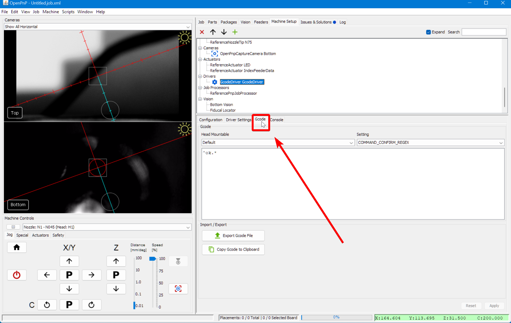

Semi-assembled (v3) LumenPnP machines should have only a limited amount of backlash in each axis and the default machine configuration in OpenPnP will typically account for it. This step is optional, and only necessary if you are still having issues with backlash. Read the OpenPnP docs page about automatic backlash compensation [here](https://github.com/openpnp/openpnp/wiki/Calibration-Solutions#calibrating-backlash-compensation).

## Set Up Acceleration Control

1. Click on the `Machine Setup` tab in the top right pane.
  

2. Click on the "Expand" checkbox if necessary.
  

3. Select `GcodeDriver GcodeDriver` from the list.
  

4. Switch to the `gcode` tab.
  

5. Select `MOVE_TO_COMMAND` in the setting drop-down.
  

6. Paste the following into the large text box:
  
    ```
    {Acceleration:M204 S%.2f}
    G1 {X:X%.4f} {Y:Y%.4f} {Z:Z%.4f} {A:A%.4f} {B:B%.4f} {FeedRate:F%.2f} ; move to target
    ```
  

7. Click `Apply` to save your changes.
  

1. Switch to the `Driver Settings` tab.
  

1. Change the Motion Control Type to `ConstantAcceleration`. Note that you may want to change this back to `ToolpathFeedRate` when you're done running the backlash calibration.
  

1.  Click `Apply` to save your changes.
  
  
## Running The Calibration

11. Click on the `Machine Setup` tab in the top right pane.
  

12. Click on the "Expand" if necessary.
  
  
13. Click on `Axes > ReferenceControllerAxisX`.
  

14. Select the `Backlash Compensation` tab.
  

15. Next, click the `Calibrate now` button. The machine will go through a long routine (between 5-15 minutes) where it measures the machine's backlash, and determines the best settings to account for it.

16. When it's done, you'll see the output data from the calibration. We suggest selecting `OneSidedPositioning` for the Compensation Method, but experiment with the different options to see which gives you the best results.
  

17. Restart from step 10 with the Y axis selected.

## Next Steps

Next is [Automatic Toolchanger Calibration.](../auto-toolchanger/index.md)
