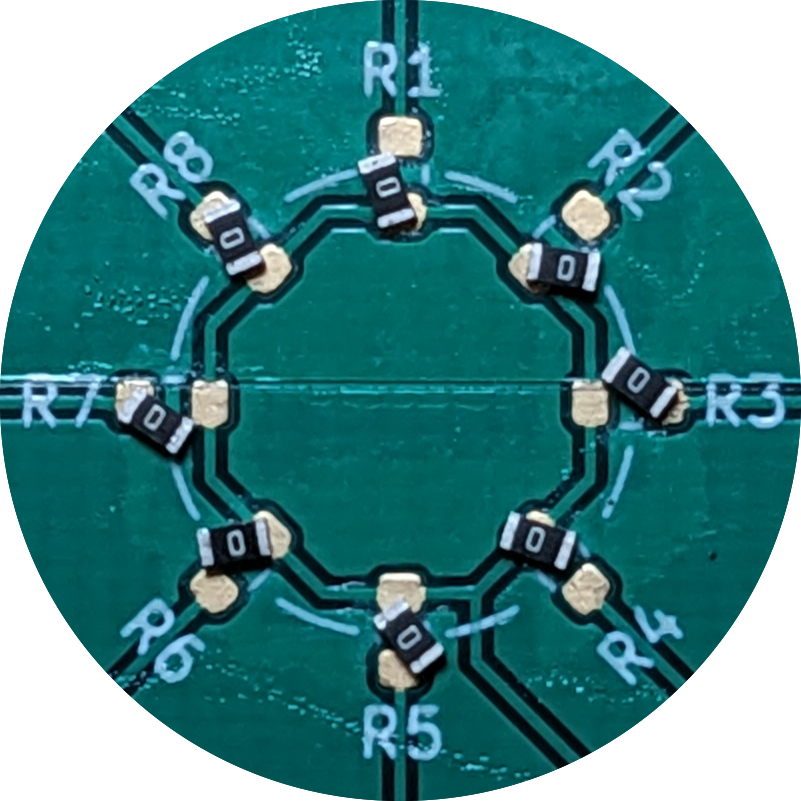
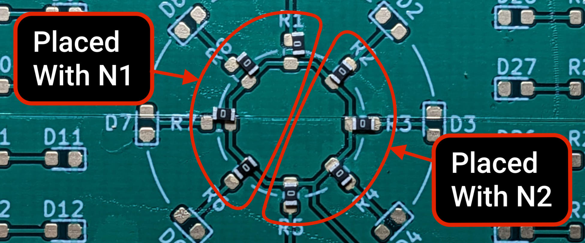
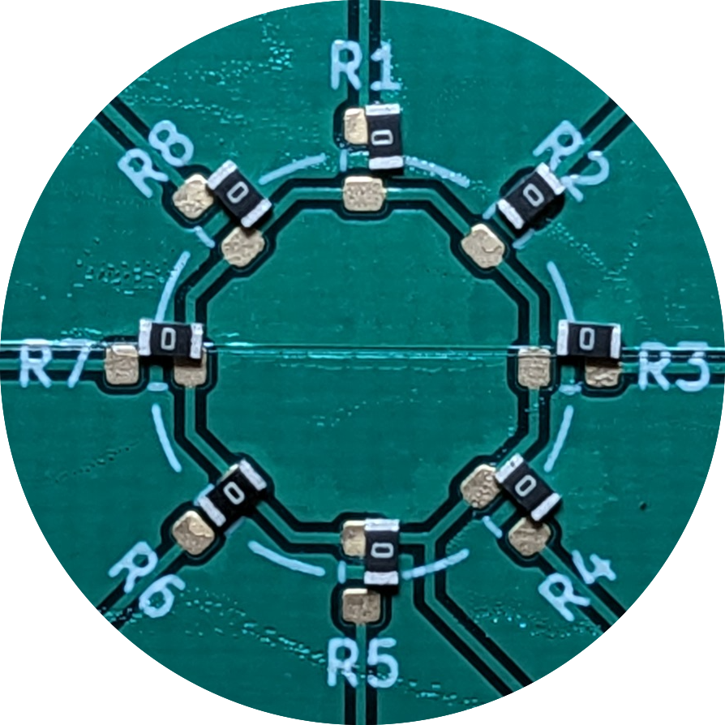
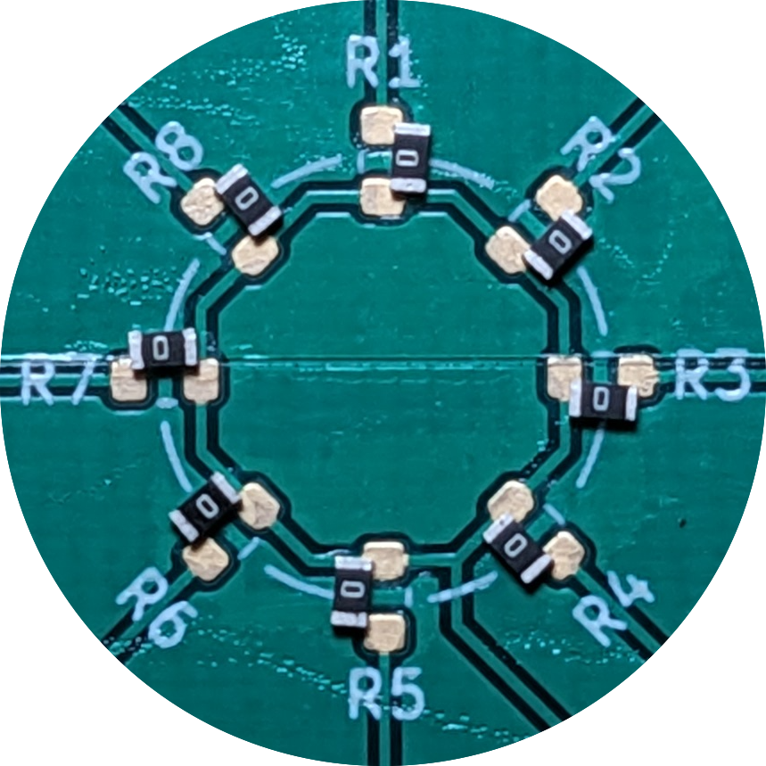
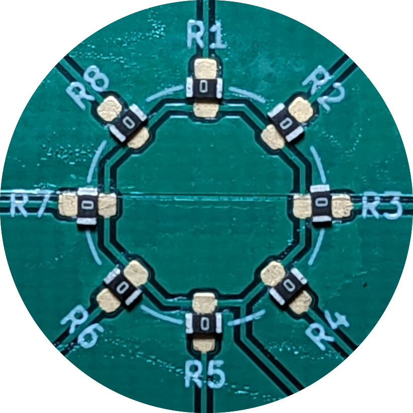

# Debugging Placement Errors

You might have found an inaccuracy or error when placing parts. This page address these errors, and how to go about fixing them. you might se a couple try to make solutions more header-y

## Part placement is seemingly random

If your parts are being placed with seemingly random offsets and rotations, there are couple potential root causes:

- **The board's Z position is too high.** If the nozzle isn't pushing the part into the board, it's dropping a short distance onto the board, and not being placed accurately. Lower the board's Z axis location in `0.10mm` increments until you see that the nozzle tip is just barely pushing into the board.
- **The part's height value is too large.** If OpenPnP thinks the part is taller than it is, it'll try to place the part too high up, even if the board Z position is correct. Select the relevant part in the `Parts` tab and lower the height value to be accurate.
- **Lack of suction force from the nozzle tip.** If your nozzle is correctly pushing the part into the board and you're still getting a seemingly random offset, it's likely a lack of suction on the nozzle tip. When the LumenPnP head moves, the part will still stay attached to the nozzle tip, but can rotate and shift because it isn't being held onto the nozzle tip with enough force. We call this shifting "pirouetting." There are two potential solves:
    - Use a larger nozzle tip for that part. The larger the nozzle tip diameter, the more suction force the part is held with.
    - Especially for the smallest N045 nozzle tip, some solder paste can get stuck in the tip, reducing suction force. If you cannot see a tiny circle of light shining through the tip when held up to a light, you might need to clean the tip with a thin wire and some isopropyl alcohol.

## Every part placed **with a specific nozzle** is offset in X and/or Y

If parts placed with a specific nozzle have a consistent offset in the X and/or Y axis, there are a couple potential root causes:

- **The nozzle offset for that nozzle needs adjustment.** If OpenPnP doesn't have an accurate idea of how far away a nozzle is from the top camera, it's going to place them with that inaccuracy. [Adjust that nozzle's offset](/openpnp/calibration/6-nozzle-offset).
- **The bottom vision pipeline for your parts needs adjustment.** OpenPnP decides how to place parts onto your board based on what it sees in the bottom camera view. If a bright light or reflective surface in view of the camera is making OpenPnP think your part is a different size than it is, you'll see a placement offset. [Adjust your part identification pipeline](/openpnp/vision-pipeline-adjustment/5).
- **The nozzle's tip calibration needs adjustment.** When OpenPnP performs a nozzle tip calibration, it profiles any runout in the nozzle tip. If this calibration does not correctly identify the nozzle tip, it can cause placement errors. [Adjust your nozzle tip calibration pipeline](/openpnp/vision-pipeline-adjustment/4-nozzle-calibration-pipeline/).

## Every part placed **with either nozzle** is offset in X and/or Y

If parts are universally placed with an offset in the X and/or Y axis, there are a few potential root causes:

- **Bottom camera position needs adjustment.** If OpenPnP's understanding of where the bottom camera is located is incorrect, part placements can also be incorrect. Perform a [nozzle offset calibration](/openpnp/calibration/6-nozzle-offset/) on one nozzle, then immediately [set the bottom camera position](/openpnp/calibration/7-bottom-camera-position/) without rotating the nozzle.
- **Fiducial calibration pipeline needs adjustment.** If OpenPnP incorrectly detects your fiducials and instead thinks a silkscreen marking or footprint pad is the fiducial, all of the locations on your board will be shifted. [Make sure your fiducial pipeline is correctly identifying your PCB's fiducials.](/openpnp/vision-pipeline-adjustment/3-pcb-fiducial-pipeline/)
- **Both nozzles need offset calibration adjustment.** It's possible that both of your nozzle offsets need adjusting. [Make sure your nozzle offsets are correct.](/openpnp/calibration/6-nozzle-offset/)
- **The LumenPnP skipped steps during motion.** If the LumenPnP's stepper motors encounter too much resistance, they can "skip steps" and lose their position. The way to confirm that this has happened is by navigating to `Machine Setup -> Heads`, clicking on `ReferenceHead H1` clicking the "Move camera to position" button next to the Homing Fiducial coordinates. If the camera is not centered on the homing fiducial, your machine has likely skipped steps. This can happen for a number of reasons:
    - The machine's gantries interfered with something in the pick area, or something in your workspace. Check to make sure the machine is free to move easily and no cables are getting caught or tangled.
    - LumenPnP models from v3.1 onward come with linear rails. These rails require proper lubrication to operate correctly. Lubricate your rails with the included lubrication packet.
    - If you've increased your machine's travel speed, it's possible this is the reason for skipped steps. If the motors aren't capable of moving the machine at the requested speed, they will skip steps. Try lowering the machine's travel speed by navigating to `Machine Setup -> Drivers -> GcodeDriver GcodeDriver -> Driver Settings` and lower the value in the `Max. Feed Rate [/min]` field.

## Parts are placed offset **relative to the part's orientation**

If parts are placed offset **relative to the orientation of the footprint**, there are a couple potential root causes:

- **The vision pipeline is inaccurate**. When OpenPnP processes the bottom vision image of a component on a nozzle, it's identifying the part's boundaries and uses that information to place it accurately. If OpenPnP incorrectly finds the boundaries of your part, it will place it inaccurately as well. This usually happens because the nozzle tip is visible by the bottom camera, and OpenPnP incorrectly thinks it's part of the component on the tip. To fix this:
    -  Lower your bottom camera's exposure according to [the instructions for nozzle tip calibration](/openpnp/calibration/8-nozzle-tip-calibration/nozzle-tip-calibration/).
    -  [Adjust your bottom vision pipeline](/openpnp/vision-pipeline-adjustment/5-part-identification-pipeline/) to make sure OpenPnP is correctly finding your component.

## Parts are rotated 90 or 180 degrees

If some of your parts are placed with a 90 or 180 degree offset, there are a couple potential root causes:

- **The feeder's rotation value needs adjustment.** When setting the position of a feeder, the rotation value you enter is equal to the initial rotation angle that the part is picked at. Adjust the `Rotation` field for the feeder of the part you notice is being placed incorrectly in increments of 90 degrees.
- **The part's vision pipeline needs adjustment.** If your rotation offset is consistently 90 or 180 degrees this is less likely, but it could still worth [adjusting that part's vision pipeline](../../vision-pipeline-adjustment/5-part-identification-pipeline.md).

## Part not picking

If the nozzle is not picking parts consistently, there are a few potential root causes:

- **The vacuum sensor threshold is too sensitive.** If you notice that your nozzle is attempting to pick a part, but seems to raise up too quickly, the vacuum sensor threshold value is incorrectly telling OpenPnP that it's successfully picked the part. This can be solved by [tuning your vacuum sensor threshold value](/openpnp/calibration/10-vacuum-sensor).
- **The feeder Z position is set too high.** If the machine is told to pick a part slightly too high, the nozzle tip doesn't make a good seal on the part, and fails to pick. This is solved by adjusting the [feeder's height](../1-installing-the-feeders/index.md).
- **Lack of suction force from the nozzle tip.** Especially for the smallest N045 nozzle tip, some solder paste can get stuck in the tip, reducing suction force. If you cannot see a tiny circle of light shining through the tip when held up to a light, you might need to clean the tip with a thin wire and some isopropyl alcohol.

## "No result found" error

- If the component was not identified by the bottom camera correctly, you will likely need to adjust its [Part Identification Vision Pipeline](../../vision-pipeline-adjustment/5-part-identification-pipeline.md).