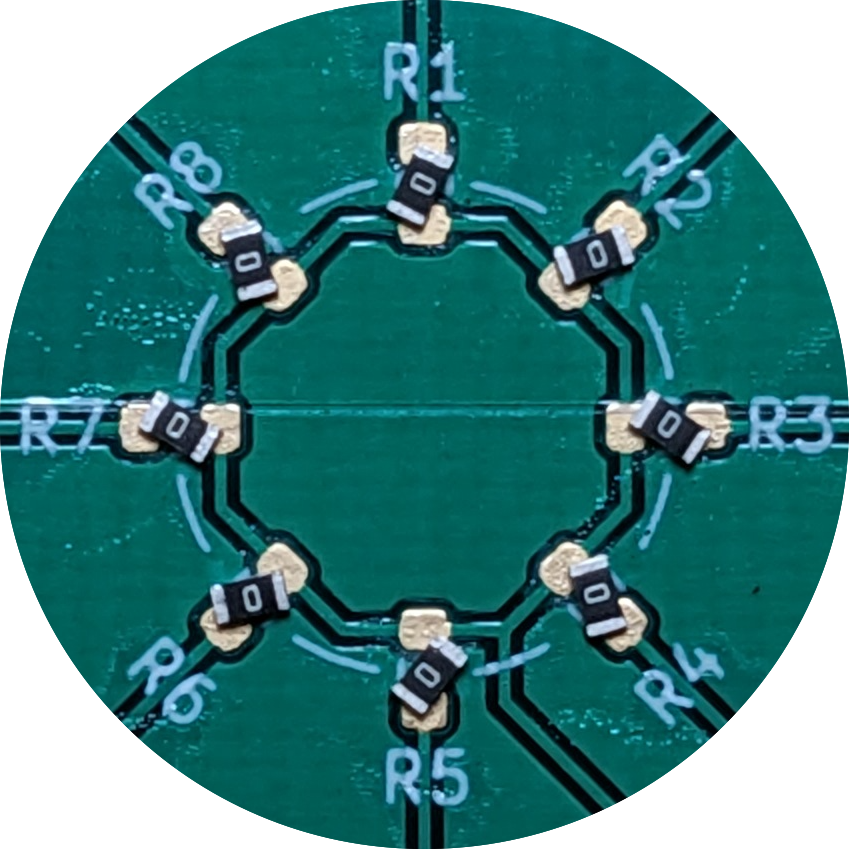
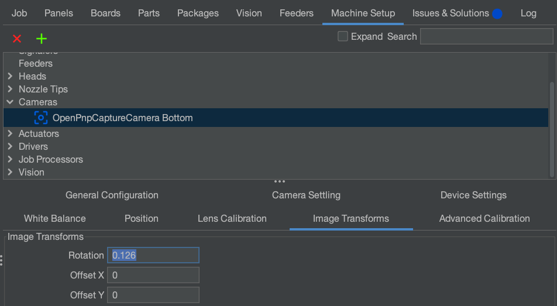

# Rotational offset

{: style="width:60%;margin-left:10%;"}

If parts placed have a consistent rotational offset, there are a couple potential root causes:

## The nozzle tip is too small for the part you're picking

If the nozzle tip you've selected to pick a part doesn't apply enough suction force to the part, it can cause the part to shift on the nozzle tip, often causing a rotational offset that we call "pirouetting." Increase the nozzle tip diameter you're using for that part to prevent this.

## The bottom camera needs a rotation adjustment

If parts from both nozzles are causing a consistent rotational offset, it could be that you need to adjust your bottom camera rotation. Navigate to `Machine Setup -> Cameras -> OpenPnPCaptureCamera Bottom -> Image Transforms` and adjust the value in the `Rotation` field.

## The bottom vision pipeline for your parts needs adjustment

OpenPnP decides how to place parts onto your board based on what it sees in the bottom camera view. If a bright light or reflective surface in view of the camera is making OpenPnP think your part is a different size than it is, you'll see a placement error. [Adjust your part identification pipeline](/openpnp/vision-pipeline-adjustment/5).
