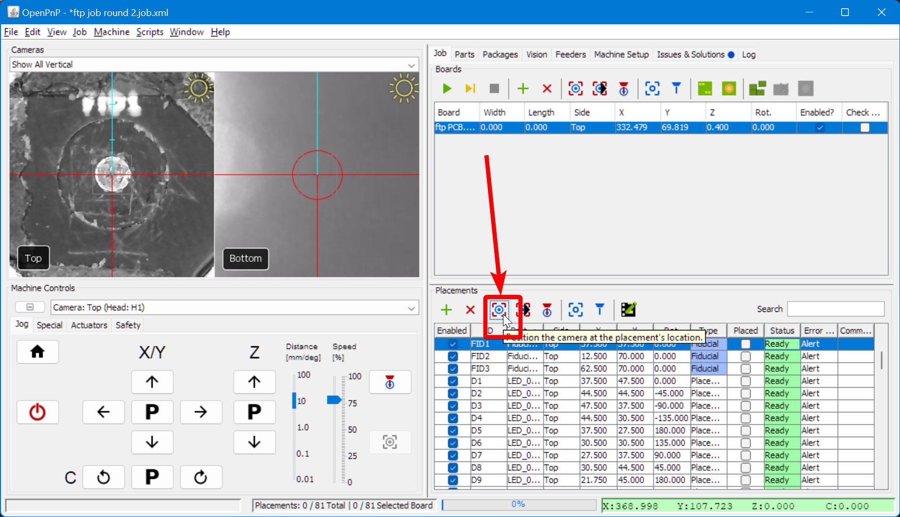
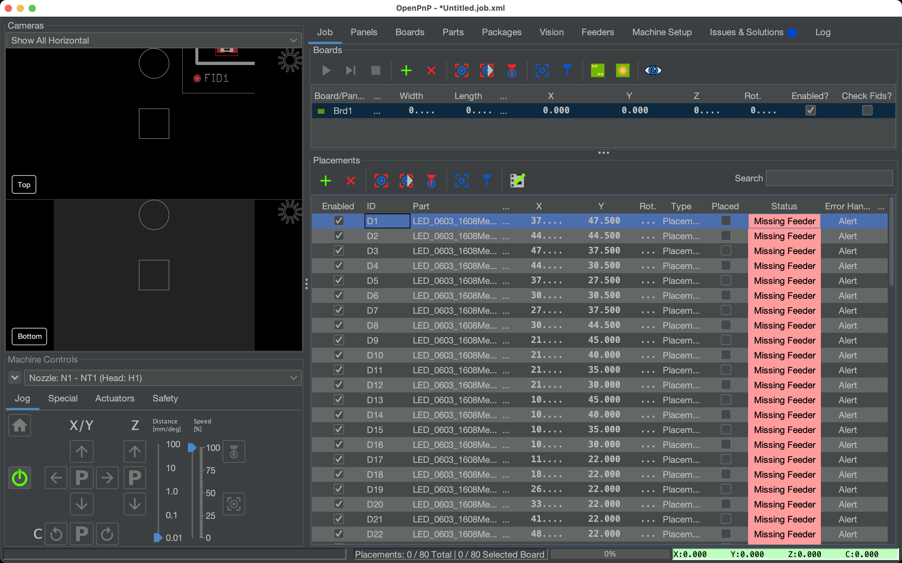

# Setting up the Board ([Video Guide](https://youtu.be/W0kdrxkkXUw?si=XuRVICYYymUc9Aoq&t=42))

The first step in running the test job is physically mounting the FTP PCB onto the LumenPnP's staging plates.

## Mounting the FTP PCB

1. Loosely screw in the universal mounting components in the following locations:
     * Static Board Mount positioned diagonally, screwed into B26
     * Dynamic Board Mount positioned vertically, screwed into D26
     * Dynamic Board Mount positioned horizontally, screwed into B28
     * Board Support placed in E29

    

2. Apply four strips of double-sided tape to the top of the FTP board, between the two white lines. Do not cover the fiducial markers. The double-sided tape holds components in place when populated, and provides a cleaner method of testing calibration than using solder paste.

    

1. Place the FTP board in the holders and push them so that they're snug against the sides of the board. The top edge of the board should line up with the ridge in the dynamic board mount's tab.

    

2. Tighten down the mounting hardware. You shouldn't be able to easily move the board except when pressing on the dynamic board mount tab.

## Importing the Position File

1. Download the FTP board position file. It's titled `ftp-top.pos`, and can be found in the [latest major release.](https://github.com/opulo-inc/lumenpnp/releases/)

2. Navigate to the `Boards` tab in the top right, click the plus icon, and select "Create New Board".

    

1. Save the board as "ftp.board.xml" on your computer

    

2. From the "Boards" tab, select the newly created board and click `File > Import Placements > KiCAD .pos`

    

3. In the Import popup:
       1. Select the `ftp-top.pos` file you downloaded earlier as the Top File
       2. Enable the `Assign Parts` checkbox.
       3. Enable the `Create Missing Parts` checkbox.
       4. Click `Import`

     

4. In the `Parts` tab on the top right, find the lines for the newly created components: `LED_0603_1608Metric-LED_Small` and `R_0603_1608_Metric-R_Small`. Set their Height values to `0.5`mm by double-clicking the cell.

    

5. Go to `File > Save Job As` and save your FTP job.

    

## Installing the N045 Nozzle

1. Grease the nozzle holder before installing the N045 nozzle.

    

2. Install your N045 nozzle onto the nozzle holder.

    

3. Wipe off any excess grease.

    

4. Go to the `Machine Setup` tab in OpenPnP.

    

5. Navigate to `Heads > ReferenceHead H1 > Nozzles > ReferenceNozzle N1`.

    

6. In the lower-right pane, switch to the `Nozzle Tips` tab.

    

7. For row `N045`, check both the `Compatible` and `Loaded` checkboxes. If you haven't set up automatic nozzle changing, you will receive a popup saying that you're required to manually load the nozzle on the toolhead.

    

8. Go to the `Packages` tab in the top-right pane.

    

9. Select `LED_0603_1608Metric` from the list.

    

10. In the lower-right pane, you'll be in the `Nozzle Tips` tab. Click the `Compatible` on the `N045` row.

    

11. Similarly, select `R_0603_1608Metric` from the Package list.

    

12. And click the `Compatible` checkbox on the `N045` row.

    

## Finding the FTP Location

Next, you'll set the physical location of the FTP board in OpenPnP.

1. Navigate to the `Job` tab in the top-right pane.

    

1. Click the green "Plus" icon, select `Existing board`, and select the board you added in a previous step.

2. In the bottom-right pane, you'll see the `Placements` panel. Find the three elements with the IDs: `FID1`, `FID2`, and `FID3`. You can sort the list by `Part` to find them easily.

    

3. For each of the three elements, go to the `Type` column, select where it says `Placement` and switch it to `Fiducial`. This tells OpenPnP that these three elements on the board are not components to be picked and placed, but fiducials to be scanned.

    

4. Jog the top camera so that it's centered on the bottom left corner of the FTP PCB. Select the board in the "Job" tab, then click on the "capture camera position" button to save the current camera position as the board's origin point.

    

5. Jog the N1 Nozzle so that it's just barely touching the top surface of the FTP PCB. Enter the current Z position (visible in the green bar in the bottom right of the UI) into the board's Z position field.

    

1. Jog the Nozzle back up and out of the way to prevent a crash.

6.  Click on the "Fiducial Scan" button. The machine will move to the fiducial locations and use the camera to identify the center of the fiducial.

    

7.  If the fiducial check fails for any reason, check out our instructions for adjusting the [PCB fiducial vision pipeline](../../vision-pipeline-adjustment/3-pcb-fiducial-pipeline.md).

8.  To confirm that the fiducial calibration was successful, select any placement in the "Placements" table and select the "jog camera to position" button. If the center of the camera is perfectly centered on the footprint, your fiducial calibration was successful.

    

## Disable the LEDs

Disabling parts on a board is a helpful feature in OpenPnP for DNP parts, alternate parts, or other irregularities. We'll disable the LEDs in this job as an example.

1. Click on the first placement in the "Job" tab with the LED part assigned to it.

    

2. Hold `SHIFT` and click on last placement with the LED part assigned to it.

    

3. Right click on the parts, and click on `Set Enabled > Disabled`. These parts will no longer be populated in the job.

    

## Next Step

Next, you'll [set up a feeder](../2-feeder-setup/index.md).
