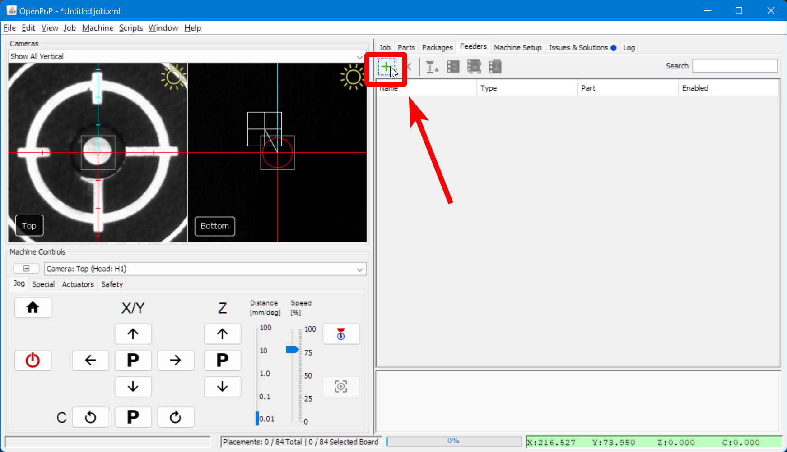
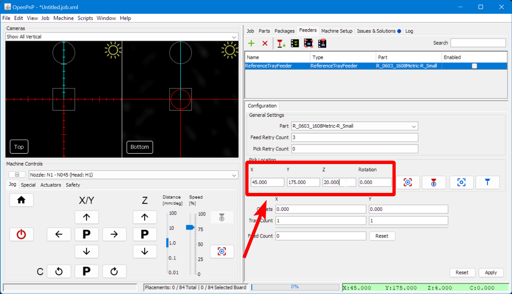

# Feeder Setup ([Video Guide](https://youtu.be/W0kdrxkkXUw?si=4_92zIogzx7Cs2Lq&t=512))

The FTP PCB has two different types of components: resistors and LEDs. We'll just be populating up the resistors to demonstrate disabling placements.

!!! Note "Powered Feeders"
    If you purchased any [8mm Photon Feeders](https://opulo.io/products/8mm-feeder), we highly recommend using them for populating the FTP board. Follow the instructions for **[setting them up](../../../feeders/1-overview/feeder-overview.md)** now, and then proceed to the [test run](../3-test-run/index.md) once complete.

## Mount a Strip Feeder

1. Use two M3x10 button head screws and two M3 wingnuts to secure the printed tray feeder through onto the staging plate using holes: C15 and E15.
  

1. For each component, cut a strip of component tape off the reel about 125mm long.

2. Slide the Resistors into the left-most tray feeder with the tape feed holes on the left. Slide the LEDs into the adjacent tray. Don't peel back the clear covering tape yet.

3. In OpenPnP, connect to your LumenPnP and home it.
  

## Add Feeders

1. Navigate to the `Feeders` tab in the top-right pane.
  

2. Click on the "Add Feeder" icon button.
  

3. Select `ReferenceTrayFeeder` and click `Accept`.
  

4. In the lower-right panel, you'll be in the `Configuration` tab. Change the `Part` to be `R_0603_1608Metric-R_Small`.
  

5. Set the `Y` `Offset` to `-4`. This is the space between components on the tape.
  

6. Set the `Y` `Tray Count` to `30`. This is the number of components available on the feeder before it needs to be manually moved forward.
  

7. Set the Pick location to: `X=45`, `Y=175`, `Z=20` as a starting point.
  

    !!! danger "Feeder rotation value"
        The `Rotation` field in feeder configuration sets the orientation that OpenPnP thinks the **component starts at in the tape**. If you find that your parts are placing with a consistent rotation offset, try adjusting this value (start with increments of 90 degrees) until your parts are placing with the correct orientation.

1. Click on the "Position Camera" icon button to move the top camera roughly over the left feeder.
  

1. Position the center of the top camera feed over the center of the top-most slot holding a resistor in the tray. You can drag the reticle in the camera feed, or use the jog buttons.
  

1.  Zoom in on the camera feed and *precisely* position the center of the reticle over the center of the slot holding the resistor. The resistor itself may not be perfectly centered, that is fine.
  

1.  Click the "Capture Camera Location" icon button to save the XY position of the start of the feeder.
  

1.  Click `Apply` to save the feeder settings
  

1.  Click the `Enable` checkbox in the feeder list.
  

1.  Do the same procedure again for the LED feeder. You'll assign the part `LED_0603_1608Metric-LED_Small` to the new feeder.

## Fine-tuning feeder height

1. Navigate to the `Feeders` tab in the top-right pane.
  

2. Select the feeder you want to start with and click on the "Position Nozzle" icon button to bring the nozzle over the feeder.
  

3. Use the Jog controls to lower the Z axis until the nozzle is touching the surface of the plastic tape cover.
  
  
  

4. Click on the "Capture Nozzle" icon button to save the new Z height of the feeder.
  

5. Jog the Z axis safely upwards, and then jog XY gantry away from the feeder.
  

6. Remove the tape cover from the feeder.
7. Click the "Pick" icon button to pick a component from the feeder. If the component is picked up properly, your Z-height is correct. If not, you should:
  

    1. Lower the Z height of the feeder by `0.1mm`
    2. Press Apply to save the change
    3. Home the machine
    4. Try picking a component from the feeder again.

    !!! warning "Effective Safe Z Coordinate Error"
        If you get an "Effective Safe Z coordinate" error as shown below, be sure that you've set the height of the part you're picking in the "Parts" tab.

        

1. After you've successfully picked a component, in the machine `Machine Controls` pane, switch to the `Special` Tab.
  

1. Recycle the component you've successfully picked up
  

1.  Copy the final Z height, select the other feeder, paste it for the other feeder, and press `Apply`
  

1.  Test picking a component from the other feeder
  

## Next Steps

Next is [running a test job](../3-test-run/index.md).
