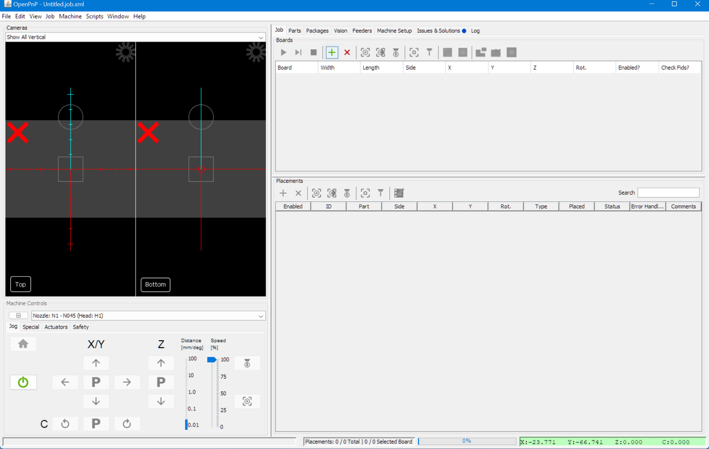
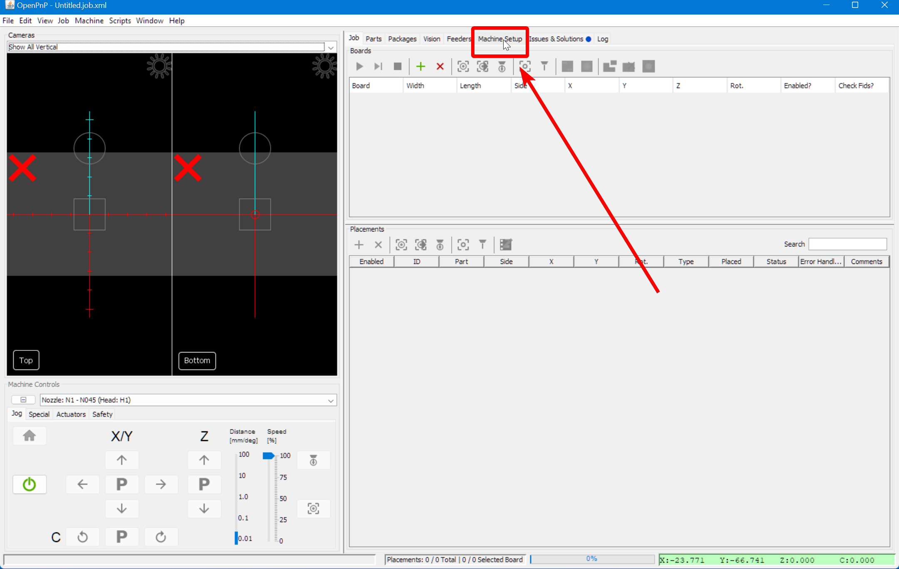
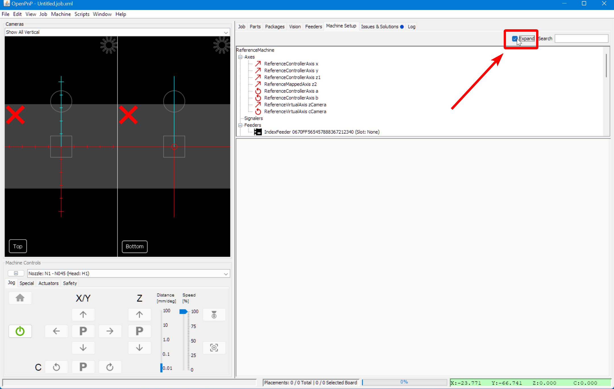
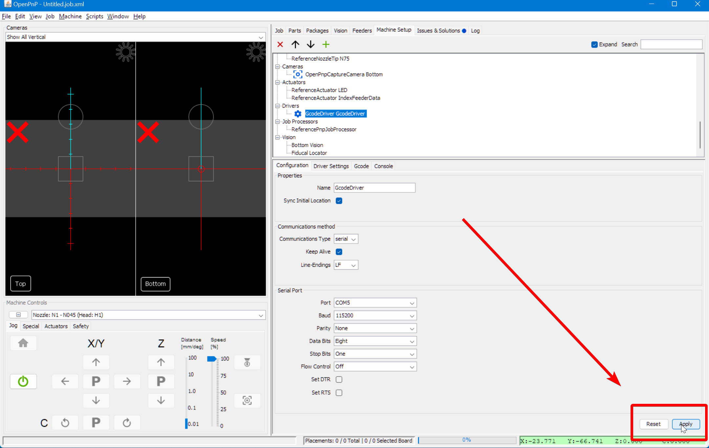
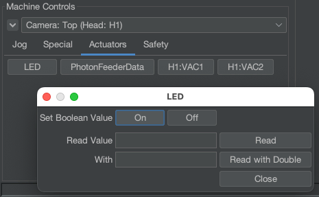
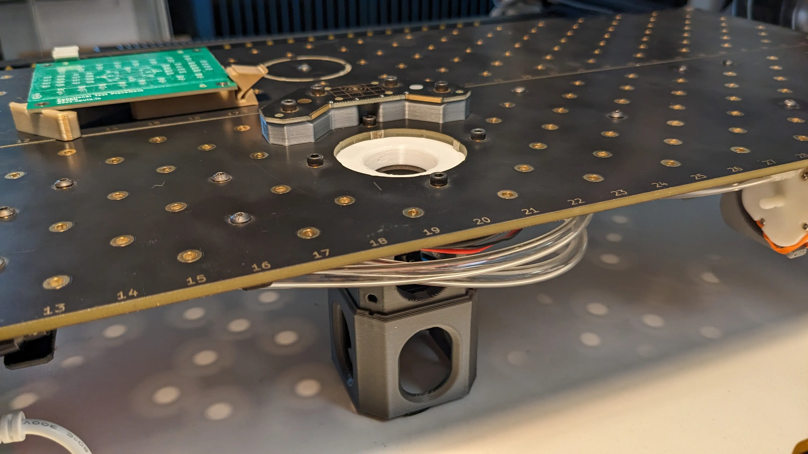
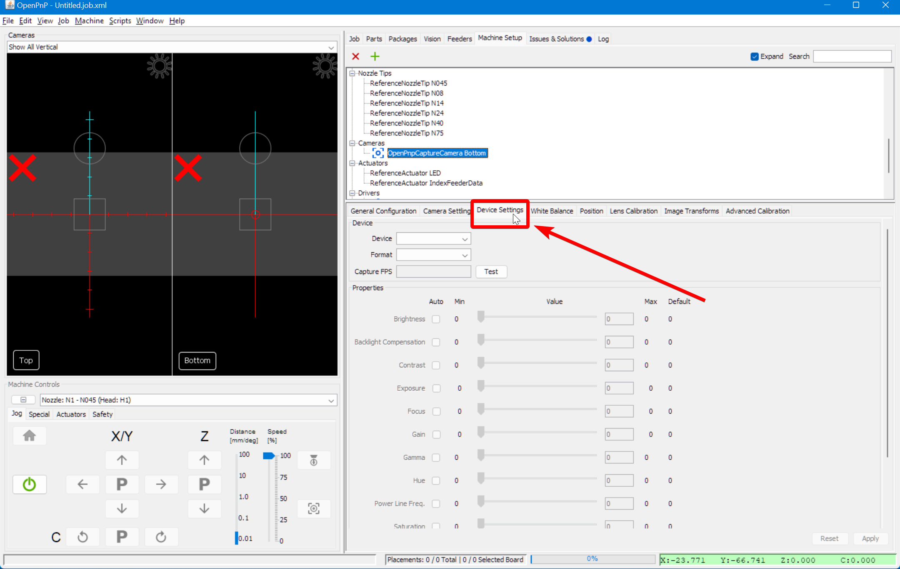
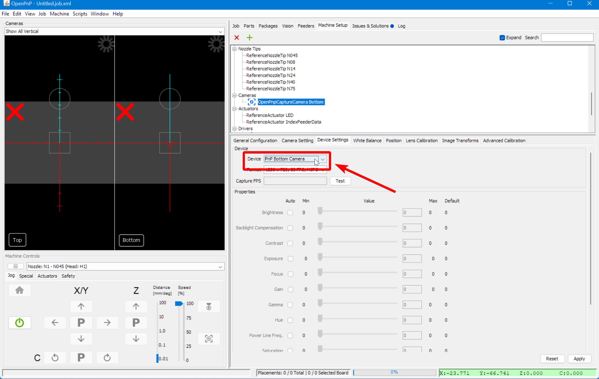

# Connecting to Your LumenPnP V3 ([Video Guide](https://youtu.be/h3mtEQfGMlM?si=EwPYDBEEKK8miH29&t=31))

**Now that OpenPnP is installed and the LumenPnP configuration files have been placed in the hidden system folder, OpenPnP can start with some basic preconfigured settings. The next step is to connect your LumenPnP and get familiar with OpenPnP’s user interface.**.

## Prepare for Connection

**Before launching OpenPnP, follow these guidelines to ensure a smooth connection**:

!!! warning "USB Connection Order Matters!"
    Always plug in your LumenPnP’s USB cable before launching OpenPnP.<br/><br/>
    If OpenPnP is already open, close it before connecting the USB.

!!! warning "Camera USB Ports"
    **Plug cameras directly into your computer using separate USB ports**.<br/><br/>
    Avoid USB hubs, as they may not provide enough bandwidth for the cameras.**Use separate USB ports directly into your computer**. The cameras require a lot of USB bandwidth, and many USB hubs aren't capable of handling it. For best results, make sure each camera is plugged into a different USB port directly into your computer, ideally on different internal USB hubs.

---

## Connecting to Your LumenPnP V3

Follow these steps in order:

    !!! danger "Always Plug In Barrel Jack First"
         Always plug in the barrel jack before USB power. This ensures the proper power up sequence for the LumenPnP motherboard. When plugging in the barrel jack, *always* make sure the USB type B connector is unplugged.

1. **Ensure OpenPnP is closed**.

1. **Power the LumenPnP** by plugging in the barrel jack power cable.

1. **Connect the LumenPnP** to your computer using the included USB cable.

1. **Connect both cameras** using their USB cables.

1. **Launch OpenPnP**. You should now see the OpenPnP user interface:<br/><br/>
  
<br/><br/>

---

## Configuration the Serial Port

**Before OpenPnP can communicate with the LumenPnP, we need to set the correct serial port**.

1. **Open Machine Setup**
    * Click the `Machine Setup` tab, toward the top right section of OpenPnP.<br/><br/>
     
<br/><br/>

1. **Expand the Configuration Trees**
    * Check the `Expand` checkbox toward the top right of OpenPnP to show all machine configuration options.
    * This will expand all of the categories, and sub-categories, in the upper pane of `Machine Setup` and will require you to scroll to see all of the options mentioned below.<br/><br/>
     
<br/><br/>

1. **Select the Gcode Driver**
    * In the upper pane, locate the newly expanded `Drivers` category and click on `GcodeDriver GcodeDriver`.<br/><br/>
     
<br/><br/>

1. **Choose the Correct Port**
    * Under the `Serial Port` section in the `Configuration` tab, select the correct `Port` from the dropdown menu:
        * **Windows**: The `Port` will be labeled as `COM#`. *(Examples COM1, COM2, COM3, etc.)*
        * **Mac**: Look for a `Port` in the format of `cu.usbmodemXXXX`, where `XXXX` is a series of numbers.
        * **Linux**: Select the `Port` formatted as `ttyACM#`. *(Examples ttyACM0, ttyACM1, ttyACM2, etc.)*<br/><br/>
     
<br/><br/>

1. **Apply and Save**
    * Click `Apply` in the lower right corner to save your changes.<br/><br/>
     
    * Save your OpenPnP configuration: `File > Save Configuration`.<br/><br/>
     

!!! info "Port Not Found?"

    If your machine's port isn't listed: 

       1. Ensure the USB cable is securely connected on both sides.
       
       2. Make sure the motherboard is powered on.
       
       3. Close OpenPnP, press the reset button on the control box, wait a few seconds, and reopen OpenPnP. 
       
       4. Finally, use our [Debug Tool](https://debug.opulo.io) and see if you are able to connect your LumenPnP there.
<br/><br/>

---

## Establishing a Serial Connection

1. **Connect OpenPnP to Your Machine**
    * Click the **green power button** in the `Machine Controls` section (Bottom left of OpenPnP).<br/><br/>
     
<br/><br/>

1. **Confirm Connection**
    * If successful, the green **power button will turn red**. This means OpenPnP has successfully connected to your machine.<br/><br/>
     <br/><br/>
    * If unsuccessful,review your [Serial Port Connection](#serial-port-configuration).
<br/><br/>

1. **Turn On Ring Lights**
    * In the bottom left corner of OpenPnP, go to `Machine Controls`.
    * Click the `Actuators` tab.
    * Click the `LED` button.
    * Then press `On`.<br/><br/>
     <br/><br/>
    * Close the LED window.
    * Switch back to the `Jog` tab so you are ready to move the nozzles in the following steps.

    !!! note "Keep Ring Lights On"
        Keep the ring lights on for the rest of calibration. All calibrations should be based on the lighting from the ring lights.
        Once calibration is complete and running a job on the LumenPnP, OpenPnP will automatically control the ring lights as needed, eliminating the need for manual operation during normal use.

---

## Preparing for Homing

1. **Level the nozzles before homing**.

    !!! danger "🚨 Critical Warning: Level Nozzles Before Homing 🚨"
        **Before pressing the homing button**—now and every time in the future—**you must ensure that your nozzles are level**.<br/><br/>
        ⚠️ **Failure to do this can cause crashes and potentially damage your machine.**<br/><br/>
        OpenPnP **does not** remember the previous nozzle positions from the last homing sequence, meaning it **cannot adjust movements based on past alignment**. If the nozzles are not level before homing, they may collide with the machine, leading to misalignment or serious hardware damage.<br/><br/>
      
<br/><br/>

1. Click the **Home button** to perform a rough homing sequence.
    * The Nozzles will move to X, Y, and Z zero positions **(front-left corner of the LumenPnP)** and park there.<br/><br/>
      <br/><br/>

!!! danger "If your machine does not move fully to the front left"
    If your LumenPnP does not move all the way to the front left of the machine when you click the Home icon, it could mean that your sensorless homing values need to be adjusted.

    Instructions for tuning this setting are [here](../../../guides/tuning-sensorless/index.md).

---

## Install the Nozzle Tips

1. **Locate Your Nozzle Tips and SuperLube tube**.
    * Find and remove the `N045` and `N24` nozzle tips in the nozzle rack located in your LumenPnP v3 packaging or mounted on the staging plate.
    * Remove the `SuperLube` Tube that is also in the LumenPnP V3 packaging.

     

1. **Lubricate both brass nozzles**.
    * Apply a small amount of **SuperLube** to the brass nozzles. This prevents damage to the rubber O-rings when mounting nozzle tips. We pre-lubricate them before shipping, but adding extra ensures longevity.<br/><br/>
     <br/><br/>

    !!! warning "Automatic Nozzle Tip Swapping"
        OpenPnP supports automatic nozzle tip swapping, but we don’t recommend it yet due to inconsistent performance. This feature will be improved in a future update, and the nozzle tip rack will be mounted on the staging plate. Most jobs can be completed using an `N045` on one nozzle and an `N24` on the other.
<br/><br/>

1. **Mount the `N045` Nozzle Tip**.
    * In OpenPnP, navigate to `Machine Setup > Heads > ReferenceHead H1 > Nozzles > ReferenceNozzle N1`.
    * Select the `Nozzle Tips` tab, and check the `Loaded?` checkbox for the `N045` row.
    * **Your machine will jog the head to the front of the machine** for easy tip loading.
    * A **”Task Interrupted:”** window will pop up. This is **not** an error! OpenPnP is just notifying you that the job has been stopped if one is running. This is normal and can be dismissed.<br/><br/>
     
     <br/><br/>
    * Slide the **N045 nozzle tip** (the one with the smaller opening) onto the **left nozzle** (using red tubing). Rotate the nozzle tip as you mount it to the brass nozzle to evenly distribute the lubricant around the O-rings. It should slide on and off smoothly after working it in.
     
<br/><br/>

1. **Mount the `N24` Nozzle Tip**.
    * In OpenPnP, navigate to `Machine Setup > Heads > ReferenceHead H1 > Nozzles > ReferenceNozzle N2`.
    * Select the `Nozzle Tips` tab, and check the `Loaded?` checkbox for the `N24` row.
    * **Don’t forget.** It will move to the second nozzle and you’ll see the **”Task Interrupted:”** popup window again.<br/><br/>
     <br/><br/>
    * Slide the N24 nozzle tip (the one with the larger opening) onto the **right nozzle** (using blue tubing). Rotate the nozzle tip as you mount it to the brass holder to ensure the grease works its way into the tip and around the O-rings. It should slide on and off easily after working it in.
     

    !!! Tip "Why These Nozzle Tips?"
        The **N045** and **N24 nozzle tips** cover the vast majority of parts **without needing swaps**. We highly recommend keeping them as the default and only swapping when absolutely (e.g., for very heavy parts).

---

## Configuring the Bottom Camera

Before calibration, the bottom camera and exposure must be set up properly. **We will need to install a nozzle tip and position it above the bottom camera to properly adjust the exposure**.

!!! Note
    More recent LumenPnP machines ship with a more recessed bottom camera, shown below. The images in our setup guides mostly show an older mounting solution, but either works the same.

    

1. **🚨 Remove Lens Caps 🚨**
    * ⚠️ Ensure both the **top and bottom cameras** have their lens caps removed.<br/><br/>
     
<br/><br/>

1. **Select the Bottom Camera in OpenPnP**
    * Navigate to `Machine Setup` > `Cameras` > `OpenPnpCaptureCamera Bottom`.<br/><br/>
     
<br/><br/>

1. **Choose the Correct Camera Device**
    * In the `Device Settings` tab, select `LumenPnP Bottom` from the `Device` dropdown.<br/><br/>
     
    * Switch to the `Device Settings` tab in the lower detail pane.<br/><br/>
     

    !!! info "Duplicate Camera Names"
        If two cameras appear with the same name, select one—if incorrect, choose the other. This is a bug within OpenPnP.
<br/><br/>

1. **Set Resolution and Frame Rate**
    * In the `Format` drop-down menu, select `1920x1080 5fps`. *A low frame rate is crucial to avoid bandwidth/performance issues*.<br/><br/>
     
<br/><br/>

1. **Apply and Verify**
    * Click `Apply` to save the **Bottom Camera** settings. One of the red "X"s in the camera feed should disappear. The image might be entirely black, but we'll fix that in the following steps.<br/><br/>
     
     
<br/><br/>

## Adjust Bottom Camera Exposure

!!! warning "Other Camera Settings"
    In the following step, **do not** modify any camera settings other than exposure. The default values should remain unchanged.

1. **Select Nozzle: N1**.
    * (If Nozzle: N1 is already centered over the bottom camera, please skip to step 4.)
    * From the `Machine Controls` dropdown, select `Nozzle: N1 - N045 (Head:H1)`.<br/><br/>
     <br/><br/>

1. **Positioning 'Nozzle: N1' Over the Bottom Camera**
    * Using the `Machine Controls`, jog `Nozzle: N1` to be anywhere **above the datum board** and lower `Nozzle: N1`, using the `Z-axis` controls, until it's just *barely* touching the datum board. (The very edge of the datum board has been ideal for easily seeing how close it is before Nozzle: N1 makes contact). This ensures the nozzle is at the correct Z-height for calibration.
    * **Keeping the Z-height unchanged, jog `Nozzle: N1` to be centered over the crosshair reticles in the bottom camera feed**.<br/><br/>
      //placeholder for photo
<br/><br/>

1. **Adjust the bottom camera exposure using the slider**.
    * Return to `Machine Setup > Cameras > OpenPnpCaptureCamera Bottom` to adjust the exposure. This will help us through the rest of the calibration.
    * 🚨 **Keep all other camera settings at their default value, and only adjust the exposure slider**.
    * In the `OpenPnpCaptureCamera Bottom` go to the `Device Settings` tab.
    * Located the `Exposure` slider and click on the check box labeled `Auto`. The camera will attempt to find the correct exposure.
    * Then, **uncheck** the `Auto` box to ensure we are now in "**manual adjustment**" mode.<br/><br/>
     <br/><br/>
    * Right click on the bottom camera's feed and select `Show Image Info?` to enable the image info card. This will give you the brightness histogram of the image.<br/><br/>
     <br/><br/>
    * In the next step, we'll be aiming for a **sharp peak on the right side** and a larger **cluster to the left** in the histogram. See the image below for reference.<br/><br/>
     {: style="width:60%;margin-left:10%;"}<br/><br/>
    !!! Warning "🚨 Important 🚨"
        The reference image below is just an example—**your histogram may look very different** depending on lighting conditions, camera placement, and other environmental factors. **Do not try to match it exactly.** Instead, focus on achieving the key characteristics: a distinct peak on the right and a noticeable cluster to the left. Adjust gradually until the image is clear and well-exposed.

1. **Set the Correct Exposure**.
    * Adjust the exposure slider, or enter varying manual exposure values, to ensure the camera can clearly detect the dark hole in the nozzle tip for calibration. The exposure should be balanced—bright enough to distinguish the nozzle tip from the background but not so bright that the hole becomes difficult to detect. Aim for a setting where the brightest areas are visible but do not appear completely white, and the darker areas remain well-defined. Use the following images as a reference for adjusting exposure:<br/><br/>
     
     
     <br/><br/>

    !!! caution "Not seeing anything in the bottom camera feed?"
        If you are not seeing anything after adjusting the bottom camera exposure, ensure the lens caps on the bottom camera has been removed.

    !!! danger "For Mac Users"
        On some Macs, If OpenPnP doesn’t allow exposure adjustments, use the open-source tool, [CameraController](https://github.com/Itaybre/CameraController).
<br/><br/>

1. **Record the Bottom Camera Exposure Value**
    * OpenPnP may not retain camera settings after restart **Record and save your exposure value** by saving them in a text file or writing them down.
    * This means every time you boot up OpenPnP you'll have to:
        * Toggle **Auto Exposure** `on`, then `off`. (This puts your camera into manual exposure mode)
        * **Type your recorded exposure value into the exposure field beside the slider**.
<br/><br/>

1. **Apply and Save**
    * Click `Apply` in the lower right corner to save your changes, if applicable.<br/><br/>
      <br/><br/>
    * Save your OpenPnP configuration now. `File > Save Configuration`.<br/><br/>
      <br/><br/>

---

## Configuring the Top Camera

The same thing needs to be done to the top camera, where the exposure must be set up properly. We'll connect to the top camera in this step and adjust the exposure in the next.

🚨 The **homing fiducial** is the 1mm dot in the center of the Opulo logo, located toward the center of the datum board. 🚨<br/><br/>
<br/><br/>

1. **Select the Top Camera in OpenPnP**
    * Navigate to `Machine Setup > Heads > ReferenceHead H1 > Cameras > OpenPnpCaptureCamera Top`.<br/><br/>
     
<br/><br/>

1. **Choose the Correct Camera Device**
    * In the `Device Settings` tab, select `LumenPnP Top` from the `Device` dropdown.<br/><br/>
     
<br/><br/>

1. **Set Resolution and Frame Rate**
    * In the `Format` dropdown menu, select `1920x1080 5fps`. *A low frame rate is crucial to avoid bandwidth/performance issues*.<br/><br/>
     
<br/><br/>

1. **Apply and Verify**
   * Click `Apply` to save the **Top Camera settings**. One of the red "X"s in the camera feed should disappear. The image might be entirely black, but we'll fix that in the following steps.<br/><br/>
     
<br/><br/>

1. **Save Your Configuration**
    * Save your OpenPnP configuration now. `File > Save Configuration`.<br/><br/>
      
<br/><br/>

---

## Next Steps

Now that your LumenPnP is connected and both cameras are configured, you're ready to proceed with setting up the homing fiducial and fine-tuning the top camera exposure. Continue to  [Homing Fiducial and Top Camera Exposure](../4-homing-fiducial/index.md).

<!--
!!! success "v3.1+ Speed Increase"

    If your machine is v3.1 or higher, your machine can move much faster than the default configuration because of the addition of linear rails, and use less current for the L and R motors with the addition of pneumatic rotation couplings.

      1. In the `Gcode` tab under your `GcodeDriver`, select `Default` in the `Head Mountable` dropdown, and `CONNECT_COMMAND` in the `Setting` dropdown. **Overwrite** the existing text in this field with the new settings below. Be sure to hit `Apply` to confirm your changes.

        ```
        G21 ; Set Millimeters Mode
        G90 ; Set absolute positioning mode
        M82 ; Set absolute mode for extruder
        M204 T5000 ; Set max travel acceleration
        M201 Y1500 ; Set max Y acceleration
        M201 X2000 ; Set max X acceleration
        M203 X1000 Y1000 ; Set max feedrate in mm/min
        M906 Y1000 ; Set Y motor current
        M906 X800 ; Set X motor current
        M906 A200 ; Set L motor current
        M906 B200 ; Set R motor current
        M569 S0 X Y ; Switches to SpreadCycle
        ```

        Your settings should look similar like the image below:

        

      2. Next, under the `Setting` dropdown, choose the `HOME_COMMAND` option. **Overwrite** the existing text in this field with the new settings below. Be sure to hit `Apply` to confirm your changes.

        ```
        M569 S1 X Y ; Switches to StealthChop
        M201 Y1500 ; Set Max Y Acceleration
        M201 X2000 ; Set Max X Acceleration
        M906 Y400 ; Set Y motor current
        M906 X200 ; Set X motor current
        M914 X50 Y30 ; Set Homing Sensitivity
        G28 ; Home all axis
        M569 S0 X Y ; Switches back to SpreadCycle
        M201 Y2500 ; Set Max Y Acceleration
        M201 X3000 ; Set Max X Acceleration
        M906 Y1000 ; Set Y motor current
        M906 X800 ; Set X motor current
        ```

      3. To tell OpenPnP to take advantage of this speed increase, you can update the `Max Feed Rate` field in the `Driver Settings` tab. Enter `35000` into this field.

      4. If you need to tweak your sensorless homing settings, make sure to adjust the values in the line starting with `M914` under `HOME_COMMAND`, *not* under `CONNECT_COMMAND`. -->