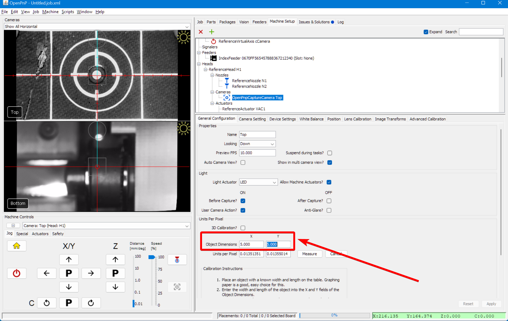
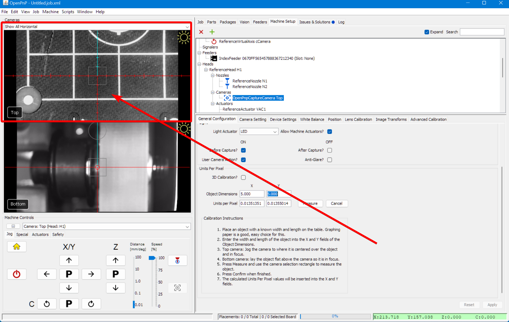
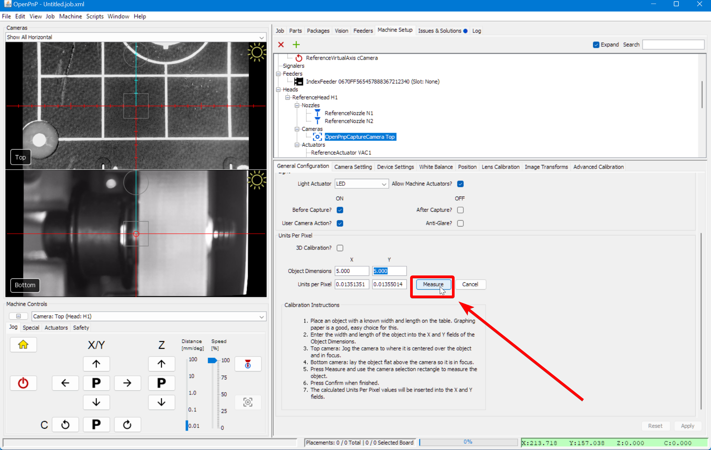
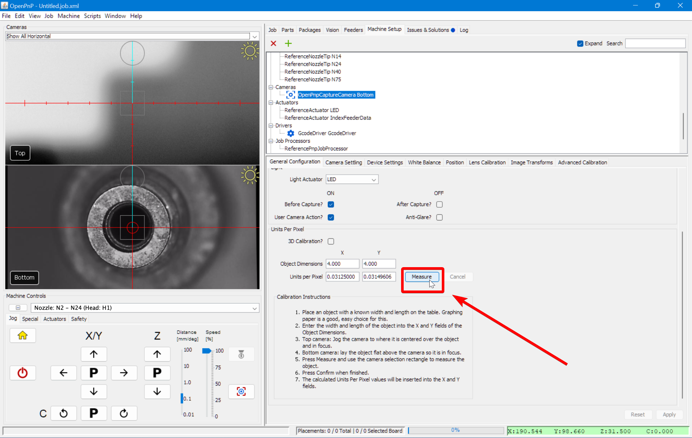
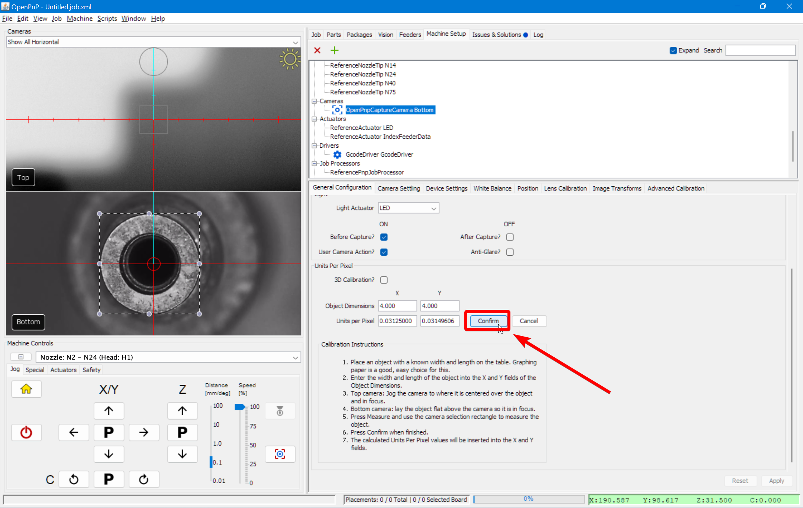

# MM/Pixel ([Video Guide](https://youtu.be/h3mtEQfGMlM?si=WXlOSWQ4RWR7R7zD&t=1002))

This next step calibrates the relationship between pixels and millimeters to make our cameras more accurate.

## Top Camera Calibration

In this step, we will calibrate the mm/pixels for the **Top Camera**. This requires us to set the dimensions and use a virtual bounding box to outline and measure one of the squares on the datum board, known as a golden guideline square. This allows us to calibrate the **top camera’s Units per pixel**, giving us accurate top camera movement.

1. **Navigate to ReferenceHead H1**.
    * In OpenPnP, go to `Machine Setup > Heads > ReferenceHead H1`.  
     
  

1. **Position the Camera over the Datum Board**.
    * Click on the "Position Camera over location" icon button shown below. This will move the top camera to where your datum board is mounted.  
     
  

1. **Select the Top Camera**.
    * Navigate to `Machine Setup > Heads > ReferenceHeadH1 > Cameras > OpenPnPCaptureCamera Top`.  
     
  

1. **Click on the `General Configuration` tab**.  
     
  

1. **Scroll down to the** `Units Per Pixel` **section**.
    * Locate the Object Dimension Fields for **X** and **Y**.  
     
  

1. **Set the Object Dimensions**.
    * In the **X** Object Dimension field, enter `5`.
    * In the **Y** Object Dimension field, enter `5`.
    * Double-check that both **X and Y** are set correctly before proceeding.  
     
  

1. **Locate a calibration square to be measured**.
    * Jog the machine until a **golden guideline square** is fully visible in the top camera view. The square should be roughly centered in the camera's reticles. The whole square must be visible. If necessary, use the scroll wheel to zoom out and ensure the entire square is visible.
    * In `Machine Controls`, you can adjust the `Distance Slider` to jog in larger or smaller increments when locating the golden guideline square.  
     
  

1. **Align and Measure**.
    * locate and click the `Measure` button.  
       
    * Click and drag in the camera view to create a bounding box. Align it with the center of the golden guideline square to align with the lines along its edge. The square is exactly 5mm x 5mm.
     

    !!! Note "Squareness"
        Don't worry if the box's square doesn't perfectly align with the camera image. Any slight skew will be adjusted for during jobs with fiducial calibration.
  

1. **Finalize Calibration**.
    * Once you have it perfectly outlined, click the `Measure` button again to update the Units Per Pixel values.  
       
    * Click `Apply` in the lower right corner to save your changes.  
       
    * Save your OpenPnP configuration now. `File > Save Configuration`.  
        

  

1. **Confirm Top Camera Calibration**.
    * First, ensure your top camera view is fully zoomed out.
    * Click and drag the center reticle (located in the middle of the camera feed) to one of the corners of the Golden Guideline Square.
    * If the mm/pixel calibration is correct, the **Top Camera** will move to be precisely over your chosen corner.

---

## Bottom Camera Calibration

The following steps will calibrate the mm/pixels for the **Bottom Camera**. This requires us to set the dimensions and use a virtual bounding box to outline the nozzle tip. This allows us to calibrate the **bottom camera’s Units per pixel**, giving us accurate bottom camera movement.

1. **Rehome your machine using the home button**.
    * The LumenPnP will attempt to scan the homing fiducial with the top camera, and scan both nozzle tips with the bottom camera. If it fails, that is okay.
    !!! warning "Too Many Vision Misdetects…"
        Don't worry if you receive a warning stating “Too many vision misdetects…”; this is expected. This means that the bottom camera’s exposure has not yet been fine-tuned to detect the N045 and N24 nozzle tips. This will be corrected in the following steps, so you can safely ignore the warning.

1. **Select the bottom Camera**.  
       
    * In the drop-down under `Machine Controls`, select `Nozzle: N2 - N24 (Head: H1)` to control the nozzle on the right. This way, for any nozzle commands we run, OpenPnP knows to base them on Nozzle: N2 and **not** the other nozzle.  
     
  

1. **Manually adjust the Nozzle to be over the Bottom Camera**.
    * Using the controls at the bottom left of OpenPnP, jog `Nozzle: N2` (right toolhead) to roughly the center of the Datum board, positioning it near the edge closest to the bottom camera. This placement makes it easier to see the nozzle tip's proximity to the Datum board as you lower it.
    * Lower the `Nozzle: N2` so that it’s just barely touching the top surface of the Datum Board.
    * **Keep the nozzle at this Z height** and carefully use the jog controls to move it directly over the **center of the bottom camera’s reticle**.  
     
     
     
  

1. **Go to the `General Configuration` tab**.
    * Navigate to `Machine Setup > Cameras > OpenPnPCaptureCamera Bottom`
    * Select the `General Configuration` tab.  
     
  

1. **Scroll down to the** `Units Per Pixel` **section**.
    * Locate the Object Dimension Fields for **X** and **Y**.  
     
  

1. **Set the Object Dimensions**
    * In the **X** Object Dimension field, enter `4`.
    * In the **Y** Object Dimension field, enter `4`.
    * Double-check that both **X and Y** are set correctly before proceeding.  
     
  

1. **Align and Measure**
    * locate and click the `Measure` button.  
       
    * Click and drag in the camera view to create a bounding box. Align it with the center of the nozzle tip so that it's **perfectly tangent to the edges** as shown in the image.  
     
  

1. **Finalize Bottom Camera Calibration**
    * Once you have it perfectly outlined, click the `Measure` button again to update the Units Per Pixel values.  
       
    * Click `Apply` in the lower right corner to save your changes.  
       
    * Save your OpenPnP configuration now. `File > Save Configuration`.  
      
  

1. **Confirm Bottom Camera Calibration**.
    * First, ensure your bottom camera view is fully zoomed out.
    * Jog the N2 nozzle tip away from the center, yet still visible by the bottom camera.
    * Click and drag the center reticle (located in the middle of the camera feed) to the middle of the nozzle tip.
    * The **Bottom Camera** should now be centered on the nozzle tip again.
    * If it's inaccurate, repeat the bottom camera calibration and confirm you are using the larger N24 nozzle tip on the nozzle on the right, Nozzle: N2.

---

## Next Steps

Next is [Nozzle Offset Calibration](../6-nozzle-offset/index.md).