# Feeder Setup ([Video Guide](https://youtu.be/W0kdrxkkXUw?si=4_92zIogzx7Cs2Lq&t=512))

Feeders hold and present components to the pick-and-place machine in a consistent manner. In this guide, we will focus on setting up an **8mm strip feeder** for resistors.

---

## Understanding Feeder Types

The FTP PCB uses two main types of components: resistors and LEDs. For this guide, we are focusing on resistors to illustrate how to disable placements effectively when needed.

!!! Note "Powered Feeders"
    If you purchased any [8mm Photon Feeders](https://opulo.io/products/8mm-feeder), we highly recommend using them for populating the FTP board. Follow the instructions for **[setting them up](../../../feeders/1-overview/feeder-overview.md)** now, and then proceed to the [test run](../3-test-run/index.md) once complete.

---

## Mounting a Strip Feeder

1. **Gather the necessary materials**.
    * Locate the 8mm strip feeder and mounting hardware from your Getting Started Kit.  
     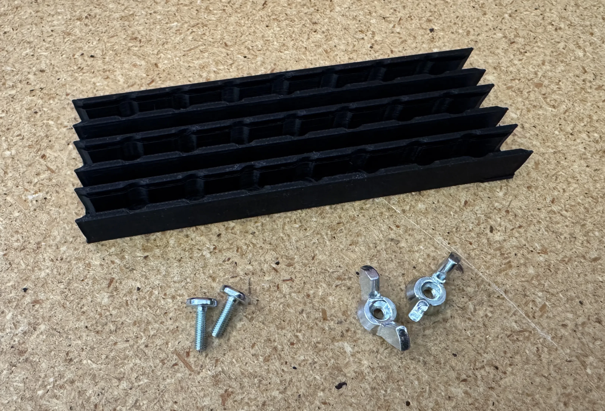
  

2. **Position the feeder correctly**.
    * Place the strip feeder onto the staging plate, aligning it with columns 14, 15, and 16.  
     
  

3. **Secure the feeder**.
    * Use the 2x M3 x 10mm super flat-head screws and M3 wingnuts to mount the strip feeder to your staging plate in holes `A15` and `G15`.  
     
     
  

4. **Load the resistors**.
    * Insert the provided resistors into the left-most track, ensuring that the tape holes are on the left. Do not remove the clear covering tape yet; it will ensure the components stay in place.  
     
     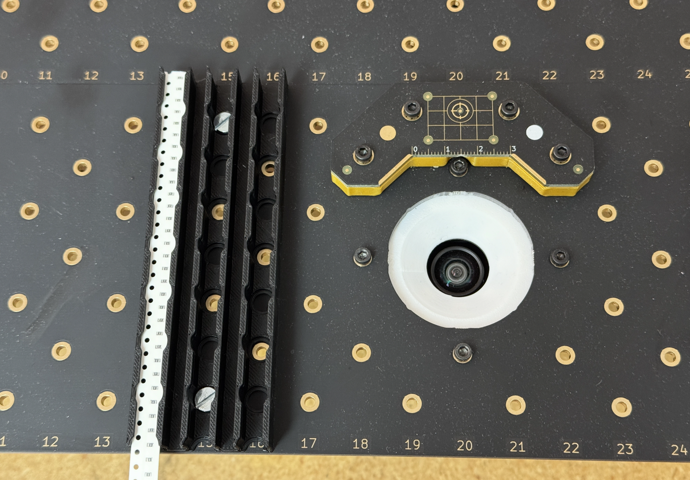
  

5. **Prepare OpenPnP**.
    * In OpenPnP, connect to your LumenPnP, verify that both nozzles are free from running into obstructions, and home the machine to set its starting position.  
     
  

---

## Adding Feeders in OpenPnP

Once the feeder is physically installed, it needs to be configured in OpenPnP so the machine knows where and how to pick components.
  

1. **Open the `Feeders` tab**.
    * It can be found in the top right pane. This section allows you to add and configure new feeders.  
     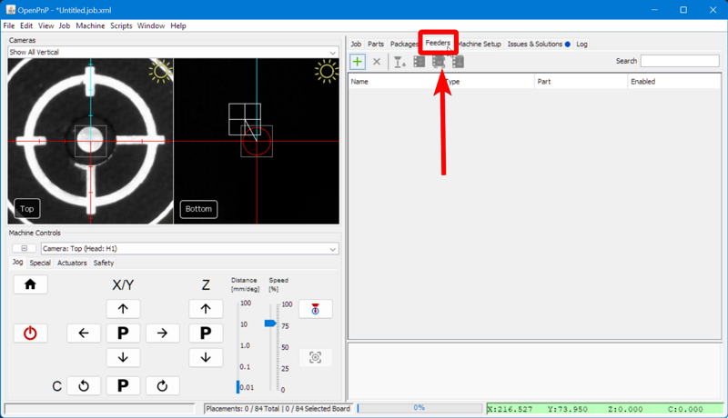
  

2. **Add a new feeder**.
    * Click on the "**Add Feeder**" icon button.  
     
  

3. **Choose the correct feeder type**.
    * Select `ReferenceTrayFeeder` and click `Accept`.  
     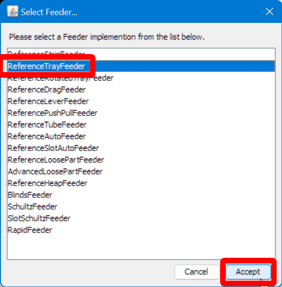
  

4. **Assign the correct component**.
    * In the `Configuration` tab, Set the `Part` field to `R_0603_1608Metric-R_Small`  
     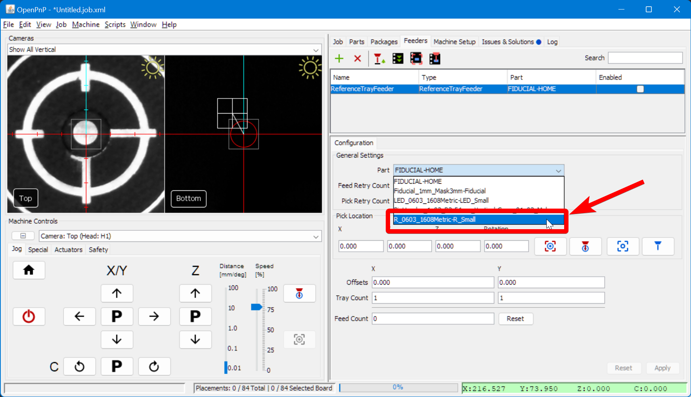
  

5. **Define feeder spacing**.
    * Set the `Y` `Offset` to `-4` to match the spacing between components on the tape.  
     
  

6. **Set feeder capacity**.
    * Set Enter `30` in the `Y` `Tray Count`, indicating the number of resistors available before advancing the tape manually.  
     
  

7. **Define pick location**.
    * Set the initial pick position to `X=130`, `Y=205`, `Z=20` as a starting point. These values act as a starting reference, which can be fine-tuned later.  
     
  

8. **Adjust rotation if needed**.
    * If components are placed incorrectly, modify the Rotation value in 90-degree increments until placement orientation is correct.
  

9. **Align the camera to the feeder**.
    * Use the `Position Camera` button to move the top camera roughly over the left feeder.  
     
  

10. **Fine-tune the alignment**.
    * Position the center of the top camera feed *precisely* over the center of the top-most slot holding a resistor in the tray. You can drag the reticle in the camera feed, or use the jog buttons. Don't forget, you want to align with the whole opening and **not** the resistor.  
     
     
  

11. **Save the feeder position**.
    * Click the "Capture Camera Location" icon button to lock in the XY position of the start of the feeder.  
     
  

12. **Apply and enable the feeder**.
    * Click `Apply` to save the feeder settings  
       
    * Click the `Enabled` checkbox in the feeder list.  
     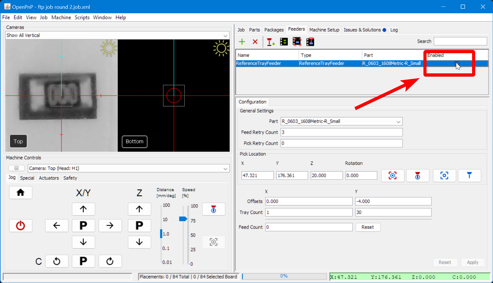  
    * Save your OpenPnP configuration now. `File > Save Configuration`.  
      
  

---

## Fine-Tuning Feeder Height

1. **Select the Nozzle**.
    * In `Machine Controls`, select `Nozzle: N1` from the dropdown. To confirm, this should have the `N045` nozzle tip installed.  
     
  

1. **Position nozzle: N1 over the feeder**.
    * Within the `Feeders` tab, select the feeder you just created and click on the `Position Nozzle` icon button to bring the nozzle over the feeder.
    * Within `Machine Controls`, use the jog controls to lower the Z axis until the nozzle is touching the surface of the plastic tape cover.  
     
     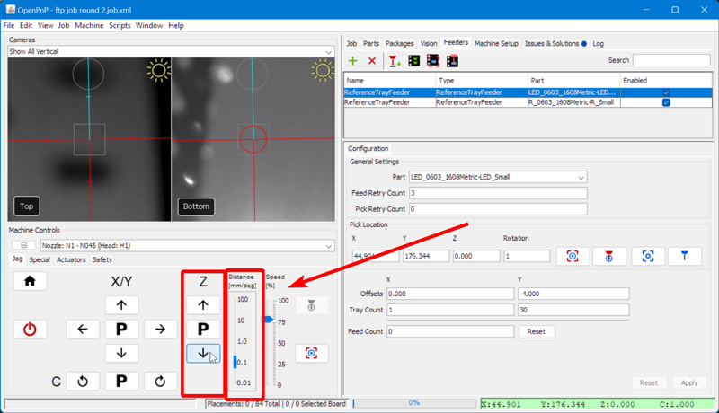
     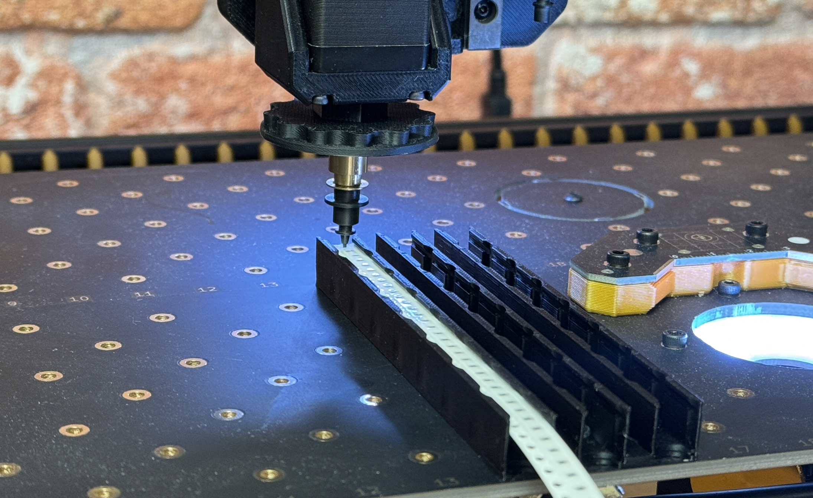
  

1. **Capture the Z height**.
    * Click the `Capture Nozzle` icon button to store the new feeder Z height value.  
     
  

1. **Apply and Save**.
    * Click `Apply` to save these changes to the feeder z height.  
        
    * Save your OpenPnP configuration now. `File > Save Configuration`.  
      
  

1. **Raise the nozzles to avoid collision**.
    * In `Machine Controls`, click the letter `P` between the **Z** up/down arrows to “**Park**” the nozzle at a safe height to prevent unwanted collisions.
    * Jog the nozzles away from the feeder using the arrows in `Machine Controls`. It does not matter where. This will prepare us to test picking parts in the next steps.  
     
  

1. **Test picking a component**.
    * Remove the cover tape.
    * Click the `Pick` icon button, seen below, to have the LumenPnP attempt to pick a component from the feeder.
    * If the component is picked up properly, your Z-height is correct.  
     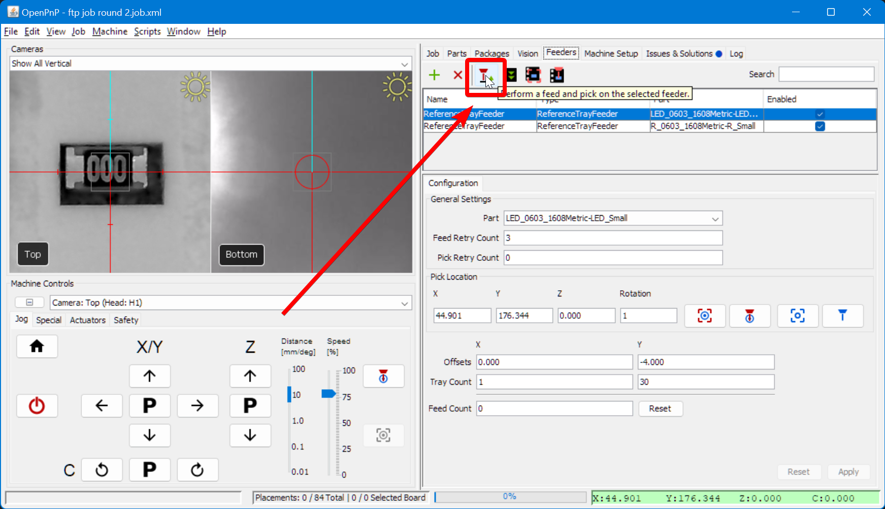  
    * If unsuccessful:
        * Lower the Z height of the feeder by `0.1mm`
        * Press `Apply` to save the change
        * Home the machine
        * Retry picking

    !!! warning "Effective Safe Z Coordinate Error"
        If you see an "Effective Safe Z Coordinate" error, ensure that the part height is correctly set in the Parts tab.  
         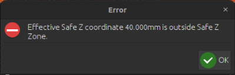
  

1. **Recycle test components**.
    * Once a pick is successful, switch to the `Special` Tab in the `Machine Controls` pane.  
     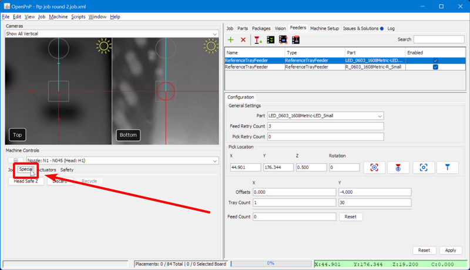  
    * Click the `Recycle` button to instruct the LumenPnP to return the picked component back to its original location in the feeder. This allows you to confirm that the picking and placing of components is functioning correctly without wasting parts.  
     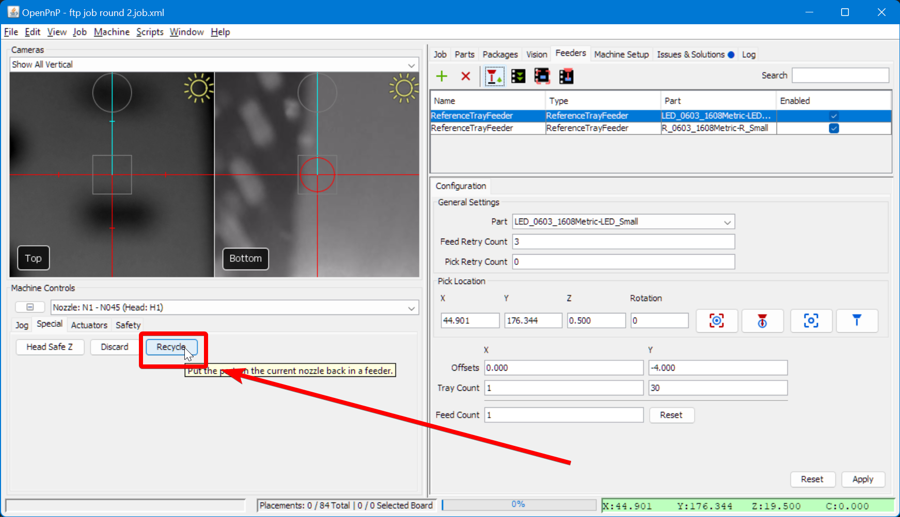
  

---

## Next Steps

Now that your feeder is properly set up and calibrated and you have your FTP PCB mounted and ready, let's verify that your LumenPnP is correctly processing through a job by performing a [Test Run](../3-test-run/index.md).
