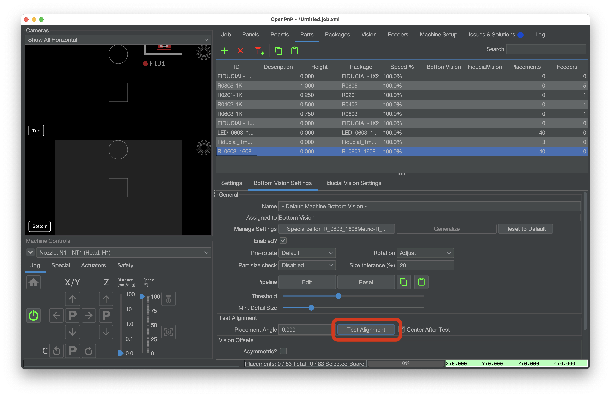

# Test Run ([Video Guide](https://youtu.be/W0kdrxkkXUw?si=lrCTfUXihKnD1p4D&t=993))

Before running the job, you'll test the bottom vision pipeline that is used to align components for more accurate placement.

## Test Bottom Vision

1. Pick a part from your feeder by selecting it in the table in the "Feeders" tab, and clicking on the "Feed and pick" button.

    

1. In the "Parts" tab, select the part you just picked and click the "Test Alignment" button.

    

1. Watch the bottom camera feed. Look for a red rectangle superimposed on the image. The rectangle should be perfectly hugging the component. If it is not, adjust your [part identification pipeline](../../vision-pipeline-adjustment/5-part-identification-pipeline.md) before proceeding.

    

## Step Through the Job

!!! danger "Home Your Machine"

    It is crucial that you home your machine before each job. The stepper motors in the LumenPnP de-power after being idle for a while, so rehoming ensures that the machine is aligned and positioned correctly for placement.

1. It's time to place your first component. First, ensure the board's `Check Fids?` checkbox is checked. Then, press the green "Play" button in the Job tab to start the job. This will initiate fiducial calibration. Once this is complete, click the "Pause" button. You can now use the "Single job step" button to proceed through the job step by step. The LumenPnP will go to pick a component, align it using the bottom camera, and place it on the board. Step through until a few parts are populated.

    

2. After a few parts are populated, move on to [debugging](../../debugging/index.md) to fine tune your calibration.
