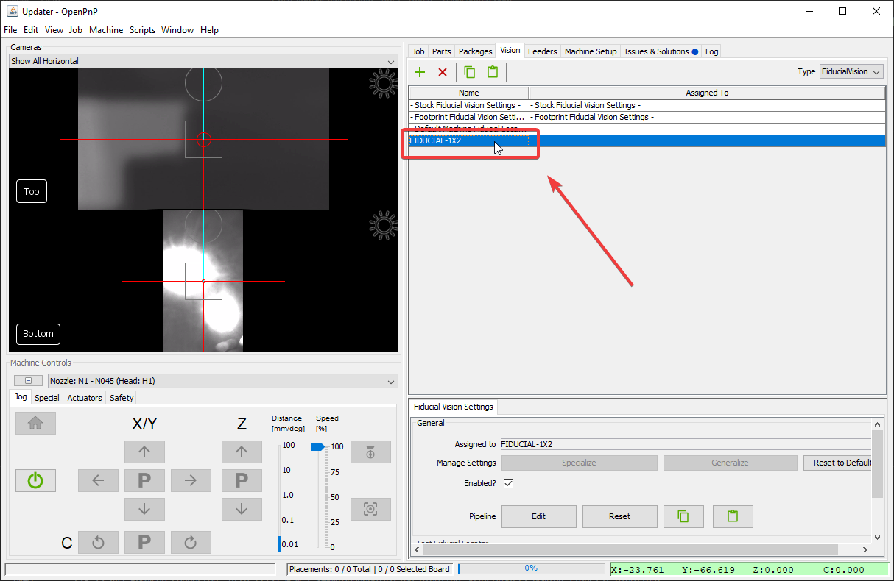

# PCB Fiducials Pipeline ([Video Guide](https://youtu.be/RVMS6vJzJyU?si=-dzIkANilr8o8j56&t=18))

Just like the homing fiducial, you'll use fiducial markers to identify the exact location of your boards. Tuning them is the same process, just in a different place in the OpenPnP UI.

1. Go to the `Vision` tab.

    

2. Select on `FiducialVision` from the type dropdown.

    

3. Select `FIDUCIAL-1X2` from the pipeline list (or whichever pipeline is assigned to your board's fiducial).

    

4. Click on Pipeline `Edit`.

    

5. Continue with the same procedure as the [Homing Fiducial Pipeline](2-homing-fiducial-pipeline.md#check-the-debug-results) section.
