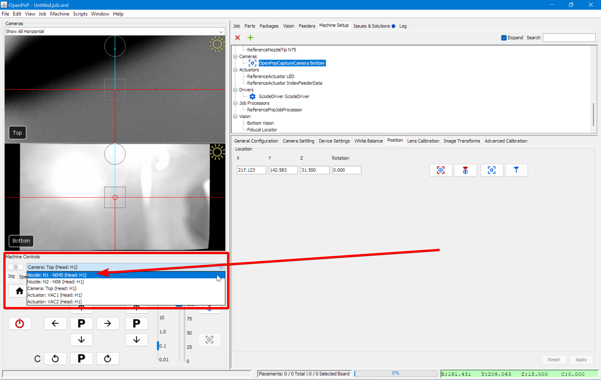
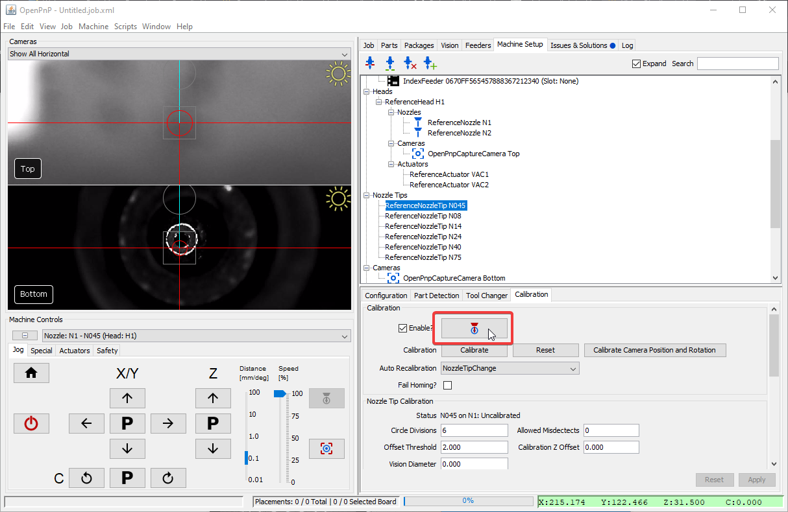
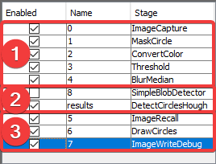
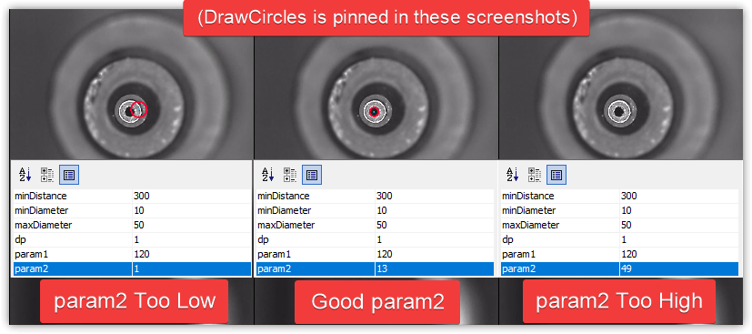

# Nozzle Calibration Pipeline ([Video Guide](https://youtu.be/RVMS6vJzJyU?si=c-ta9EFDhIMdvlam&t=249))

If you receive the error message `Nozzle tip calibration: not enough results from vision. Check pipeline and threshold` when homing your LumenPnP, you likely need to adjust your nozzle tip calibration pipeline. Follow the steps below for a guide on the iterative approach. See also our [setup video](https://youtube.com/watch?v=CSnczX6VJ7M&si=EnSIkaIECMiOmarE&t=1875).

  

---

## Position Nozzle Over Bottom Camera

1. Click on the `Machine Setup` tab in the top right pane.<br/><br/>
     
<br/><br/>

1. If necessary, click on the "Expand" checkbox.<br/><br/>
     
<br/><br/>

1. Navigate to `Heads > ReferenceHead H1 > Nozzles > ReferenceNozzle N1`<br/><br/>
     
<br/><br/>

1. Select the `Nozzle Tips` tab.<br/><br/>
     
<br/><br/>

1. Ensure the `Loaded?` checkbox for nozzle tip N045 is checked.<br/><br/>
     
<br/><br/>

1. Continue to `Nozzle Tips > ReferenceNozzleTip N045` (or the nozzle you're tuning).<br/><br/>
     
<br/><br/>

1. Click on the `Calibration` tab.<br/><br/>
     
<br/><br/>

1. Home your LumenPnP to ensure accurate toolhead positioning. Ignore the `Nozzle tip calibration: not enough results from vision. Check pipeline and threshold` error if it appears.<br/><br/>
     
<br/><br/>

1.  From the machine controls dropdown, select `Nozzle: N1 - N045 (Head:H1)`<br/><br/>
     
<br/><br/>

1.  Click the `Position tool over location` button to bring the left nozzle above the bottom camera.<br/><br/>
     
<br/><br/>

1.  Click `Edit` in the Pipeline section.<br/><br/>
     

---

## Edit the pipeline

### Circular symmetry method

!!! warning "Check your pipeline version"

      If your vision pipeline doesn't look like the image below, you still have the old version of detecting nozzle tips. You can easily update your vision pipeline as follows.

      

      1. Click the "Copy" button in the code block below for the relevant nozzle tip to save the vision pipeline to your clipboard.

        === "N045"
            ```xml
            <cv-pipeline>
              <stages>
                  <cv-stage class="org.openpnp.vision.pipeline.stages.ImageCapture" name="image" enabled="true" default-light="true" settle-option="Settle" count="1"/>
                  <cv-stage class="org.openpnp.vision.pipeline.stages.MaskCircle" name="mask" enabled="true" diameter="100" property-name="MaskCircle"/>
                  <cv-stage class="org.openpnp.vision.pipeline.stages.DetectCircularSymmetry" name="cir" enabled="true" min-diameter="5" max-diameter="25" max-distance="250" search-width="0" search-height="0" max-target-count="1" min-symmetry="1.2" corr-symmetry="0.0" outer-margin="0.2" inner-margin="0.4" sub-sampling="8" super-sampling="1" symmetry-score="OverallVarianceVsRingVarianceSum" property-name="" diagnostics="true" heat-map="true"/>
                  <cv-stage class="org.openpnp.vision.pipeline.stages.ConvertModelToKeyPoints" name="results" enabled="true" model-stage-name="cir"/>
              </stages>
            </cv-pipeline>
            ```

        === "N08"
            ```xml
            <cv-pipeline>
              <stages>
                  <cv-stage class="org.openpnp.vision.pipeline.stages.ImageCapture" name="image" enabled="true" default-light="true" settle-option="Settle" count="1"/>
                  <cv-stage class="org.openpnp.vision.pipeline.stages.MaskCircle" name="mask" enabled="true" diameter="200" property-name="MaskCircle"/>
                  <cv-stage class="org.openpnp.vision.pipeline.stages.DetectCircularSymmetry" name="cir" enabled="true" min-diameter="20" max-diameter="35" max-distance="250" search-width="0" search-height="0" max-target-count="1" min-symmetry="2.0" corr-symmetry="0.0" outer-margin="0.2" inner-margin="0.4" sub-sampling="8" super-sampling="1" symmetry-score="OverallVarianceVsRingVarianceSum" property-name="" diagnostics="true" heat-map="true"/>
                  <cv-stage class="org.openpnp.vision.pipeline.stages.ConvertModelToKeyPoints" name="results" enabled="true" model-stage-name="cir"/>
              </stages>
            </cv-pipeline>
            ```

        === "N14"
            ```xml
            <cv-pipeline>
              <stages>
                  <cv-stage class="org.openpnp.vision.pipeline.stages.ImageCapture" name="image" enabled="true" default-light="true" settle-option="Settle" count="1"/>
                  <cv-stage class="org.openpnp.vision.pipeline.stages.MaskCircle" name="mask" enabled="true" diameter="200" property-name="MaskCircle"/>
                  <cv-stage class="org.openpnp.vision.pipeline.stages.DetectCircularSymmetry" name="cir" enabled="true" min-diameter="35" max-diameter="55" max-distance="250" search-width="0" search-height="0" max-target-count="1" min-symmetry="1.2" corr-symmetry="0.0" outer-margin="0.2" inner-margin="0.4" sub-sampling="8" super-sampling="1" symmetry-score="OverallVarianceVsRingVarianceSum" property-name="" diagnostics="true" heat-map="true"/>
                  <cv-stage class="org.openpnp.vision.pipeline.stages.ConvertModelToKeyPoints" name="results" enabled="true" model-stage-name="cir"/>
              </stages>
            </cv-pipeline>
            ```

        === "N24"
            ```xml
            <cv-pipeline>
              <stages>
                  <cv-stage class="org.openpnp.vision.pipeline.stages.ImageCapture" name="image" enabled="true" default-light="true" settle-option="Settle" count="1"/>
                  <cv-stage class="org.openpnp.vision.pipeline.stages.MaskCircle" name="mask" enabled="true" diameter="200" property-name="MaskCircle"/>
                  <cv-stage class="org.openpnp.vision.pipeline.stages.DetectCircularSymmetry" name="cir" enabled="true" min-diameter="70" max-diameter="90" max-distance="250" search-width="0" search-height="0" max-target-count="1" min-symmetry="1.2" corr-symmetry="0.0" outer-margin="0.2" inner-margin="0.4" sub-sampling="8" super-sampling="1" symmetry-score="OverallVarianceVsRingVarianceSum" property-name="" diagnostics="true" heat-map="true"/>
                  <cv-stage class="org.openpnp.vision.pipeline.stages.ConvertModelToKeyPoints" name="results" enabled="true" model-stage-name="cir"/>
              </stages>
            </cv-pipeline>
            ```

        === "N40"
            ```xml
            <cv-pipeline>
              <stages>
                  <cv-stage class="org.openpnp.vision.pipeline.stages.ImageCapture" name="image" enabled="true" default-light="true" settle-option="Settle" count="1"/>
                  <cv-stage class="org.openpnp.vision.pipeline.stages.MaskCircle" name="mask" enabled="true" diameter="200" property-name="MaskCircle"/>
                  <cv-stage class="org.openpnp.vision.pipeline.stages.DetectCircularSymmetry" name="cir" enabled="true" min-diameter="40" max-diameter="85" max-distance="250" search-width="0" search-height="0" max-target-count="1" min-symmetry="1.2" corr-symmetry="0.0" outer-margin="0.2" inner-margin="0.4" sub-sampling="8" super-sampling="1" symmetry-score="OverallVarianceVsRingVarianceSum" property-name="" diagnostics="true" heat-map="true"/>
                  <cv-stage class="org.openpnp.vision.pipeline.stages.ConvertModelToKeyPoints" name="results" enabled="true" model-stage-name="cir"/>
              </stages>
            </cv-pipeline>
            ```

        === "N75"
            ```xml
            <cv-pipeline>
              <stages>
                  <cv-stage class="org.openpnp.vision.pipeline.stages.ImageCapture" name="image" enabled="true" default-light="true" settle-option="Settle" count="1"/>
                  <cv-stage class="org.openpnp.vision.pipeline.stages.MaskCircle" name="mask" enabled="true" diameter="200" property-name="MaskCircle"/>
                  <cv-stage class="org.openpnp.vision.pipeline.stages.DetectCircularSymmetry" name="cir" enabled="true" min-diameter="40" max-diameter="70" max-distance="250" search-width="0" search-height="0" max-target-count="1" min-symmetry="1.2" corr-symmetry="0.0" outer-margin="0.2" inner-margin="0.4" sub-sampling="8" super-sampling="1" symmetry-score="OverallVarianceVsRingVarianceSum" property-name="" diagnostics="true" heat-map="true"/>
                  <cv-stage class="org.openpnp.vision.pipeline.stages.ConvertModelToKeyPoints" name="results" enabled="true" model-stage-name="cir"/>
              </stages>
            </cv-pipeline>
            ```

1. Check the output of the `mask` stage. This stage blacks out unnecessary parts of the image to reduce false detections. This reduces the chance that the pipeline will find a different circle in the image and detect it as the homing fiducial. Click on this stage to view and adjust its `diameter` settings.

    * A diameter too large could allow other potential circles into the image and could be erroneously detected by the pipeline. A diameter too small could potentially mask out the actual homing fiducial.<br/><br/>
    

1. Check the output of the `cir` stage of the pipeline. This stage looks for circular symmetry in the image, and outputs a colored heatmap showing where it thinks the center of circular symmetry is. The goal is to have this stage put the brightest, most yellow point of the heatmap in the center of the homing fiducial. Click on this stage to view its settings.

    * If OpenPnP detects circular symmetry, you will see a line similar to: `Circle [x=639.5, y=361.5, diameter=78.0, score=133.06040353848752]` in the field in the bottom right of the window. This means OpenPnP found circular symmetry, and it tells you about the circle that it found.<br/><br/>
    

    * If no circles are detected, adjust the max diameter circle so that it can find larger ones. Increasing the value for `maxDiameter` will tell the stage to accept circles of a larger diameter.

### Detect Circles Method (Legacy)

!!! warning "Legacy Method"
    If your pipeline looks like this, we recommend you switch to the [circle symmetry method](#circular-symmetry-method).

#### Stage Breakdown



1. Stages 0-4 pre-process the image from the camera to make the tip of the nozzle clearer. Their goal is to outline the tip of the nozzle on its own so that it's exact position can be calculated. Of these stages, #3, `Threshold` is the most useful to tune. (See below for details)
2. The Results stage, `DetectCirclesHough`, takes the highlighted nozzle tip and calculates it's exact location by fitting a perfect circle to the tip. It's important that this calculation be reliable and repeatable. It's also important not to have extra erroneous circles detected, which could throw off the nozzle tip calibration and lead to imprecise picking.
3. Stages 5-7 are for debugging and showing you visually the output of the Results Stage. The most useful stage here is the #6 `DrawCircles` stage. After adjusting a setting, review the `DrawCircles` stage and check if the fiducial has been correctly identified.

!!! Tip
    It may be helpful to pin the `DrawCircles` stage so you can see the results of the pipeline. This saves you having to click back and forth between stages while making adjustments.
    

#### General Strategy

To reliably detect nozzle tips, tune the pipeline to recognize the internal hole of the nozzle tip rather than its outer edge.<br/><br/>
<br/><br/>

* **Multiple or incorrect circles detected**: Adjust filtering until only the correct homing fiducial is found. We need to more clearly distinguish the real nozzle tip.
* **No circle detected** Adjust detection settings to improve identification.
* If the image looks like the reference image, your pipeline is properly tuned.

Since each LumenPnP can have unique lighting conditions, tuning requires an iterative approach. Make small changes and observe the impact on detection.

!!! Note "Check the Debug Results"
    Unlike [homing fiducial tuning](2-homing-fiducial-pipeline.md), nozzle tip tuning needs to be able to identify the nozzle multiple times as it is rotated. This can make it slightly trickier to see the issues with your calibration pipeline. You may need to run a round of calibration and watch the results live to see which orientation of the toolhead gives the pipeline the most trouble. You can also increase the `Allowed Misdetects` option if you're getting good picking results, but homing still fails occasionally.
     <br/><br/>

#### Threshold Tuning

The `Threshold` stage converts the image to black and white, clearly defining the nozzle tip. Ensure the inner hole appears as a distinct white circle. Raise or lower the `threshold` parameter as necessary until the image is precise. (Note that the `invert` button is checked so that the nozzle tip hole is shown in white for the next steps.)

* If the image is too dark, raise the `threshold` value.
* If the image is too bright, lower the `threshold` value.<br/><br/>
  <br/><br/>

#### DetectCirclesHough Tuning

`DetectCirclesHough` is the other commonly edited stage. You'll need to experiment with the following adjustments:

`param2` adjusts how likely the algorithm will be to detect a circle.

* If there are no circles, lower the `param2` setting.
* If there are too many circles, raise the `param2` setting.<br/><br/>
  <br/><br/>

Depending on your nozzle tip, may also need to adjust the `maxDiameter` setting.

* Raise the `maxDiameter` setting if there are no circles detected at all after adjusting the other settings.
* Lower the `maxDiameter` setting if very large circles are drawn around noise in the image.<br/><br/>
  <br/><br/>

#### BlurMedian Tuning

`BlurMedian` can be useful if there are debris blocking the inner hole of your nozzle tip. That debris can cause the round silhouette of the hole to be interrupted and not be identified by the `DetectCirclesHough` stage. Use `BlurMedian` to remove artifacts in the photo, but don't blur so much that you significantly change the silhouette of the nozzle.<br/><br/>
<br/><br/>

1. Raise the `kernelSize` if the center of your nozzle tip doesn't make a perfect circle.
2. Lower the `kernelSize` if the center of your nozzle tip is distorted from too much blur.
