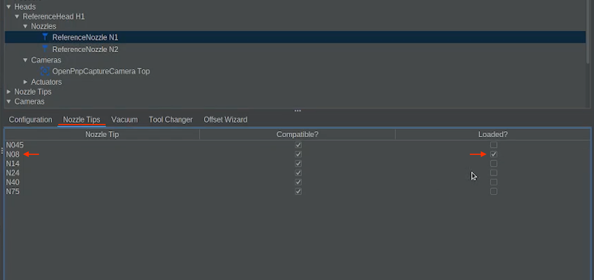
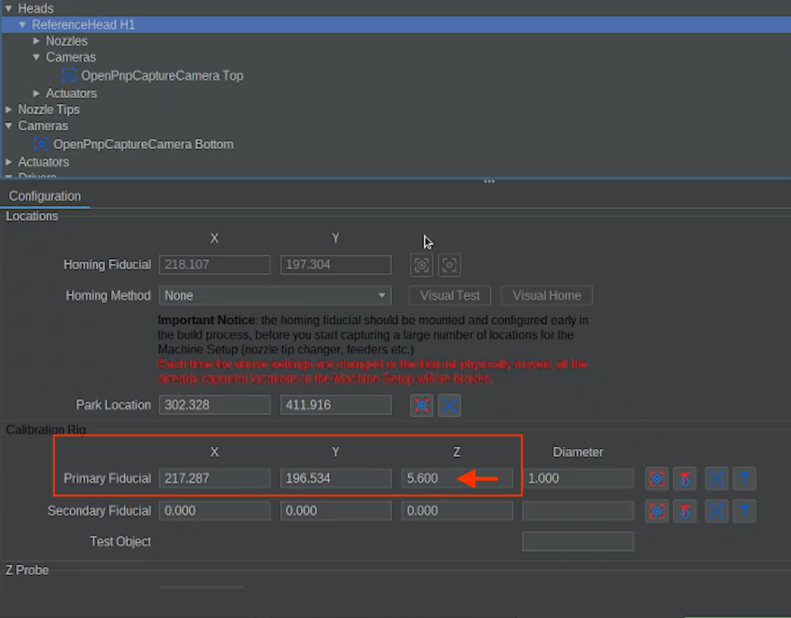
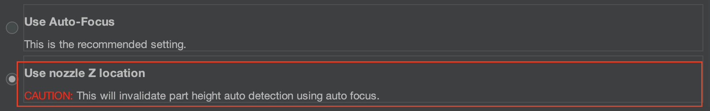
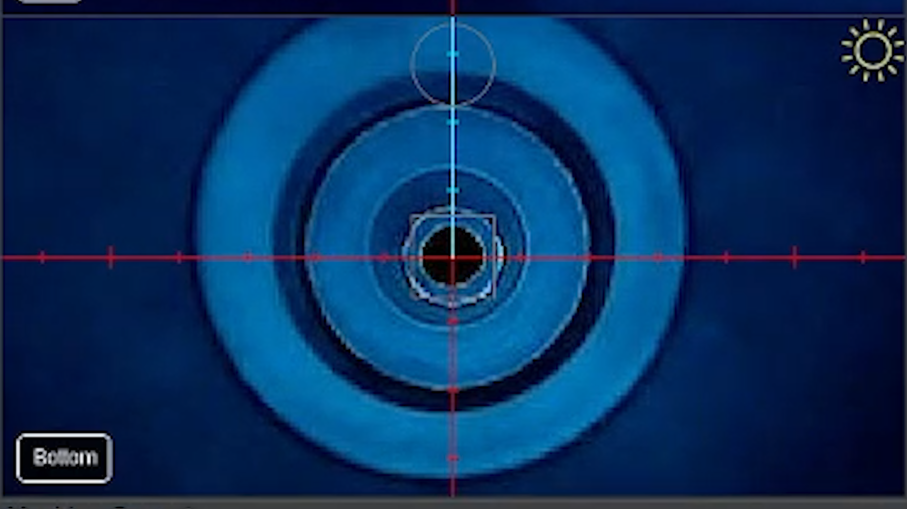
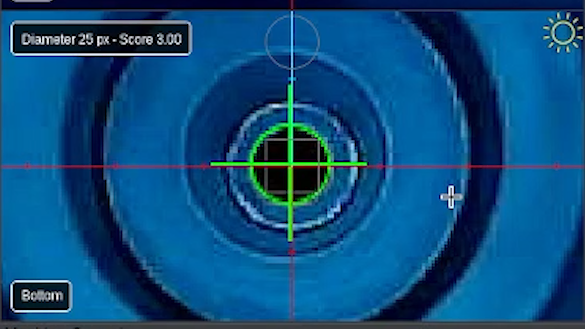
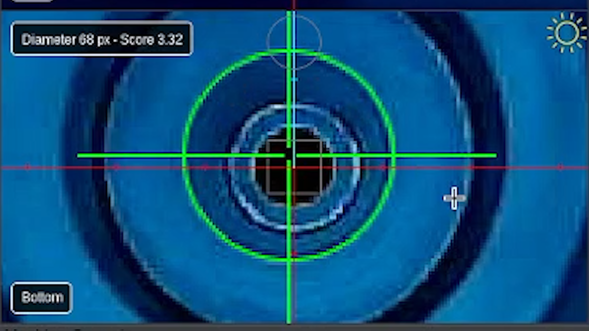

# Determine the up-looking camera Bottom position & initial calibration

<div class="progress-container">
  <div class="progress-step progress-complete">Fiducial Calibrations</div>
  <div class="progress-step progress-complete">Nozzle Offsets</div>
  <div class="progress-step progress-current">Bottom Camera Calibration</div>
  <div class="progress-step">Backlash</div>
  <div class="progress-step">Precise Offsets</div>
  <div class="progress-step">Camera Settling</div>
</div>

---

<div class="issue-solution">

<div class="issue-label">
Issue
</div>

Determine the up-looking camera Bottom position and initial calibration.

<div class="solution-label">
Solution
</div>

Move the nozzle N1 over the up-looking camera Bottom and capture the position.

</div>

---

## What This Step Does

This step teaches OpenPnP where the **bottom (up-looking) camera** is located in space.

By detecting the center of the nozzle tip with the bottom camera, OpenPnP learns how the camera aligns with the system.

---

## Change the Nozzle Tip on Nozzle N1

For this step we will use the **N08 nozzle tip**.

You can find this in the nozzle tip holder beside the N045 nozzle tip slot.


Navigate to:

```
Machine Setup → Heads → ReferenceHead H1 → Nozzles → ReferenceNozzle N1 → Nozzle Tips
```

1. In the **Loaded?** column:
    * Uncheck **N045**
    * Check **N08**
2. When you uncheck the N045 tip:
    * The machine will move to the nozzle loading position
    * A popup will appear
    * The popup may look like an error, but this is **expected**.  
3. Remove the **N045 tip** and install the **N08 tip**.



---

## Use the Same Z Height as the Primary Fiducial

For this calibration step, the nozzle must use the **same Z height that was captured when touching the primary fiducial**.

This is the same height as the top of the datum board.

Both cameras are focused at this height, so it must remain the reference plane.

You can have the N1 nozzle touch the datum board again, or use the Z height found in the Primary fiducial's coordinates.

```
Machine Setup > Heads > ReferenceHeads H1 > Primary Fiducial Coordinates > Z
```



<div class="good-to-know">

<div class="good-to-know-title">
Before performing this calibration step
</div>

<div>You must choose which way the Z height will be use for this calibration before beginning.</div>

You may have to scroll down to see the option.

</div>

You are given two options to pick from:



Select:

* '**Use Nozzle Z Location**'
* Do **not** use the '**Auto Focus**' option.

---

<div class="good-to-know">

<div class="good-to-know-title">
Good to Know
</div>

The Z height recorded during the primary fiducial calibration represents the correct focal plane for both cameras.

Using the same Z height ensures the bottom camera calibration is accurate.

You can check to see what it is by going to Machine Setup > Heads, ReferenceHead H1.

Within ReferenceHead H1, locate the Primary Fiducial Coordinates. Then, remember what the Z height is set to.

</div>

## Move Nozzle N1 Over the Bottom Camera

1. Use the **Machine Controls** to jog **Nozzle N1**, with the N08 nozzle tip installed, over the bottom camera.
2. When close, double-check your nozzle's Z height is lowered to the correct height above the bottom camera by confirming that the green DRO (Digital Read Out) in the bottom right corner is reading the same Z height of your primary fiducial's Z height coordinates.
3. The nozzle tip should be positioned directly above the center of the bottom camera view.
4. Use smaller jog increments as you approach the center.



---

## Detect the Nozzle Tip Opening

Adjust the **Feature Diameter** so the circle matches the **opening of the nozzle tip**.

The most accurate circle to detect is the **inner dark circle** of the nozzle tip.

If detection is difficult, it's possible that you need to slightly adjust the **camera exposure** until the circle becomes easier to detect.

The goal is to make the nozzle tip easy to differentiate from the rest of the nozzle.

This image shows the correct circle detection.



---

<div class="pro-tip"><div class="pro-tip-title">
Example of Proper Detection
</div>

Make sure the green detected circle matches the inner opening of the nozzle tip, not the outer edge of the tip.


</div>

<div class="stop-if"><div class="stop-if-title">
Examples of False Positives / Bad Detection
</div>

<div>
These are wrong and will cause a calibration failure.
</div>

The first image below may be convincing, but is wrong. It should be on the inner circle of the tip, not the outside edge.




</div>

---

## Capture the Calibration

Once the circle correctly matches the nozzle opening, click:


OpenPnP will move the nozzle around the bottom camera view while measuring the camera's position.

As the nozzle moves away from the center, watch the detection circle to make sure the nozzle opening continues to be detected correctly.

<div class="good-to-know">

<div class="good-to-know-title">
Important!
</div>

Occasionally, reflections, lighting changes, or other visual artifacts may cause OpenPnP to detect an incorrect circle during this calibration. If the detection appears incorrect during this process, you may have to reopen this step and repeat the calibration.

</div>

---

### If Calibration Fails

The nozzle tip we are using is very small and the bottom camera has a very wide lens. When the calibration gets to the edges, other objects or lighting can affect the cameras ability to see the nozzle tip accurately.

If you accidentally chose Auto-Focus for this calibration, even after reopening the step and redoing the calibration, though rare, it can sometimes cause enough issue that it requires you to restart calibration entirely.

---

## Complete the Calibration

Once the process finishes and the issue is marked as **Solved**, click:


This will move to the next calibration step.

---

<div class="stop-if"><div class="stop-if-title">
Very Important!
</div>

<div>
You must set the homing method before moving on. This will ensure the homing procedure is performed as needed for reliable operation.
</div>

<div>
Go to Machine Setup > Heads > ReferenceHead H1. For Homing Method, choose ResetToFiducialLocation.
</div>


<div>
Click the Apply button in the bottom right, and go back to the Issues & Solutions tab.
</div>

</div>

---

<div class="next-step-container">

<div class="next-step-title">
Next Step
</div>

<div class="next-step-description">
Now that the Bottom Camera Position has been calibrated, we can move on to Backlash Compensation for X and Y axis.
</div>

<a href="../x-backlash/" class="next-step">X Axis Backlash →</a>

</div>