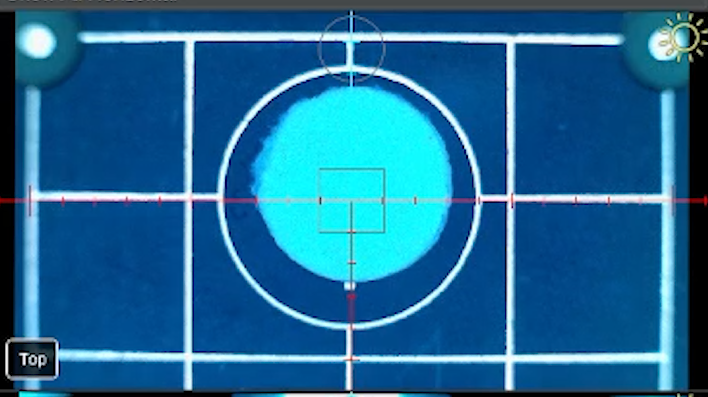
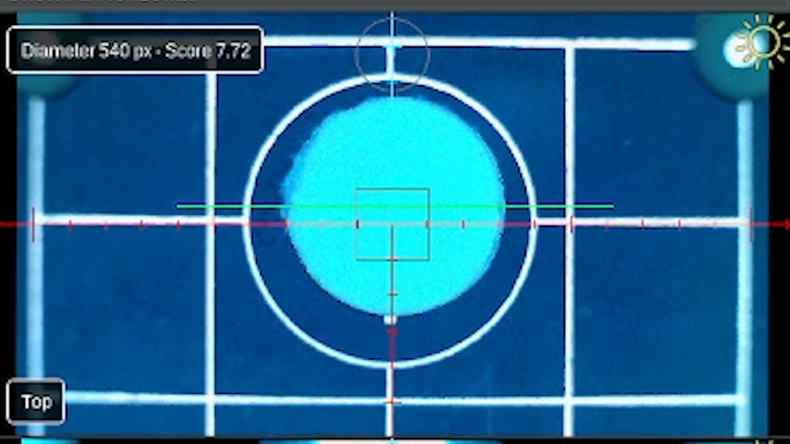
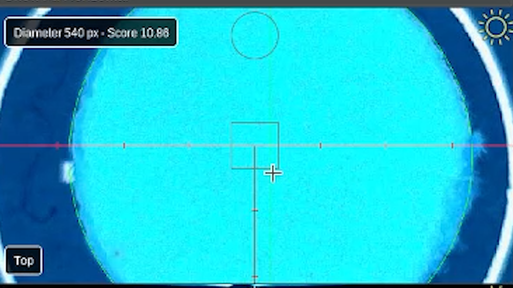

# Calibrate precise camera ↔ nozzle N1 offsets

<div class="progress-container">
  <div class="progress-step progress-complete">Fiducial Calibrations</div>
  <div class="progress-step progress-complete">Nozzle Offsets</div>
  <div class="progress-step progress-complete">Bottom Camera Calibration</div>
  <div class="progress-step progress-complete">Backlash</div>
  <div class="progress-step progress-current">Precise Offset N1</div>
  <div class="progress-step">Precise Offset N2</div>
  <div class="progress-step">Camera Settling</div>
</div>

---

<div class="issue-solution">

<div class="issue-label">
Issue
</div>

Calibrate precise camera ↔ nozzle N1 offsets.

<div class="solution-label">
Solution
</div>

Use a test object to perform the precision camera ↔ nozzle N1 offsets calibration.

</div>

---

## What This Step Does

This step **precisely** measures the relationship between the **top camera and Nozzle N1**.

OpenPnP picks up the hole punch reference, rotates the nozzle, and sets it back down while observing it with the camera. By measuring how the circle appears from different angles, OpenPnP can calculate the precise offset and rotation behavior of the nozzle.

---

<div class="good-to-know">

<div class="good-to-know-title">
Good to Know
</div>

The precise camera ↔ nozzle N1 and N2 offset steps are not mandatory for operation, but can be nice.

</div>

---

## Place the Hole Punch Reference

Locate the **hole punch reference** included with your kit.

Place the hole punch directly over the **primary fiducial**, covering the Opulo logo as much as possible.

The hole punch provides a clean circular feature that the camera can easily detect.



---

## Center the Camera on the Hole Punch

Use the **Machine Controls** to jog the **top camera** over the hole punch.

Center the camera so the circular hole punch reference is clearly visible.

---

## Detect the Circle

Adjust the **Feature Diameter** so the circle matches the hole punch opening.

You may use **Auto Detect** to find a starting value, but always visually confirm that the detected circle matches the hole punch.

Example from our calibration:

```
Feature Diameter: 540
Score: 7.72
```

Your values may differ slightly.



It can be very difficult to see the circle sometimes. Using the green crosshairs can help identify that the circle is there.

Example: The image below may look like the green circle is not present until you look closely.



---

<div class="good-to-know">

<div class="good-to-know-title">
Good to Know
</div>

Auto-detection usually finds a good starting point, but always confirm the detected circle matches the hole punch before continuing.

</div>

---

## Start the Calibration

 

Click accept to begin the calibration.

OpenPnP will:

* Pick up the hole punch using **Nozzle N1**
* Rotate the nozzle
* Place the hole punch
* Measure the difference between each movement

This allows OpenPnP to determine the precise camera-to-nozzle relationship.

---

## Complete the Calibration

Once the process finishes and the issue is marked as **Solved**, click:


This will move to the next calibration step.

---

<div class="next-step-container">

<div class="next-step-title">
Next Step
</div>

<div class="next-step-description">
With Precise top camera to nozzle tip offset calibrate for the N1 nozzle tip, We'll do the same for nozzle N2.
</div>

<a href="../n2-offset-precise/" class="next-step">Precise N2 Offset →</a>

</div>