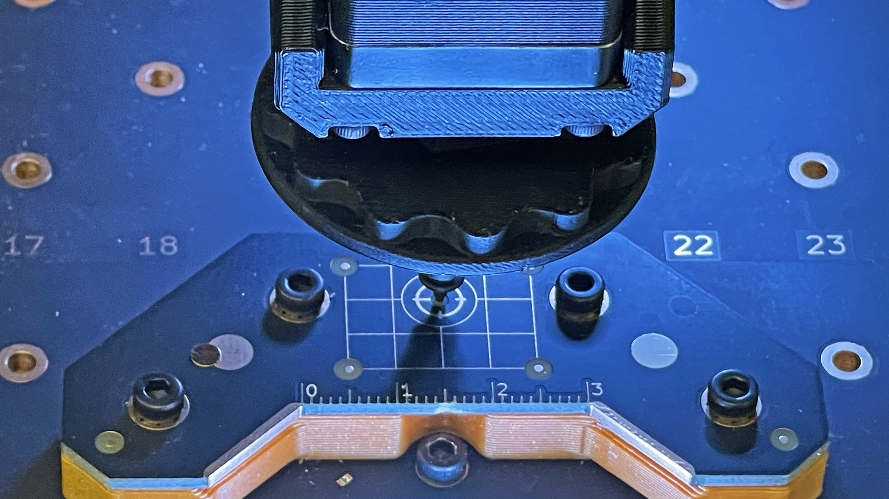

# Nozzle N1 offsets for the primary fiducial

  
Fiducial Calibrations

  
N1 Primary Offsets

  
N1 Secondary Offsets

  
N2 Primary Offsets

  
Bottom Camera Calibration

  
Backlash

  
Precise Offsets

  
Camera Settling

---

Issue

Nozzle N1 offsets for the primary fiducial.

Solution

Move the nozzle N1 to the primary calibration fiducial and capture its offsets.

---

## What This Step Does

This step measures the position of **Nozzle N1 relative to the top camera**.

By capturing the center of the primary fiducial using the nozzle, OpenPnP learns how the nozzle is positioned relative to the camera.

This relationship allows the machine to accurately place parts later.

---

## Move Nozzle N1 Over the Primary Fiducial

1. Use the **Machine Controls** to move **Nozzle N1** over the primary calibration fiducial.
2. Make sure **N1 is the selected nozzle** in the Machine Controls panel.
3. Use smaller jog increments as you approach the center of the fiducial.

---

## Center the Nozzle on the Fiducial

1. Position the nozzle tip directly over the center of the primary fiducial.
2. Use smaller movement increments such as:
    * **1 mm**
    * **0.1 mm**
    * **0.01 mm**

This will help you precisely align the nozzle.

* 

This is a very important calibration. It is worth taking the time to make sure it is precise.

Record your Z Height Coordinates

Keep note of the Z height  when the nozzle is touching the primary fiducial. 
Use the green DRO (Digital Read Out) that displays the nozzles current coordinates.
 
 It is located in the very bottom right corner of OpenPnP.
 Keep record of that Z height. You'll need it during the bottom camera calibration.

---

Good to Know

The nozzle tip itself will obscure the fiducial when centered.

Align the nozzle so the fiducial appears evenly visible around the tip by looking from the front and the side.

---

## Capture the Offset

Once the nozzle is centered over the fiducial, click:

OpenPnP will record the nozzle offset relative to the camera.

---

## Complete the Calibration

Once the process finishes and the issue is marked as **Solved**, click:

This will move to the next calibration step.

---

Next Step

The top camera to nozzle tip offset has been calibrated for the primary fiducial. Next, let's calibrate the Secondary fiducial with nozzle N1.

<a href="../n1-offset-secondary/" class="next-step">N1 Secondary Offset →</a>

