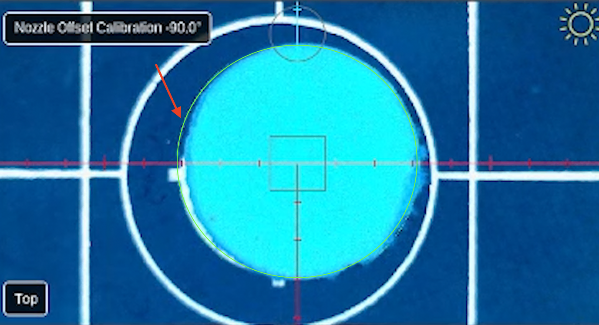

# Calibrate precise camera ↔ nozzle N2 offsets

<div class="progress-container">
  <div class="progress-step progress-complete">Fiducial Calibrations</div>
  <div class="progress-step progress-complete">Nozzle Offsets</div>
  <div class="progress-step progress-complete">Bottom Camera Calibration</div>
  <div class="progress-step progress-complete">Precise Offset N1</div>
  <div class="progress-step progress-current">Precise Offset N2</div>
  <div class="progress-step">Camera Settling</div>
</div>

---

<div class="issue-solution">

<div class="issue-label">
Issue
</div>

Calibrate precise camera ↔ nozzle N2 offsets.

<div class="solution-label">
Solution
</div>

Use a test object to perform the precision camera ↔ nozzle N2 offsets calibration.

</div>


---

## What This Step Does

This step **precisely** measures the relationship between the **top camera and Nozzle N2**.

OpenPnP picks up the hole punch reference, rotates the nozzle, and sets it back down while observing it with the camera. By measuring how the circle appears from different angles, OpenPnP can calculate the precise offset and rotation behavior of the nozzle.

---

## Place the Hole Punch Reference

Locate the **hole punch reference** included with your kit.

Place the hole punch directly over the **primary fiducial**, covering the Opulo logo as much as possible.

The hole punch provides a clean circular feature that the camera can easily detect.

---

## Center the Camera on the Hole Punch

Use the **Machine Controls** to jog the **top camera** over the hole punch.

Center the camera so the circular hole punch reference is clearly visible.


---

## Detect the Circle

Adjust the **Feature Diameter** so the circle matches the hole punch opening.

You can use your prior hole punch feature diameter as a starting point, and it should be pretty close to the same reading.

You may use **Auto Detect** to find a starting value, but always visually confirm that the detected circle matches the hole punch.

Example from our calibration:

```
Feature Diameter: 540
Score: 7.40
```

Your values may differ slightly.


It can be very difficult to see the circle sometimes. Using the green crosshairs can help identify that the circle is there.

---

<div class="good-to-know">

<div class="good-to-know-title">
Good to Know
</div>

Auto-detection usually finds a good starting point, but always confirm the detected circle matches the hole punch before continuing.

</div>

---

<div class="stop-if"> <div class="stop-if-title"> be careful not to partly detect the Opulo logo! </div>

When the paper hole punch is being spun around, it can expose a small amount of our logo underneath and cause it to see a bigger circle than what is actually there. This can cause the calibration to be askew and will require you to reopen and complete this step again.

<div>

---

</div>



<div>

---

</div>

As a patch to this happening, you can use black sharpie on a small piece of paper that fits over the datum boards primary fiducial area. Make sure it won't move, and then do the calibration on top of that. This is the quickest solve to get the precise accuracy we need from this step when experiencing this.

</div>

---

## Start the Calibration

 

Click accept to begin the calibration.

OpenPnP will:

* Pick up the hole punch using **Nozzle N2**
* Rotate the nozzle
* Place the hole punch
* Measure the difference between each movement

This allows OpenPnP to determine the precise camera-to-nozzle relationship.

---

## Complete the Calibration

Once the process finishes and the issue is marked as **Solved**, click:


---

<div class="next-step-container">

<div class="next-step-title">
Next Step
</div>

<div class="next-step-description">
With Precise camera to nozzle tip offset calibrated, we'll move on to calibrating the adaptive camera settling method for the top camera.
</div>

<a href="../camera-settling-top/" class="next-step">Top Camera Settling→</a>

</div>