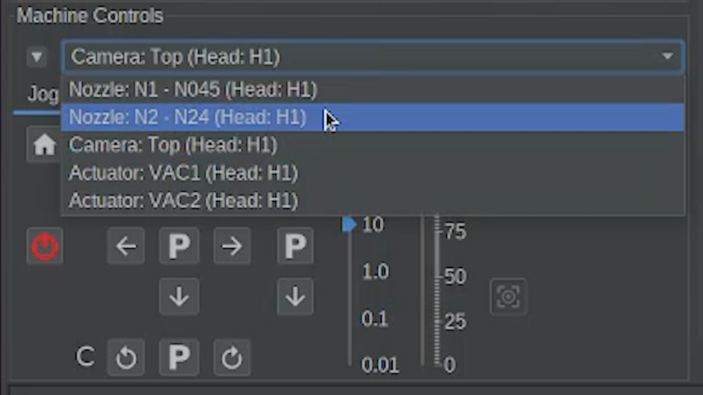
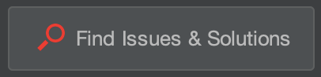

# Nozzle N2 offsets for the primary fiducial

  
Fiducial Calibrations

  
N1 Primary Offsets

  
N1 Secondary Offsets

  
N2 Primary Offsets

  
Bottom Camera Calibration

  
Precise Offsets

  
Camera Settling

---

Issue

Nozzle N2 offsets for the primary fiducial.

Solution

Move the nozzle N2 to the primary calibration fiducial and capture its offsets.

---

## What This Step Does

This step measures the position of **Nozzle N2 relative to the top camera**.

By capturing the center of the primary fiducial using the nozzle tip, OpenPnP learns how the second nozzle is positioned relative to the camera.

This allows the LumenPnP to accurately place parts using either nozzle.

---

## Select Nozzle N2

1. In the **Machine Controls** panel, change the selected nozzle to **N2**.
2. Once selected, the jog controls will move Nozzle N2 instead of Nozzle N1.

---

## Move Nozzle N2 Over the Primary Fiducial

1. Once you get to this offset, OpenPnP is smart enough to know that we are needing to jog the Nozzle N2, and automatically selects it for us.
2. Use the **Machine Controls** to jog **Nozzle N2** over the primary calibration fiducial.
3. Use smaller jog increments as you approach the center of the fiducial.

---

## Center the Nozzle on the Fiducial

Position the nozzle tip directly over the center of the primary fiducial.

This will help you precisely align the nozzle.

This is a very important calibration. It is worth taking the time to make sure it is precise.

---

## Capture the Offset

Once the nozzle is centered over the fiducial, click:

OpenPnP will record the offset for **Nozzle N2**.

---

With both nozzle offsets captured, OpenPnP now understands how the nozzles relate to the top camera.

---

## Complete the Calibration

Once the process finishes and the issue is marked as **Solved**, click:

This will move to the next calibration step.

---

Next Step

All nozzle offsets have been calibrated. Now lets set the bottom camera position.

<a href="../bottom-cam-pos/" class="next-step">Bottom Camera Calibration</a>

