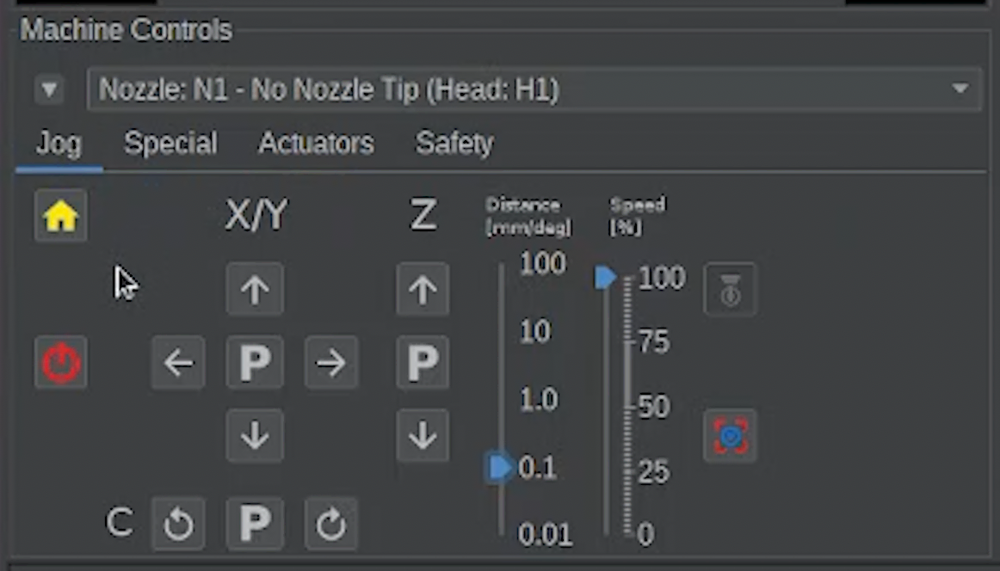
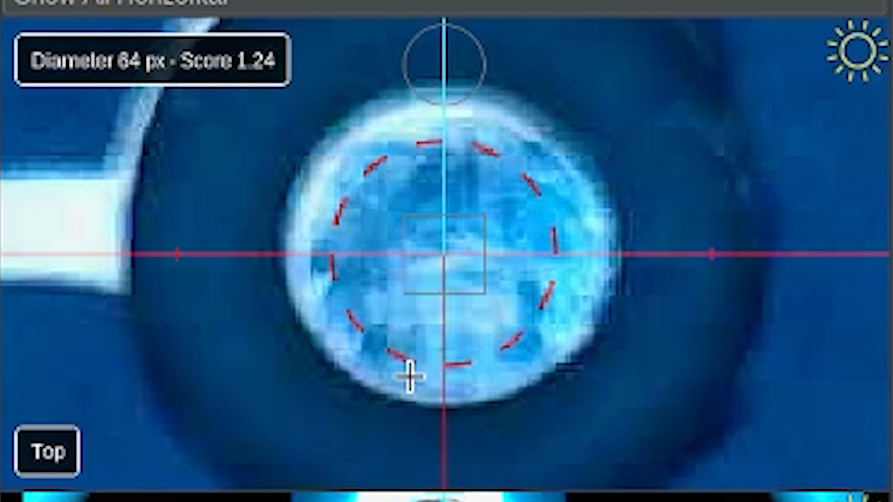
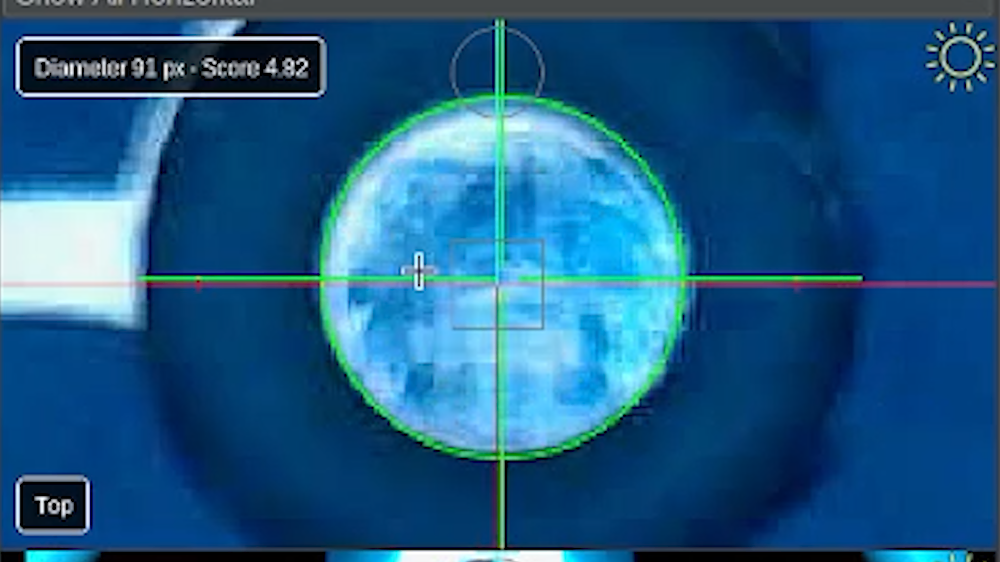

# Primary calibration fiducial position & initial camera calibration

  
Primary Calibration

  
Secondary Calibration

  
Nozzle Offsets

  
Bottom Camera Calibration

  
Precise Offsets

  
Camera Settling

---

Issue

Primary calibration fiducial position and initial camera calibration.

Solution

Move the camera over the primary calibration fiducial and capture its position.

---

## Dismiss These Unneeded Steps

First, before starting the Issues and Solutions calibration, if you happen to see these unneeded steps, Do not complete them.

The unneeded steps are already set to what they should be for the LumenPnP with our configuration files you imported.

If you see these steps, make sure to dismiss them.

**Dynamic Safe Z for N1**

* If this pops up, dismiss this step and do not do anything on this page.
* After, click the “Find Issues $ Solutions” button to refresh the list

**Dynamic Safe Z for N2**

* If this pops up, dismiss this step and do not do anything on this page.
* After, click the “Find Issues $ Solutions” button to refresh the list

---

## What This Step Does

This step tells OpenPnP where the **primary fiducial** is located on the staging plate.  
This fiducial is also used later as the machine's **homing reference point**.

---

## Move the Camera Over the Fiducial

Use the **Machine Controls** to jog the top camera over the primary fiducial.

Use smaller jog increments as you approach the center.

---

## Detect the Fiducial

Adjust the **Feature Diameter** setting.

You can:

* Manually adjust the diameter
* Enter a value
* Use the **automatic scan**

During scanning:

* A **red dotted circle** grows larger
* 
* If a circle is detected it becomes **solid green**
* 
* The system continues scanning for a better match until it completes and gives us it's **best guess** at the circle.
* Adjust the feature diameter up and down to confirm the circle is correct for the primary fiducial.

Good to Know

The automatic scan often finds a good starting point but it is not always perfect.  
Visually confirm the circle matches the fiducial before accepting.

---

## Accept the Calibration

Once the circle correctly matches the fiducial, click:

OpenPnP will move around the fiducial briefly to calculate its position.

---

## Complete the Calibration

Once the process finishes and the issue is marked as **Solved**, click:

This will refresh the Issues and Solutions list and move to the next calibration step.

---

Next Step

You've captured the primary calibration fiducial's position. Now let's do the same for the secondary calibration fiducial's position.

<a href="../secondary-cal-fid-pos/" class="next-step">Capture Secondary Position →</a>

