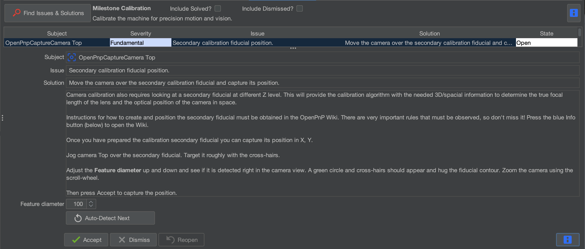
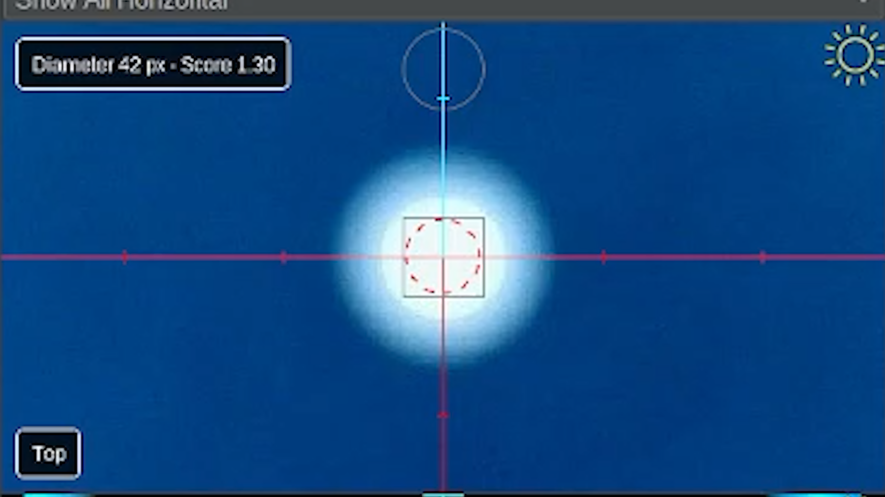

# Secondary calibration fiducial position & initial camera calibration

  
Primary Calibration

  
Secondary Calibration

  
Nozzle Offsets

  
Bottom Camera Calibration

  
Precise Offsets

  
Camera Settling

---

Issue

Secondary calibration fiducial position and initial camera calibration

Solution

Move the camera over the secondary calibration fiducial and capture its position.

---

## What This Step Does

This step records the position of the **secondary fiducial** on the staging plate.

By measuring two known fiducials, OpenPnP can determine the **orientation and scale** of the staging plate relative to the machine.

---

## Move the Camera Over the Secondary Fiducial

Use the **Machine Controls** to jog the top camera over the secondary fiducial.

Use smaller jog increments as you approach the center.

---

## Detect the Fiducial

Adjust the **Feature Diameter** setting.

You can either:

* Manually adjust the diameter
* Enter a specific value
* Use the **automatic scan tool**

During the scan:

* A **dotted red circle** begins small
* 
* The circle gradually grows larger
* When a circle is detected it becomes **solid green**
* 
* The system continues scanning for a better match until it completes and gives us it's **best guess** at the circle.
* Adjust the feature diameter up and down to confirm the circle is correct for the primary fiducial.

---

Good to Know

The automatic scan often finds a good starting point, but it can occasionally detect the wrong circle.

Always visually confirm the green circle matches the fiducial before continuing.

---

## Accept the Calibration

Once the circle correctly matches the fiducial, click:

OpenPnP will briefly jog around the fiducial to calculate its position.

---

## Complete the Calibration

Once the process finishes and the issue is marked as **Solved**, click:

This will move to the next calibration step.

---

Next Step

You've captured the secondary calibration fiducial's position, as well as the primary's. We'll continue by calibrating the Nozzle N1's offset to the top camera.

<a href="../n1-offset/" class="next-step">Nozzle N1 Offset →</a>

