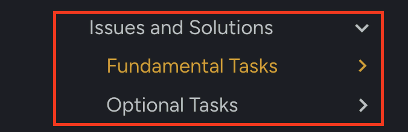

# How Calibration Works

  
Install & Import

  
Connect

  
Homing

  
Nozzle Tips

  
Calibration Prep

  
OpenPnP Overview

## What Does Calibration Actually Do?

Before we begin clicking through Issues and Solutions, it helps to understand what calibration actually does, including important tips.

Calibration is not a single adjustment. It is a layered process that teaches the machine how physical space, camera space, and motion space all relate to each other.

 
 Good to Know 

Please be aware that some calibration steps cannot be brought back after completion. In the event that a calibration step completed incorrectly, though rare, it may require starting over and reloading the downloaded config files again.

---

## Why We Run Only Specific Calibration Steps

**Issues and Solutions** has three types of steps:

* **Fundamental Steps** (To start, only complete the ones we list)
* **Suggestion Steps** (Do not attempt any of these steps until we have validated the fundamental steps and have attempted to place parts.)
* **Error Steps** (With our configuration files, there will show some steps labeled as Errors, ignore for calibration.)

 

### "**Which Issues & Solutions Tasks Should I Actually Do?**"

Within our docs guides on this site, you'll see different sections under the Issues & Solutions steps menu, on the left of the page. Here is a brief description of what they are:

* **Fundamental**: All of these are mandatory to properly complete calibration.
* **Optional**: These should not be needed. You'll want to validate the FTP board by populating it with components before attempting extra/optional steps. Stick to the specific steps that we have listed within the guide section,`Fundamental`, first.

 

OpenPnP includes many calibration tools that are designed to support a wide variety of machines, and we only want to use certain ones that are listed in the Fundamental steps.

The LumenPnP is designed to work a certain way mechanically, and the workflow follows that design.
We run the steps that are necessary for getting the LumenPnP properly calibrated.

**Completing any steps that are not listed in this guide can introduce problems and/or cause conflicting calibration data**.

 
 Follow Only the Steps in This Guide 

The Issues & Solutions tool may show additional suggestions.

For the LumenPnP, follow only the steps described in this guide.

Some suggestions are not required for this machine and may interrupt the calibration workflow.

---

Next Step

You've learned more about calibration. Now learn the layout of OpenPnP.

<a href="../interface-overview/" class="next-step">OpenPnP Interface Overview →</a>

