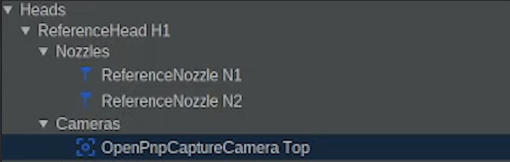
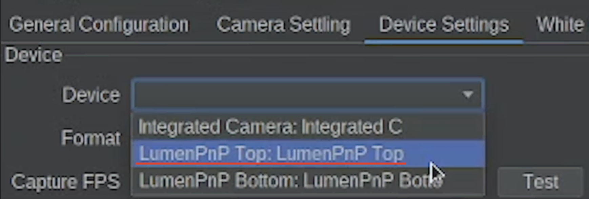
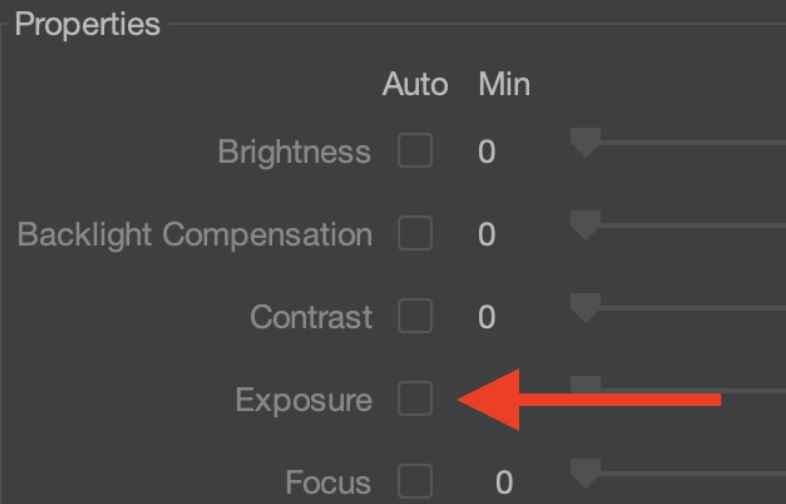
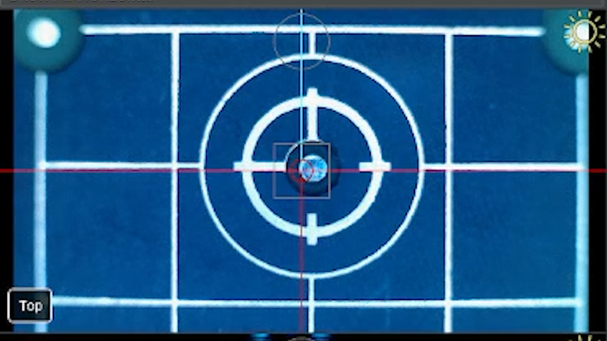
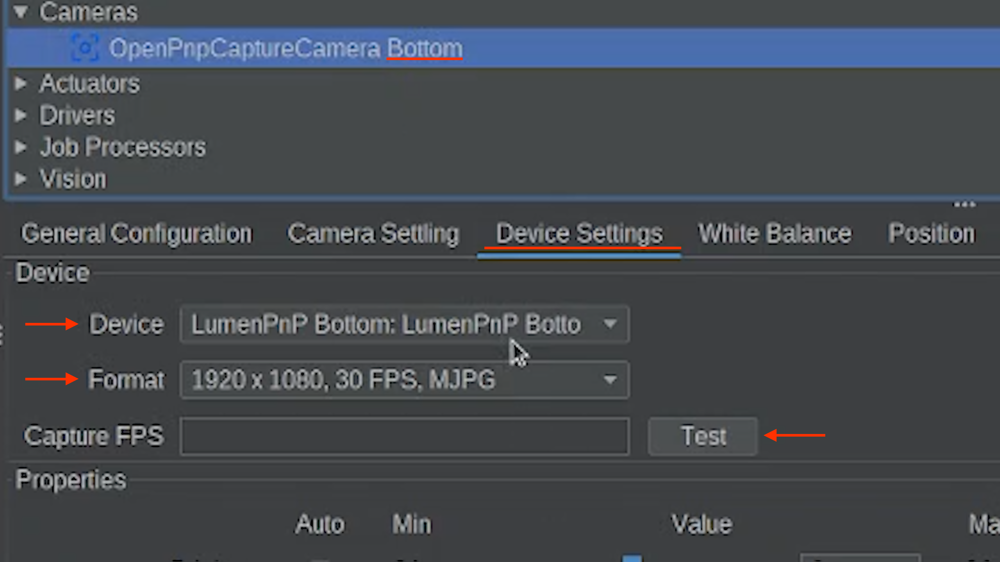

# Connect Your Top and Bottom Cameras

  
Install & Import

  
Connect LumenPnP

  
Connect Cameras

  
Homing

  
Nozzle Tips

  
Calibration Prep

  
OpenPnP Overview

---

## Connect the Top Camera

1. Navigate to: `Machine Setup > Heads > ReferenceHead H1 > Cameras > OpenPnpCaptureCamera Top`
    * 
2. Open the `Device Settings` tab.
3. Locate the `Device dropdown`.
    * select the LumenPnP Top Camera
    * 
4. Locate the `Format dropdown` below.
5. Then select the format:
    * `1920x1080, 30FPS, MJPG`
6. If the camera fails to connect, try:
    * `1920x1080, 5FPS, YUYV`
7. Click `Test` next to `Capture FPS`. This will:
    * Apply the selected format
    * Start the camera feed
    * Automatically apply the settings

 
 Good to Know 

The camera image may appear completely black at first.
This is normal until the exposure is adjusted in the next step.

---

### Confirm Camera Settings

Verify the following camera properties match what we have here:

| Setting | Value |
|--------|------|
| Brightness | 0 |
| Backlight Compensation | 0 |
| Contrast | 30 |
| Exposure | Manually Set |
| Focus | 0 |
| Gain | 0 |
| Gamma | 100 |
| Hue | 1 |
| Power Line Frequency | 1 |
| Saturation | 64 |
| Sharpness | 0 |
| White Balance | 4000 |
| Zoom | 0 |

---

### Set Exposure Mode

To place the camera in manual exposure mode:

1. Enable Auto Exposure
    * In the camera properties, there's a column named `Auto`.
    * Along the `Auto` column, **click the checkbox beside the exposure property**.
2. Disable Auto Exposure
    * **uncheck the checkbox** that you just clicked.
    * This step ensures your exposure settings will be saved correctly.

---

### Adjust the Top Camera Exposure

Set Exposure ≈ 100 as a rough starting point.

Using the machine controls in the bottom left of OpenPnP, jog the top camera to be overtop the datum board.

Using the datum board for this is important, as it is used often for top camera vision and gives a solid starting point.

Example of proper brightness:

 
 Good to Know 

A properly exposed image should show the homing fiducial clearly without being overly bright."

---

## Connect the Bottom Camera

1. Navigate to: `Machine Setup > Cameras > OpenPnpCaptureCamera Bottom`
2. Open the `Device Settings` tab.
3. Locate the `Device dropdown`.
4. Then, select the LumenPnP Bottom Camera from the list.
5. Locate the `Format dropdown` below.
6. Then select the format:
    * `1920x1080, 30FPS, MJPG`
7. If the camera fails to connect, try:
    * `1920x1080, 5FPS, YUYV`
8. Click `Test` next to **Capture FPS**. This will:
    * Apply the selected format
    * Start the camera feed
    * Automatically apply the settings

---

### Confirm Camera Settings

All of the following settings remain the same as what you did for the top camera until Adjusting Exposure, where there is a subtle differences.

Use the same property values used for the top camera.:

| Setting | Value |
|--------|------|
| Brightness | 0 |
| Backlight Compensation | 0 |
| Contrast | 30 |
| Exposure | Manually Set |
| Focus | 0 |
| Gain | 0 |
| Gamma | 100 |
| Hue | 1 |
| Power Line Frequency | 1 |
| Saturation | 64 |
| Sharpness | 0 |
| White Balance | 4000 |
| Zoom | 0 |

---

### Set Exposure Mode

To place the camera in manual exposure mode:

1. Enable Auto Exposure
    * In the camera properties, there's a column named `Auto`.
    * Along the `Auto` column, **click the checkbox** beside the `exposure` property.
2. Disable Auto Exposure
    * **uncheck the checkbox** you just clicked.
    * This step ensures your exposure settings will be saved correctly.

---

### Adjust the Bottom Camera Exposure

Set Exposure ≈ 80 as a rough starting point.

Adjust accordingly.

You may need to jog the machine head using the Machine Controls panel so the camera is able to see the nozzles as a point of reference.

 
 Good to Know 

A properly exposed image should show the nozzle tips clearly without being overly bright."

---

**Confirm**

Both cameras should now:

* Appear in the OpenPnP interface
* Show a live video feed
* Display a properly exposed image

---

Next Step

Now that both cameras are connected and producing a video feed, we will prepare the machine for its first homing.

<a href="../../homing-prep/" class="next-step">Home the LumenPnP →</a>

