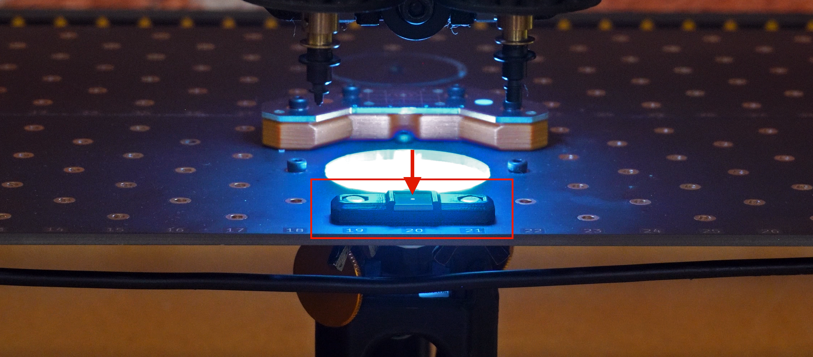

# LumenPnP V4.1 Preflight Checklist – Before You Begin

  
Version Check

  
Preflight

  
Calibration

  
Validation

!!!WARNING "These docs require your machine to have a secondary fiducial. If you don't have one, or are unsure if you have one or not, please see options below"

---

## Confirm Your Staging Plate Revision

LumenPnP V4.1 includes a staging plate revision that adds a secondary calibration fiducial.
This guide assumes that fiducial is present.

Confirming this now ensures calibration behaves as expected and you don't waste any time.

---

## Locate the Secondary Fiducial

  

* The secondary fiducial is located near the closer side to the up facing bottom camera on the staging plate.
* It sits opposite of the primary fiducial found on the datum board.
* It is a small circular fiducial on a square PCB that is held in a small mounting bracket.

---

## If You See the Secondary Fiducial

You are in the correct guide. Continue to Preflight:

<a href="install-config/install-openpnp/" class="next-step">✅ Continue to Preflight →</a>

 

---

## If You Do Not See the Secondary Fiducial

You are likely using LumenPnP V4.0. You have two options:

### Option 1 – Continue with V4.0 Documentation

If you prefer to keep your current configuration, you can continue using the V4.0 guide.

If you only have one fiducial, go to:

[**V4.0 documentation**](../../v4/install-config/install/index.md)

These docs are made for your version.  

### Option 2 – Install the Secondary Fiducial Upgrade (Recommended)

Upgrading your LumenPnP V4.0 allows you to utilize the latest OpenPnP improvements, including better calibration.

1. Secondary fiducial upgrade:
    * Costs less than $10.00
    * It requires no machine disassembly
    * Installs in minutes
    * Enables the improved calibration used in this guide
1. [**View Secondary Fiducial Upgrade →**](https://www.opulo.io/products/secondary-fiducial-upgrade-kit?_pos=1&_psq=secon&_ss=e&_v=1.0)
