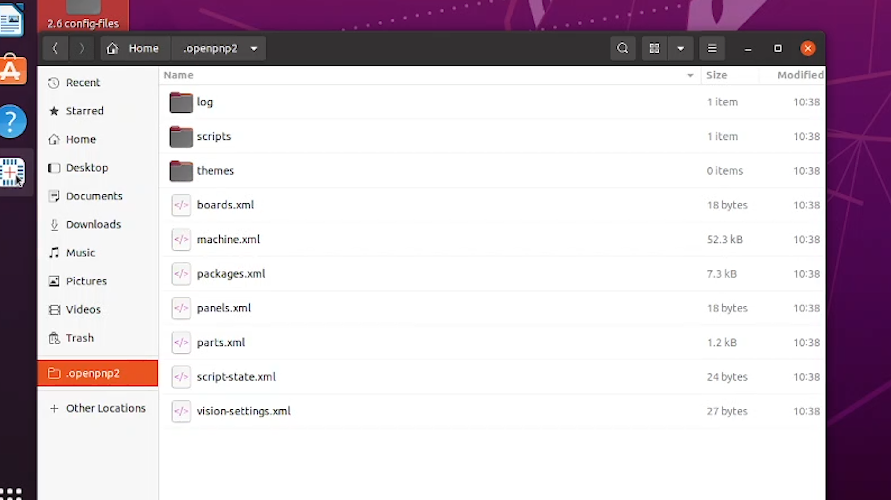
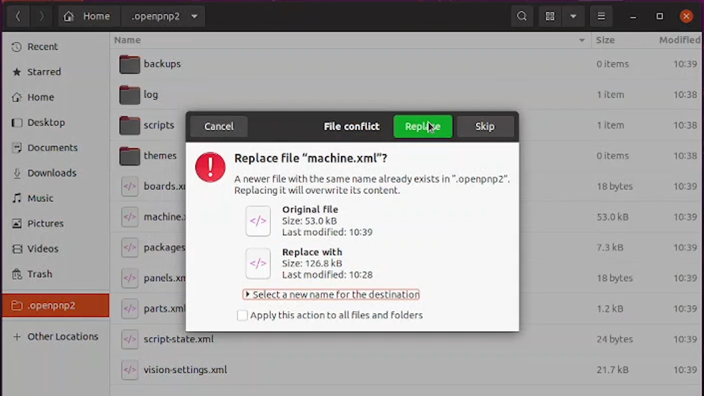

# Importing the Configuration Files for Your LumenPnP 4.1

  
Install & Import

  
Connect

  
Homing

  
Nozzle Tips

  
Calibration Prep

  
OpenPnP Overview

---

## Download the Opulo Configuration Files

Download the configuration files for LumenPnP 4.1:

<a href="install-config/install-openpnp/" class="download-button">Download Config Files</a>

1. Unzip the download. You should find two files:
    * `machine.xml`
    * `vision-settings.xml`
2. These will replace the default OpenPnP configuration files that go by the same name.

---

## Close OpenPnP Completely

 
 Stop If 

OpenPnP cannot be running for the next steps.

Editing configuration files while OpenPnP is open can easily corrupt the files and cause unknown errors.

Make sure OpenPnP is fully closed before continuing.

---

## Locate the `.openpnp2` Folder

OpenPnP stores its configuration files in a hidden folder named: `.openpnp2`

**Linux (Ubuntu)**

1. Open your `Home` folder
2. Press `Ctrl + H` to show hidden files
3. Locate and open the `.openpnp2` folder

**Windows**

1. Open File Explorer
2. Click View
3. Enable Hidden items
4. Navigate to: `C:\Users\[your username]\.openpnp2`

---

## Replace the Configuration Files

Inside the .openpnp2 folder you will find several XML files.

1. Locate these two files:
    * machine.xml
    * vision-settings.xml
1. Replace them with the two files you downloaded earlier.
    * They should have the same name.
    * Copy and paste the files into the `.openpnp2` folder
    * It will prompt you to overwrite the current files. Allow it to do so.

 
 Good to Know 

These files configure how OpenPnP communicates with the LumenPnP hardware and vision system.
Replacing them ensures OpenPnP starts with the correct machine configuration.

---

## Verify the Configuration Loaded

1. Start OpenPnP
    * Allow it to fully load
    * Confirm the main interface opens normally
1. If OpenPnP launches successfully, the configuration files were imported correctly.

---

Next Step

You've installed the correct Opulo provided config files in the .openpnp2 folder, and have confirmed they have loaded correctly. Next is to Establish a connection with your LumenPnP.

<a href="../../connect/connect-lumen/" class="next-step">Conenct LumenPnP →</a>

