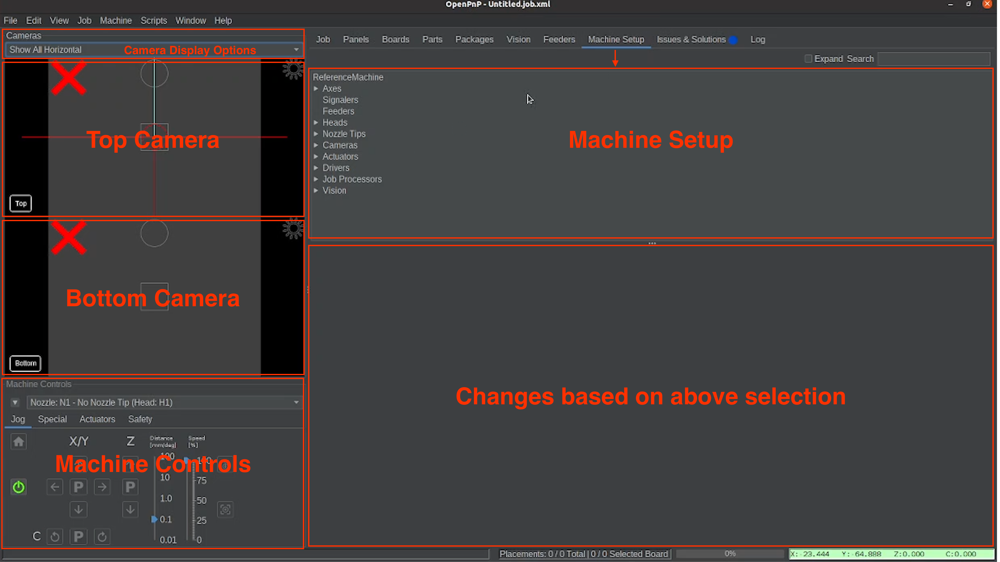
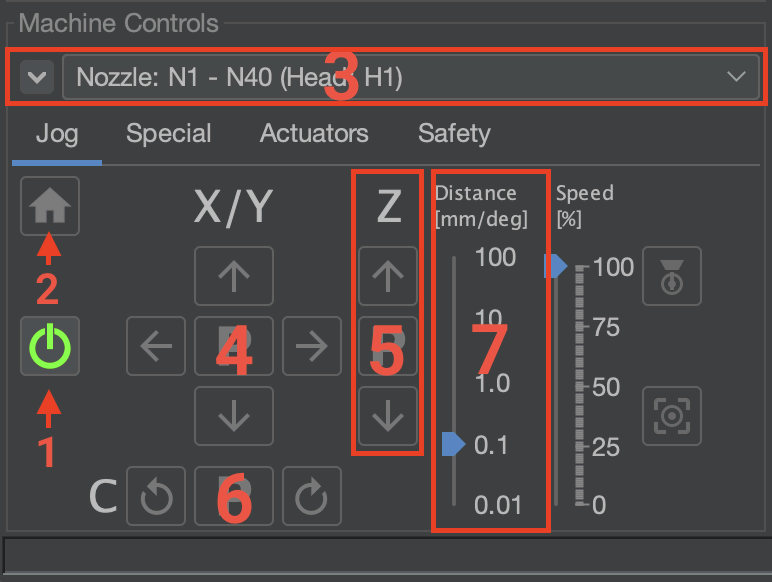
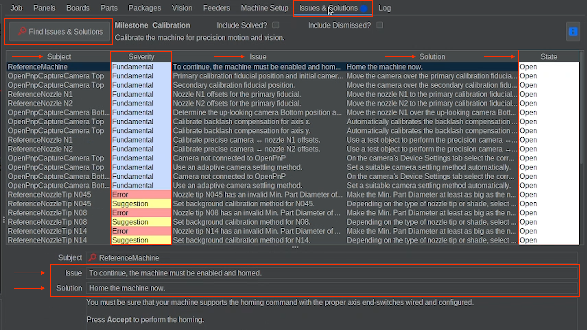
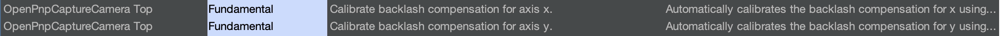

# OpenPnP Overview

  
Install & Import

  
Connect

  
Homing

  
Nozzle Tips

  
Calibration Prep

  
OpenPnP Overview

---

## Get to know the OpenPnP Interface

---

### Machine Controls Overview

Located in the bottom left of OpenPnP

**Breakdown of each Machine Control tab and what they do:**

---

**Jog Tab** (Default)

1. Power Button
2. Home Button (turns yellow when powered on)
3. Nozzle dropdown Selection (Change between Nozzle N1 and N2)
4. X/Y Jog Controls (jog the machine head in the x and y axis)
5. Z Jog Controls (jog the machine head vertically up and down)
6. C Jog Controls (Rotates the selected nozzle. Distance converts to degrees of rotation when using these controls)
7. Jog Distance Slider (Allows for adjusting the jogging distance.)

---

**Special Tab**

* Recycle picked part
* Discard picked part

---

**Actuators Tab**

* Manually turn LEDs on and off
* Manually turn on and read vacuum pumps

---

For making things easier

- Use the mouse's scroll wheel while the mouse is hovering over the camera preview window to zoom in or out on the image.

- Right click on either camera feed and choose crosshair, then select Ruler. This helps when calibrating.

---

## Issues and Solutions Overview

The Issues and Solutions tab can be found towards the very top of OpenPnP

the `Find Issues and Solutions` button is how to refresh the steps and find out what needs done next.

The `Severity column` has 3 types:

* **Fundamental** (These are usually very good to do)
* **Suggestion** (Suggested options, but not necessary. some QoL enhancements could be found. But be warned.)
* **Error** (This would suggest that something is wrong and need fixed. When going through calibration, ignore any that show up until you're through calibration)

The `State column` has 3 types:

* **Open** (white - not done)
* **Solved** (green - Finished Step)
* **Dismissed** (Grey - Dismissed Steps)

Every calibration Step displays two things:

* Issue (What is needing fixed)
* Solution (What needs done to fix it)

---

### **Steps to Dismiss and Skip**

**Issues and Solutions 'Suggestion' Steps to dismiss**:

*If you see any of the following steps, make sure to dismiss them right away.*

* `Dynamic Safe Z for N1` - Dismiss this step and refresh list
* `Dynamic Safe Z for N2` - Dismiss this step and refresh list
* `Set the low side soft limit and capture` - Dismiss this step and refresh list
* `Set the high side soft limit and capture` - Dismiss this step and refresh list

**Issues and Solutions 'Optional' Steps to skip during initial setup, as they are not needed**:

*You don't have to dismiss these. Just skip them when first going through calibration, as this should already be accounted for with one-sided positioning that negates the need for these steps.*

* `Calibrate backlash compensation for axis x` - Even though it says it is a fundamental step, skip it during calibration.
* `Calibrate backlash compensation for axis y` - Even though it says it is a fundamental step, skip it during calibration.

---

## What Happens Next

In the next section, we will begin the calibration process using OpenPnP's Issues & Solutions.

Each step will guide you through adjusting cameras, nozzles, and machine settings until everything is properly aligned.

**When calibration is complete:**

* The machine properly homes
* Nozzles tips align consistently with camera crosshairs
* Repeat movements return to the same position
* Placement accuracy is visually consistent

Take your time. Each step builds on its last, and eventually needs less and less hand holding, so it is very important that the base fundamentals are carefully captured.  

---

 You've completed Preflight!  

  
Install & Import

  
Connect

  
Homing

  
Nozzle Tips

  
Calibration Prep

  
OpenPnP Overview

Next Step

You've completed Preflight! Now we will begin the guided calibration process using our guide and OpenPnP's Issues & Solutions tasks

<a href="../../issues-solutions/fundamental/primary-cal-fid-pos/" class="next-step">Issues and Solutions →</a>

