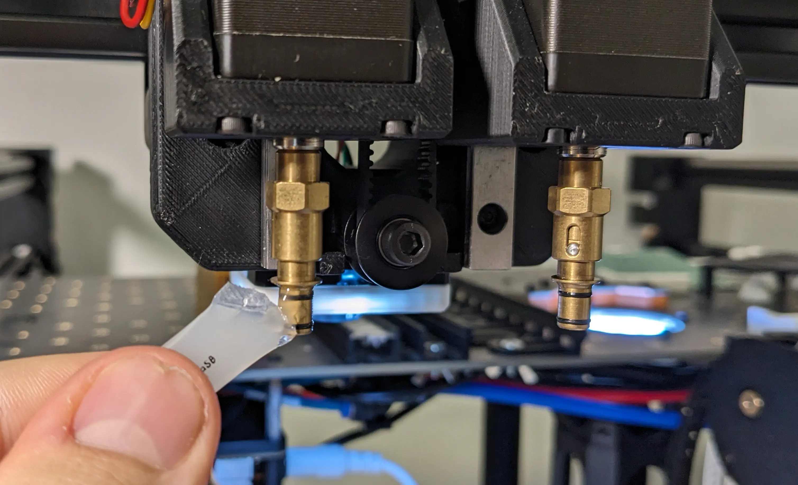
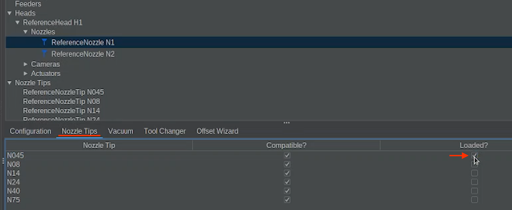
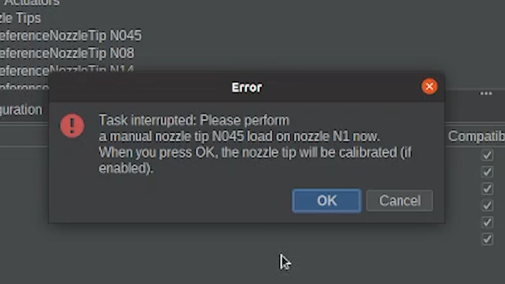
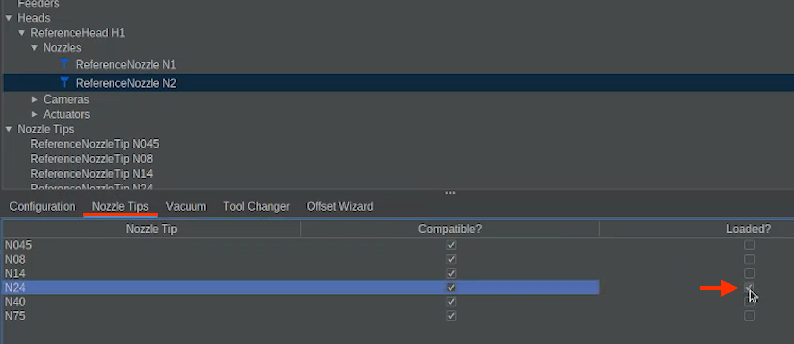

# Install the Nozzle Tips

  
Install & Import

  
Connect

  
Homing

  
Nozzle Tips

  
Calibration Prep

  
OpenPnP Overview

---

## Prepare the Nozzle Tips

The LumenPnP uses CP40 style nozzle tips.

For calibration, we will use three nozzle tips in total (N045, N08, & N24). We will install two nozzle tips on the machine to begin.

1. Before installing nozzle tips for the first time, lightly lubricate the O-rings.
    * Apply a very small amount of lubricant to the nozzles and insert/remove the nozzle tip several times to distribute it evenly.
    * Even though you want a small amount, you want to make sure the nozzle is well covered, with no excess left on the nozzles.

 
 Stop If 

Stop if too much lubricant is applied.

The openings in the CP40 nozzle tips are extremely small.

Excess lubricant can easily clog the tip.

Only a very small amount is needed.

 
 
 Good to Know 

It is best to lubricate all nozzle tips early on.
Proper lubrication makes future automatic nozzle tip changes much smoother and prevents the O-rings from wearing prematurely.

---

## Load the N045 Nozzle Tip

Install the following tips to begin calibration:

| Nozzle | Nozzle Tip |
|--------|------|
| N1 (Left Nozzle) | N045 |
| N2 (Right Nozzle) | N24 |

1. First, go to: `Machine Setup → Heads → ReferenceHead H1 → Nozzles → ReferenceNozzle N1 → Nozzle Tips`
2. Check the `Loaded?` checkbox for the `N045` Nozzle Tip

When this is selected:

* The LumenPnP will move the head to a position towards the center of the machine.
* A popup message will appear
* This popup looks like an error but is expected. It simply pauses the process so you can install the nozzle tip.

---

## Install the N045 nozzle tip onto Nozzle N1

1. Push the N045 nozzle tip onto Nozzle N1 until it seats smoothly against the O-rings.
2. Do not force it. Lubricate as needed.

---

## Load the N24 Nozzle Tip

Repeat the same process for the second nozzle.

1. Navigate to: `Machine Setup → Heads → ReferenceHead H1 → Nozzles → ReferenceNozzle N2 → Nozzle Tips`
2. Check the `Loaded?` checkbox for Nozzle Tip N24.

## Install the N24 nozzle tip onto Nozzle N2

1. Push the N24 nozzle tip onto Nozzle N2 until it seats smoothly against the O-rings.
2. Do not force it. Lubricate as needed.

 
 Pro Tip 

Insert and remove each nozzle tip several times during lubrication.
This distributes lubricant evenly across the O-rings and makes future tip swaps much easier.

---

Next Step

You have the N045 and N24 nozzle tips installed. Now let's go over what calibration looks like.

<a href="../../preflight/calibration-philosophy/" class="next-step">Calibration Prep →</a>

