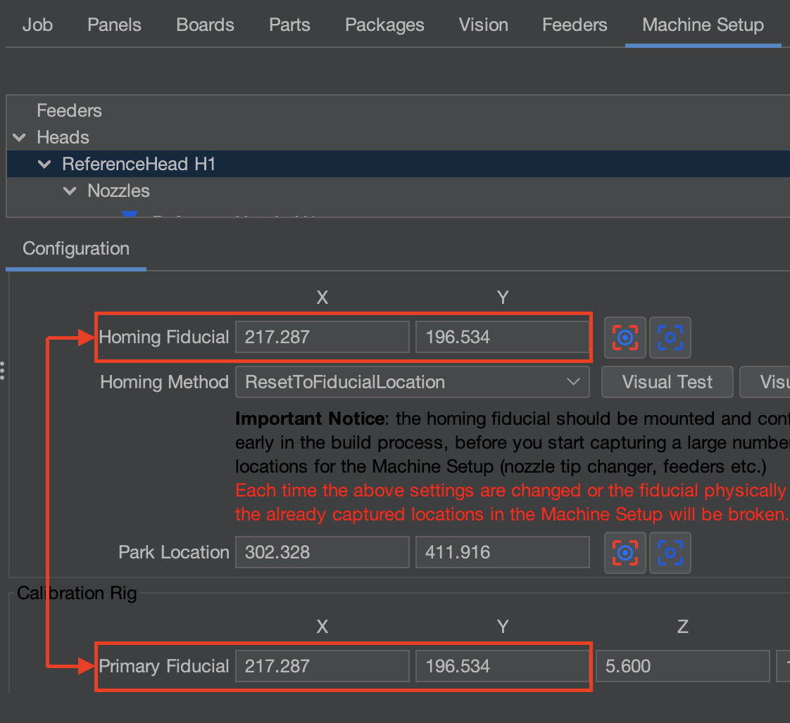
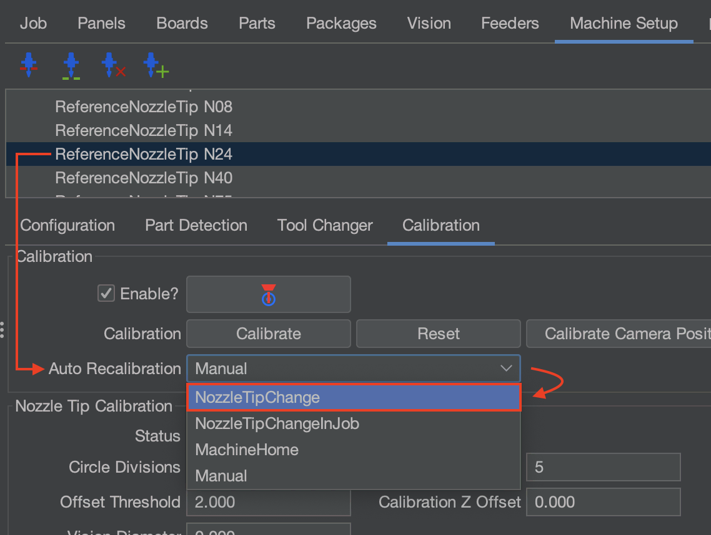

# Prepare Your LumenPnP for Homing

---

## What homing should look like

Now that `ResetToFiducialLocation` is set, when the homing button is pressed, you will see that the head does not stay in the front left corner, but instead it moves to the primary fiducial where it scans and centers itself on the fiducial's exact center. After the fiducial homing process is complete, it is followed up by scanning each nozzle tip for runout compensation. OpenPnP will automatically calibrate any installed nozzle tips that are configured for `NozzleTipChange` recalibration. scanning the nozzle tips during homing will be activates in the steps below.

## What this step does

Homing requires a precise, consistent location to call upon and center itself on after homing is initiated. The end stops provide a repeatable starting point, but small amounts of mechanical variation can still exist after each homing cycle. The Homing Method `ResetToFiducialLocation` uses a known fiducial location to perfect the machine's position after homing, which improves the repeatability and placement accuracy.

Runout calibration measures how the center of a nozzle tip appears to shift as it rotates under the bottom vision camera. This shift can be caused by manufacturing tolerances, mounting variation, or slight misalignment between the nozzle and rotation axis. OpenPnP calculates this offset and compensates for it during placement. This ensures the center of the component remains accurately aligned regardless of nozzle rotation.

---

## Prepare for Homing your machine

Before you can properly use the LumenPnP, you must ensure the following changes have been made before homing the machine. Without these changes, your machine will be inaccurate.

**Set your Homing Method**

Confirm the following settings before homing the LumenPnP.

### Homing Method

* Go to `Machine Setup > Heads > ReferenceHead H1 > Homing Method` and ensure it is changed from `None` to `ResetToFiducialLocation`

    
* While here, confirm that the homing fiducial's XY coordinates match what is set for the primary fiducial.

    

### Nozzle Tip Runout

* (Apply this to all nozzles that will be used. We plan to use the `N045` and `N24` nozzle tips for validation.)
* Go to `Machine Setup > Nozzle Tips > ReferenceNozzleTip N045 > Calibration Tab > Auto Recalibration dropdown` and change it from `Manual` to `NozzleTipChange`

    
* Go to `Machine Setup > Nozzle Tips > ReferenceNozzleTip N24 > Calibration Tab > Auto Recalibration dropdown` and change it from `Manual` to `NozzleTipChange`

    

---

## Calibration Complete

Calibration is done and homing has been configured. Now, all we need to do is validate that the machine is properly calibrated and placing parts in a controlled environment. To do this, we'll populate the FTP board with components.

 **Do not continue with any other steps within Issues and Solutions until the FTP Board has been successfully validated with proper placements. Verifying the FTP Board with a known working position file and PCB that we supply ensures the machine is properly calibrated and provides a safe environment to test your placement of parts before using your own.**

Next Step

We need to validate that the machine is properly calibrated and placing parts in a controlled environment. We'll use the FTP board to accomplish this.

<a href="../../v4-1/controlled-validation-test/introduction/" class="next-step">Validation Test →</a>

