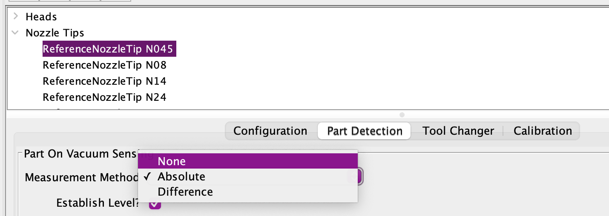
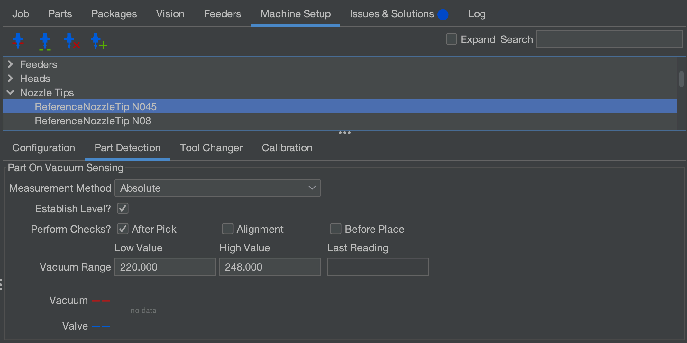

# Vacuum Part Detection ([Video Guide](https://youtu.be/h3mtEQfGMlM?si=eluz16VnR4F9oS9S&t=1956))

When picking up parts with the LumenPnP, it’s important to verify that a part has been successfully picked. While the bottom camera can confirm this visually, using the LumenPnP's vacuum sensors provides a faster way to detect a successful pick.

---

## How Vacuum Part Detection Works

When a part is picked up, it seals the nozzle opening, causing an increase in vacuum pressure within the pneumatic line. This change in pressure is measured by the vacuum sensors, and OpenPnP uses this data to determine whether a part has been successfully picked. With the nozzle tip covered, **if the vacuum sensor value falls within the Vacuum Range low and high values, OpenPnP considers the part "picked"**.

Each nozzle has a different vacuum reading due to variations in nozzle tip size. **The exact numbers aren’t critical as long as you understand how to set the high and low values correctly and adjust them accordingly**.
  

!!! note "Disabling Vacuum Detection is an Option"
    **Vacuum Part detection is not required to use the LumenPnP** because the bottom camera checks for a part before placing anyway. If you'd like to disable this feature, it's just a matter of setting "**Measurement Method**" to "**None**" on the relevant nozzle tip. **Don't forget to `Apply` your settings before moving on**. `Machine Setup > Nozzle Tips > Reference Nozzle Tip N## > Part detection tab > Measurement Method > None`

     
  

---

## Setting Up Vacuum Part Detection for Nozzle: N1

1. **Confirm the correct nozzle is installed**.
    * Ensure that the `N045` nozzle tip is securely attached to the **left toolhead**.
  

1. **Position the Nozzle for Accurate Readings**.
    * Navigate to `Machine Setup > Cameras > OpenPnPCaptureCamera Bottom > Position tab > Location`
    * Click the `Position the tool over the center of the location` button.
    *  This brings the `nozzle: N1` to the **same Z height as the datum board**, ensuring more consistent readings for the following steps.
  

1. **Open the Part Detection Settings**.
    * Navigate to `Machine Setup > Nozzle Tips > ReferenceNozzleTip N045 > Part Detection`.
     
  

1. **Measure the Vacuum Pressure**.
    Open the H1:VAC1 actuator window.
    1. Click `On` to activate the pump and valve.
    2. Click `Read`. A value will appear in the `Read Value box`. This represents the vacuum pressure when the nozzle is **uncovered**.
    3. **Take note of this number**. We will need it later.

     
     
  

1. **Measure the Vacuum Pressure with a Sealed Nozzle**.
    1. Cover the nozzle tip completely with your fingertip.
    2. Click `Read` again. This represents the vacuum pressure when a part is picked, or "**covered**".
    3. **Take note of the new value**. We will also need it later.
  

1. **Calculate the Detection Threshold**. 
    1. Find the midpoint between the uncovered and covered values. For example:
        * Uncovered: **240**
        * Covered: **230**
        * Midpoint: **235** → Enter this as the `High Value`.
        * 
    2. Ensure the `Low Value` is at least **5-10 units lower** than the uncovered reading. The default low value is **220**, but if your readings are close to this number, you may need to lower it further to avoid false detections. If your uncovered reading is **225**, setting the low value to **215 (or lower)** is a good starting point.
    3. Enter the calculated midpoint value into the **Vacuum Range** `High Value` field for the **N045** nozzle tip.

    !!! caution
        The difference between uncovered and covered readings may be small, but **even a single-digit change can indicate a successful pick**. Nozzle sizes affect these readings, so expect variations between nozzles.

1. **Apply the Settings**.
    * Click `Apply` to save the changes to the **N045** nozzle tip.

---

## Setting Up Vacuum Part Detection for Nozzle: N2

1. **Confirm the correct nozzle is installed**.
    * Ensure that the `N24` nozzle tip is securely attached to the **right toolhead**.
  

1. **Position the Nozzle for Accurate Readings**.
    * Navigate to `Machine Setup > Cameras > OpenPnPCaptureCamera Bottom > Position tab > Location`
    * Click the `Position the tool over the center of the location` button.
    *  This brings the `nozzle: N2` to the **same Z height as the datum board**, ensuring more consistent readings for the following steps.
  

1. **Open the Part Detection Settings**.
    * Navigate to `Machine Setup > Nozzle Tips > ReferenceNozzleTip N24 > Part Detection`.
     
  

1. **Measure the Vacuum Pressure**.
    Open the `H1:VAC1` actuator window.
    1. Click `On` to activate the pump and valve.
    2. Click `Read`. A value will appear in the `Read Value box`. This represents the vacuum pressure when the nozzle is **uncovered**.
    3. **Take note of this number**. We will need it later.

     
     
  

1. **Measure the Vacuum Pressure with a Sealed Nozzle**.
    1. Cover the nozzle tip completely with your fingertip.
    2. Click `Read` again. This represents the vacuum pressure when a part is picked, or "**covered**".
    3. **Take note of the new value**. We will also need it later.
  

1. **Calculate the Detection Threshold**. 
    1. Find the midpoint between the uncovered and covered values. For example:
        * Uncovered: **240**
        * Covered: **230**
        * Midpoint: **235** → Enter this as the `High Value`.
        * 
    2. Ensure the `Low Value` is at least **5-10 units lower** than the uncovered reading. The default low value is **220**, but if your readings are close to this number, you may need to lower it further to avoid false detections. If your uncovered reading is **225**, setting the low value to **215 (or lower)** is a good starting point.
    3. Enter the calculated midpoint value into the **Vacuum Range** `High Value` field for the **N24** nozzle tip.

    !!! caution "Don't forget"
        The difference between uncovered and covered readings may be small, but **even a single-digit change can indicate a successful pick**. Nozzle sizes affect these readings, so expect variations between nozzles.

1. **Apply the Settings**.
    * Click `Apply` to save the changes to the **N24** nozzle tip.

---

## Next Steps

Next is [the FTP](../../ftp/index.md).
