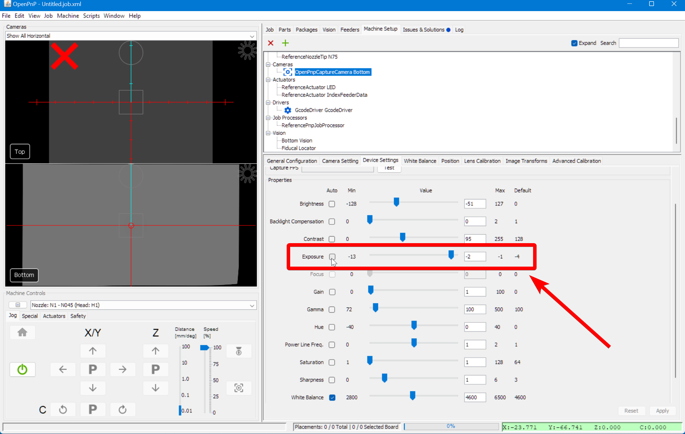

# Connecting to Your LumenPnP V4 ([Video Guide](https://youtu.be/h3mtEQfGMlM?si=EwPYDBEEKK8miH29&t=31))

**Now that OpenPnP is installed and the LumenPnP configuration files have been placed in the hidden system folder, OpenPnP can start with some basic preconfigured settings. The next step is to connect your LumenPnP and get familiar with OpenPnP’s user interface.**.

## Prepare for Connection

**Before launching OpenPnP, follow these guidelines to ensure a smooth connection**:

!!! warning "USB Connection Order Matters!"
    Always plug in your LumenPnP’s USB cable before launching OpenPnP.  
    If OpenPnP is already open, close it before connecting the USB.

!!! warning "Camera USB Ports"
    **Plug cameras directly into your computer using separate USB ports**.  
    Avoid USB hubs, as they may not provide enough bandwidth for the cameras.**Use separate USB ports directly into your computer**. The cameras require a lot of USB bandwidth, and many USB hubs aren't capable of handling it. For best results, make sure each camera is plugged into a different USB port directly into your computer, ideally on different internal USB hubs.

---

## Connecting to Your LumenPnP V4

Follow these steps in order:

1. **Ensure OpenPnP is closed**.

1. **Power the LumenPnP** by plugging in the barrel jack power cable.

1. **Connect the LumenPnP** to your computer using the included USB cable.

1. **Connect both cameras** using their USB cables.

1. **Launch OpenPnP**. You should now see the OpenPnP user interface:
  
  

---

## Configuration the Serial Port

**Before OpenPnP can communicate with the LumenPnP, we need to set the correct serial port**.

1. **Open Machine Setup**
    * Click the `Machine Setup` tab, toward the top right section of OpenPnP.
     
  

1. **Expand the Configuration Trees**
    * Check the `Expand` checkbox toward the top right of OpenPnP to show all machine configuration options.
    * This will expand all of the categories, and sub-categories, in the upper pane of `Machine Setup` and will require you to scroll to see all of the options mentioned below.
     
  

1. **Select the Gcode Driver** 
    * In the upper pane, locate the newly expanded `Drivers` category and click on `GcodeDriver GcodeDriver`.
     
  

1. **Choose the Correct Port**
    * Under the `Serial Port` section in the `Configuration` tab, select the correct `Port` from the dropdown menu:
        * **Windows**: The `Port` will be labeled as `COM#`. *(Examples COM1, COM2, COM3, etc.)*
        * **Mac**: Look for a `Port` in the format of `cu.usbmodemXXXX`, where `XXXX` is a series of numbers.
        * **Linux**: Select the `Port` formatted as `ttyACM#`. *(Examples ttyACM0, ttyACM1, ttyACM2, etc.)*
     
  

1. Apply and Save
    * Click `Apply` in the lower right corner to save your changes.
     
    * Save your OpenPnP configuration: `File > Save Configuration`.
     

!!! info "Port Not Found?"

    If your machine's port isn't listed: 

       1. Ensure the USB cable is securely connected on both sides.
       
       2. Make sure the motherboard is powered on.
       
       3. Close OpenPnP, press the reset button on the control box, wait a few seconds, and reopen OpenPnP. 
       
       4. Finally, use our [Debug Tool](https://debug.opulo.io) and see if you are able to connect your LumenPnP there.
  

---

## Establishing a Serial Connection

1. **Connect OpenPnP to Your Machine**
    * Click the **green power button** in the `Machine Controls` section (Bottom left of OpenPnP).
     
  

1. **Confirm Connection**
    * If successful, the green **power button will turn red**. This means OpenPnP has successfully connected to your machine.
     
    * If unsuccessful,review your [Serial Port Connection](#serial-port-configuration).
  

1. **Turn On Ring Lights**
    * In the bottom left corner of OpenPnP, go to `Machine Controls`.
    * Click the `Actuators` tab.
    * Click the `LED` button.
    * Then press `On`.  
     

    !!! note "Keep Ring Lights On"
        Keep the ring lights on for the rest of calibration. All calibrations should be based on the lighting from the ring lights.
        Once calibration is complete and running a job on the LumenPnP, OpenPnP will automatically control the ring lights as needed, eliminating the need for manual operation during normal use.

---

## Configuring the Bottom Camera

Before calibration, the bottom camera and exposure must be set up properly.

1. **Remove Lens Caps**
    * Ensure both the **top and bottom cameras** are uncovered.
     
  

1. **Select the Bottom Camera in OpenPnP**
    * Navigate to `Machine Setup` > `Cameras` > `OpenPnpCaptureCamera Bottom`.
     
  

1. **Choose the Correct Camera Device**
    * In the `Device Settings` tab, select `LumenPnP Bottom` from the `Device` dropdown.
     
    * Switch to the `Device Settings` tab in the lower detail pane.
     

    !!! info "Duplicate Camera Names"
        If two cameras appear with the same name, select one—if incorrect, choose the other. This is a bug within OpenPnP.
  

1. **Set Resolution and Frame Rate**
    * In the `Format` drop-down menu, select `1920x1080 5fps`. *A low frame rate is crucial to avoid bandwidth/performance issues*.
     
  

1. **Apply and Verify**
    * Click `Apply` to save the **Bottom Camera** settings. One of the red "X"s in the camera feed should disappear. The image might be entirely black, but we'll fix that in the following steps.
     
     
  

1. **Positioning 'Nozzle: N1' Over the Bottom Camera**
    * In the bottom left of OpenPnP, select `Nozzle: N1` from the `machine controls` drop-down menu.
      //placeholder for photo
    * Using the `Machine Controls`, jog `Nozzle: N1` to be anywhere **above the datum board** and lower `Nozzle: N1`, using the `Z-axis` controls, until it's just *barely* touching the datum board. The exact position on the datum board isn’t critical. This ensures the nozzle is at the correct Z-height for calibration.
    * **Keeping the Z-height unchanged**, jog Nozzle: N1 to be roughly over the bottom camera.
      //placeholder for photo
  

1. **Adjust the Bottom Camera Exposure**.
    * Return to `Machine Setup > Cameras > OpenPnpCaptureCamera Bottom` to adjust the exposure. This will help us through the rest of the calibration.
    * In the `OpenPnpCaptureCamera Bottom` go to the `Device Settings` tab and locate the `Properties` section.
    * We will only be touching the exposure slider. All other sliders should be left to their default.
    * Located the `Exposure` slider and click on the check box labeled `Auto`. Allow the camera to attempt to auto focus.
    * Then, uncheck the `Auto` box to ensure we are now in "manual adjustment" mode.
    * Adjust the `Exposure` slider until the nozzle tip is easy to see. This is a preliminary adjustment—you'll fine-tune it later.
     
  

    !!! warning "Other Camera Settings"
        Do not modify any camera settings other than exposure. The default values should remain unchanged.

    !!! danger "For Mac Users"
        On some Macs, If OpenPnP doesn’t allow exposure adjustments, use the open-source tool, [CameraController](https://github.com/Itaybre/CameraController).
  

---

## Configuring the Top Camera

1. **Select the Top Camera in OpenPnP**
    * Navigate to `Machine Setup > Heads > ReferenceHead H1 > Cameras > OpenPnpCaptureCamera Top`.
     
  

1. **Choose the Correct Camera Device**
    * In the `Device Settings` tab, select `LumenPnP Top` from the `Device` dropdown.
     
  

1. **Set Resolution and Frame Rate**
    * In the `Format` dropdown menu, select `1920x1080 5fps`. *A low frame rate is crucial to avoid bandwidth/performance issues*.
     
  

1. **Apply and Verify**
   * Click `Apply` to save the **Top Camera settings**. One of the red "X"s in the camera feed should disappear. The image might be entirely black, but we'll fix that in the following steps.
     
  

1. **Positioning the Top Camera Over the Datum**
    * Go to `Machine Controls` in the bottom left corner of OpenPnP and **jog the `Top Camera` to be roughly above the datum board**.
  

1. **Adjust the Exposure**.
    * Return to `Machine Setup > Heads > ReferenceHead H1 > Cameras > OpenPnpCaptureCamera Top` to adjust the exposure. This will help us through the rest of the calibration.
    * In the `OpenPnpCaptureCamera Top` go to the `Device Settings` tab and locate the `Properties` section.
    * We will only be touching the exposure slider. All other sliders should be left to their default.
    * Located the `Exposure` slider and click on the check box labeled `Auto`. Allow the camera to attempt to auto focus.
    * Then, uncheck the `Auto` box to ensure we are now in "manual adjustment" mode.
    * Adjust the `Exposure` slider until the Datum Board is easy to see. This is a preliminary adjustment—you'll fine-tune it later.
      
  

---

## Next Steps

Now that your LumenPnP is connected and both cameras are configured, you're ready to proceed with calibration. Continue to  [Homing Fiducial](../4-homing-fiducial/index.md).
