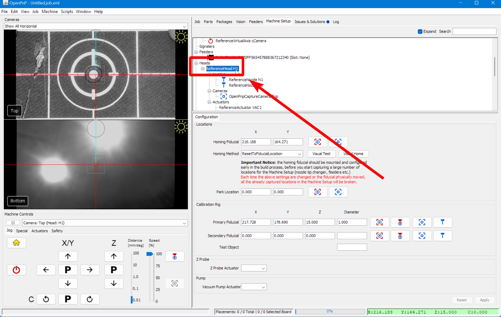
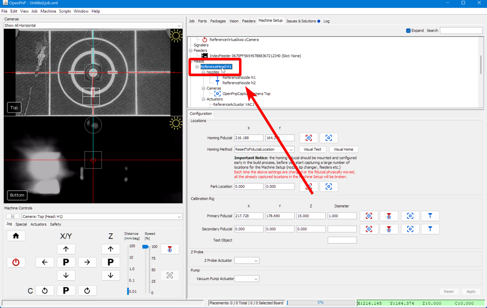

# Homing Fiducial ([Video Guide](https://youtu.be/h3mtEQfGMlM?si=YzBwkxLlAcJWxDJe&t=527))

Now, we can set up the **datum board**. Setting up the datum board ensures **precise and repeatable homing** for the LumenPnP. The center dot on the datum board is called the **"homing fiducial"**, and is the key calibration point, allowing fine-tuning of the machine’s XY position **to compensate for minor variations in limit switch accuracy**.

## Preparing for Homing

1. **Level the nozzles before homing**.

    !!! danger "🚨 Critical Warning: Level Nozzles Before Homing 🚨"
        **Before pressing the homing button**—now and every time in the future—**you must ensure that your nozzles are level**.  
        ⚠️ **Failure to do this can cause crashes and potentially damage your machine.**  
        OpenPnP **does not** remember the previous nozzle positions from the last homing sequence, meaning it **cannot adjust movements based on past alignment**. If the nozzles are not level before homing, they may collide with the machine, leading to misalignment or serious hardware damage.
      
  

2. Click the **Home button** to perform a rough homing sequence.
    * The Nozzles will move to X, Y, and Z zero positions **(front-left corner of the LumenPnP)** and park there.
      

---

## Setting Homing Fiducial Location

1. Navigate to  `Machine Setup > Heads > ReferenceHead H1`.
      
  

2. In the **Configuration tab**, change the **Homing Method** to `ResetToFiducialLocation`.
    * This sets the **homing sequence** to always finish by **scanning the fiducial**, which helps correct any minor inaccuracies caused by the endstops.
      
  

3. Apply and Save
    * Click `Apply` in the lower right corner to save your changes.
      
    * Save your OpenPnP configuration now. `File > Save Configuration`.
      

    !!! Warning "Caution"
          **DO NOT** click the **homing button** again until you have fine-tuned the homing fiducial location, as explained in the next section.
  

4. Click on the **"Position Camera Over Location"** icon button shown below.
    * This moves the **top camera** to the **approximate position** of the datum board..
      
  

5. Ensure **LED lights** are on:
    * Ensure your **Top and Bottom ring lights** are still on. If not, go back to the **Machine Controls** in the bottom-left section of OpenPnP and go to `Actuators tab > LED > On`.
      
      

    !!! info "Tip"
          **Cameras are pre-adjusted to the correct focus**, but if you'd like to fine-tune their focus, you can twist the top of the lens.
  

6. Return to the `Jog` tab in **Machine Controls** so we can fine-tune the homing fiducial location.
      
  

7. Set the `Distance` slider to `0.1` or `0.01` for more precise movements.
    * You can use your mouse scroll wheel to zoom in on the feed for more precision.
      

8. Align the Top Camera:
    * Towards the bottom right of OpenPnP, **use the jog controls** to position the **center of the reticle** directly over the **Homing Fiducial** in the perfect-center of the **Opulo logo**. Adjust the `Distance` slider as needed.
      

      
  

9. Now that we're **perfectly centered** on the homing fiducial, We need to save this location in **two** different places.
    * **First**, click the `Capture Camera Location` button to save the fiducial’s position for the **Homing Fiducial**.
    * **Then**, Scroll down to the **Calibration Rig** section and click the `Capture Camera Location` button next to the **Primary Fiducial** field.
      s

    !!! info "Tip"
        We use the "**Ruler**" Reticle in the following steps. If you prefer a different **reticle style** in the center of the camera feed, right-click the **camera feed** to change the **Reticle style**. Choose "**Ruler**" to match our docs photos best.
        
  

1.  Apply and Save
    * Click `Apply` in the lower right corner to save your changes.
      
    * Save your OpenPnP configuration now. `File > Save Configuration`.
      
  

---

## Fine-tune Camera Exposure

In order for OpenPnP to reliably detect the LumenPnP's homing fiducial, we'll need to **set the exposure and camera settings for your top camera** correctly.

We also detail this process in our [setup video](https://youtu.be/h3mtEQfGMlM?t=842).

1. Navigate to `Machine Setup > Heads > ReferenceHead H1 > Cameras > OpenPnPCaptureCamera Top`.
      
  

2. In the lower detail pane, switch to the `Device Settings` tab.
      
  

3. Right click on the camera feed and select `Show Image Info?` to enable the image info card. This will give you the brightness histogram of the image.
      
  

4. Adjust the exposure using the slider.
    * 🚨 **Keep all other camera settings at their default value, and only adjust the exposure slider**.
    * Aim for a **sharp peak on the right side** and a larger **cluster to the left** in the histogram. See the image below for reference.
    !!! Warning "🚨 Important 🚨"
        The reference image below is just an example—**your histogram may look very different** depending on lighting conditions, camera placement, and other environmental factors. **Do not try to match it exactly.** Instead, focus on achieving the key characteristics: a distinct peak on the right and a noticeable cluster to the left. Adjust gradually until the image is clear and well-exposed.
      {: style="width:60%;margin-left:10%;"}
  

5. Once you've found a good exposure value, **record your exposure value** by saving them in a text file or writing them down:
    * OpenPnP may not retain camera settings after restart, so **save the exposure value** for reference.
    * This means every time you boot up OpenPnP you'll have to:
        * Toggle **Auto Exposure** `on`, then `off`. (This puts your camera into manual exposure mode)
        * **Type your recorded exposure value into the exposure field beside the slider**.
  

6. **Turn off the histogram view** the same way you turned it on.

---

## Test Fiducial Homing

1. Navigate to `Machine Setup > Heads > ReferenceHead H1`.
      
  

2. Click on the **Home button** in the `Machine Controls Pane > Jog Tab` and watch your machine home using the limit switches, then moves the top camera over the homing fiducial and find its exact location. When the camera scans the fiducial, it will have a red-colored hue that scans for the fiducial's circle.
      
  

3. If you receive the error `FIDUCIAL-HOME no matches found`, OpenPnP was not able to find your homing fiducial. You need to adjust your [Homing Fiducial Pipeline](../../vision-pipeline-adjustment/2-homing-fiducial-pipeline.md/).
      
  

---

## Next Steps

Next is the [MM/Pixel Calibration.](../5-mm-per-pixel/index.md)