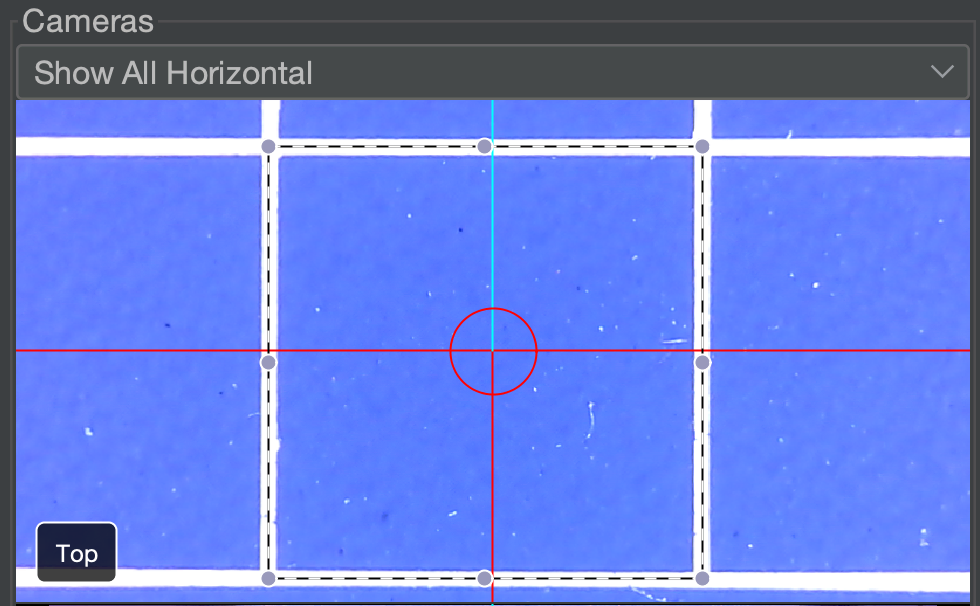

# MM/Pixel ([Video Guide](https://youtu.be/h3mtEQfGMlM?si=WXlOSWQ4RWR7R7zD&t=1002))

This next step calibrates the relationship between pixels and millimeters to make our cameras more accurate. But first, we're going to add some nozzle tips to our nozzles.

## Mounting Nozzle Tips

1. **Lubricate both brass nozzles**.
    * Apply a small amount of **SuperLube** to the brass nozzles. This prevents damage to the rubber O-rings when mounting nozzle tips. We pre-lubricate them before shipping, but adding extra ensures longevity.

    
  

2. **Locate Your Nozzle Tips**.
    * Find and remove the `N045` and `N24` nozzle tips in the nozzle rack located in your LumenPnP v4 packaging.

     

    !!! warning "Automatic Nozzle Tip Swapping"
        OpenPnP supports automatic nozzle tip swapping, but we don’t recommend it yet due to inconsistent performance. This feature will be improved in a future update, and the nozzle tip rack will be mounted on the staging plate. Most jobs can be completed using an `N045` on one nozzle and an `N24` on the other.
  

3. **Mount the `N045` Nozzle Tip**.
    * In OpenPnP, navigate to `Machine Setup > Heads > ReferenceHead H1 > Nozzles > ReferenceNozzle N1`.
    * Select the `Nozzle Tips` tab, and check the `Loaded?` checkbox for the `N045` row.
    * **Your machine will jog the head to the front of the machine** for easy tip loading.
    * A **”Task Interrupted:”** window will pop up. This is **not** an error! OpenPnP is just notifying you that the job has been stopped if one is running. This is normal and can be dismissed.
     
     
    * Slide the **N045 nozzle tip** (the one with the smaller opening) onto the **left nozzle** (red tubing). Rotate the nozzle tip as you mount it to the brass nozzle to evenly distribute the lubricant around the O-rings. It should slide on and off smoothly after working it in.
     
  

4. **Mount the `N24` Nozzle Tip**.
    * In OpenPnP, navigate to `Machine Setup > Heads > ReferenceHead H1 > Nozzles > ReferenceNozzle N2`.
    * Select the `Nozzle Tips` tab, and check the `Loaded?` checkbox for the `N24` row.
    * **Don’t forget.** It will move to the second nozzle and you’ll see the **”Task Interrupted:”** popup window again.
     
    * Slide the N24 nozzle tip (the one with the larger opening) onto the **right** nozzle (using blue tubing). Rotate the nozzle tip as you mount it to the brass holder to ensure the grease works its way into the tip and around the O-rings. It should slide on and off easily after working it in.
     

    !!! Tip "Why These Nozzle Tips?"
        The **N045** and **N24 nozzle tips** cover the vast majority of parts **without needing swaps**. We highly recommend keeping them as the default and only swapping when absolutely (e.g., for very heavy parts).

---

## Top Camera Calibration

In this step, we will calibrate the mm/pixels for the **Top Camera**. This requires us to set the dimensions and use a virtual bounding box to outline and measure one of the squares on the datum board, known as a golden guideline square. This allows us to calibrate the **top camera’s Units per pixel**, giving us accurate top camera movement.

1. **Navigate to ReferenceHead H1**.
    * In OpenPnP, go to `Machine Setup > Heads > ReferenceHead H1`.
     
  

2. **Position the Camera over the Datum Board**.
    * Click on the "Position Camera over location" icon button shown below. This will move the top camera to where your datum board is mounted.
     
  

3. **Select the Top Camera**. 
    * Navigate to `Machine Setup > Heads > ReferenceHeadH1 > Cameras > OpenPnPCaptureCamera Top`.
     
  

4. **Click on the `General Configuration` tab**.
     
  

5. **Scroll down to the** `Units Per Pixel` **section**.
    * Locate the Object Dimension Fields for **X** and **Y**.
     
  

6. **Set the Object Dimensions**.
    * In the **X** Object Dimension field, enter `5`.
    * In the **Y** Object Dimension field, enter `5`.
    * Double-check that both **X and Y** are set correctly before proceeding.
     
  

7. **Locate a calibration square to be measured**.
    * Jog the machine until a **golden guideline square** is fully visible in the top camera view. The square should be roughly centered in the camera's reticles. The whole square must be visible. If necessary, use the scroll wheel to zoom out and ensure the entire square is visible.
     
  

8. **Align and Measure**.
    * locate and click the `Measure` button.
     
    * Click and drag in the camera view to create a bounding box. Align it with the center of the golden guideline square to align with the lines along its edge. The square is exactly 5mm x 5mm.
     

    !!! Note "Squareness"
        Don't worry if the box's square doesn't perfectly align with the camera image. Any slight skew will be adjusted for during jobs with fiducial calibration.
  

9. **Finalize Calibration**.
    * Once you have it perfectly outlined, click the `Measure` button again to update the Units Per Pixel values.
     

    * Click `Apply` to save the changes.
     
  

10. **Confirm Top Camera Calibration**.
    * Click and drag the center reticle (located in the middle of the camera feed) to one of the corners of the Golden Guideline Square.
    * If the mm/pixel calibration is correct, the **Top Camera** will move to be precisely over your chosen corner.

---

## Bottom Camera Calibration

The following steps will calibrate the mm/pixels for the **Bottom Camera**. This requires us to set the dimensions and use a virtual bounding box to outline the nozzle tip. This allows us to calibrate the **bottom camera’s Units per pixel**, giving us accurate bottom camera movement.

1. **Rehome your machine using the home button**.
    !!! warning "Too Many Vision Misdetects…"
    Don't worry if you receive a warning stating “Too many vision misdetects…”; this is expected. This means that the bottom camera’s exposure has not yet been properly adjusted to detect the fiducial on the datum board. This will be corrected in the following steps, so you can safely ignore the warning.
  

1. **Select the bottom Camera**. 
    * Navigate to `Machine Setup > Cameras > OpenPnPCaptureCamera Bottom`
    * Open the `Position` tab.
     
    * In the drop-down under `Machine Controls`, select `Nozzle: N2` to control the nozzle on the right. This way, for any nozzle commands we run, OpenPnP knows to base them on N2 and **not** N1 (left) nozzle.
     
  

1. **Manually adjust the Nozzle to be over the Bottom Camera**.
    * Using the controls at the bottom left of OpenPnP, jog the N2 (right) nozzle to be roughly in the center of the Datum board. It does not need to be precise.
    * Lower the N2 nozzle so that it’s just barely touching the top surface of the Datum Board. It doesn’t matter exactly where.
    * **Keep the nozzle at this Z height** and carefully use the jog controls to move it directly over the **center of the bottom camera’s reticle**.
     
     
     
    !!! Tip "Fine-Tuning Focus"
        The bottom camera’s focus is pre-adjusted before shipping, but you can fine-tune it if needed. The lens is secured with friction grease, so apply light pressure while twisting the top portion of the lens until the image appears sharp. Avoid excessive force.
         
  

1. **Go to the `General Configuration` tab**.
     
  

1. **Scroll down to the** `Units Per Pixel` **section**.
    * Locate the Object Dimension Fields for **X** and **Y**.
     
  

1. **Set the Object Dimensions**
    * In the **X** Object Dimension field, enter `4`.
    * In the **Y** Object Dimension field, enter `4`.
    * Double-check that both **X and Y** are set correctly before proceeding.
     
  

1. **Align and Measure** 
    * locate and click the `Measure` button.
     
    * Click and drag in the camera view to create a bounding box. Align it with the center of the nozzle tip so that it's **perfectly tangent to the edges** as shown in the image.
     
  

1. **Finalize Bottom Camera Calibration**
    * Once you have it perfectly outlined, click the `Measure` button again to update the Units Per Pixel values.
     
    * Click `Apply` to save the changes.
     
  

1.  **Confirm Bottom Camera Calibration**. 
    * Jog the N2 nozzle tip to be away from the center, yet still visible by the bottom camera.
    * Click and drag the center reticle (located in the middle of the camera feed) to the middle of the nozzle tip.
    * The **Bottom Camera** should now be centered on the nozzle tip again.
    * If it's inaccurate, repeat the bottom camera calibration and confirm you are using the larger N24 nozzle tip on the nozzle on the right, N2.

---

## Next Steps

Next is [Nozzle Offset Calibration](../6-nozzle-offset/index.md).
