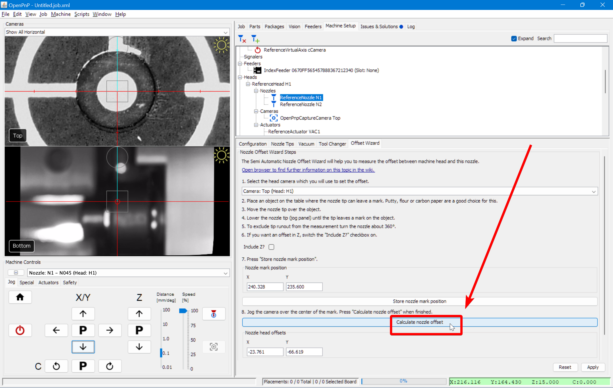

# Top Camera to Nozzle Offset ([Video Guide](https://youtu.be/h3mtEQfGMlM?si=wUI5YeJmyOG8ii4G&t=1375))

Calibrating the nozzle offset ensures precise alignment between the nozzle tips and the top camera. This process involves capturing the exact position of the nozzle tip and aligning the top camera to the same reference point. The calibration is essential for accurate component placement and must be performed carefully.

This guide will calibrate both nozzles, ensuring they share the same focal plane as your datum board, components, and PCBs.

---

## N1 Nozzle Offset (Left Toolhead)

For these steps, you should be in the `Machine Setup` tab.

!!! note
    Use the `P` between the Z-axis up/down arrows to ensure the nozzle tips are out of the way. The `P` stands for **Parking** the nozzle out of the way into a safe height that won’t collide with any objects.

1. **Confirm the correct nozzle is installed**.
    * Confirm that the `N045` nozzle tip is securely attached to the **left toolhead**.
     
  

2. **Select the correct nozzle to control**.
    * In the bottom left of OpenPnP, select `Nozzle: N1 - N045 (Head:H1)` from the **machine controls** dropdown. This ensures that movements and adjustments apply to the **left** nozzle equipped with the `N045` nozzle tip.
     
  

3. **Open the Nozzle N1 settings**.
    * Click through the following path: `Heads > ReferenceHead H1 > Nozzles > ReferenceNozzle N1`.
     
  

4. **Open the Offset Wizard tab**.
    * Navigate to the `Offset Wizard` tab, where the nozzle offset calibration process will be performed.
     
  

5. **Confirm the ‘Include Z?’ setting**.
    * Ensure that the `Include Z?` checkbox is checked. This ensures that the Z-height is properly factored into the calibration process.
     
  

6. **Position the nozzle over the homing fiducial**.
    * Jog the N1 (left) nozzle so that it *barely* touches the datum board and is perfectly centered over the golden homing fiducial. **Avoid collisions while jogging the nozzle tip**.
     
    * Use the shiny edges of the fiducial that are visible around the nozzle tip to determine proper centering. Accuracy here is crucial to achieving precise placements, so please take your time with this and ensure it is dead center.
     
     
  

7. **Capture the nozzle’s position**.
    * Click the `Store nozzle mark position` button within the **Offset Wizard** tab to capture the N1 (left) nozzle's location for calibration purposes. 
    * Do not navigate away from the **Offset Wizard tab** while you go through the following steps to capture the nozzle offset. 
     
  

8. **Raise the nozzle off the datum board**.
    * Click the letter `P` between the Z up/down arrows to “**Park**” the nozzle at a safe height. This prevents collisions when moving the top camera into position.
     

    !!! Note
        The nozzles may not be level when clicking the “Park” button, which is okay. The nozzle only moves to the point that it reaches the “safe zone” and then stops.
  

9. **Align the top camera over the homing fiducial**.
    * Jog the **X** and **Y** axes to bring the top camera directly over the same homing fiducial used in the previous step so it is in the exact center of the camera feed. **Do not switch away from the Offset Wizard tab**. OpenPnP **will not save** your nozzle mark position.
     
  

10. **Calculate the nozzle offset**.
    * Once the homing fiducial is centered in the top camera view, click `Calculate nozzle offset`. This determines the offset distance between the nozzle and the top camera based on their recorded positions.
     
  

11. **Save the nozzle offset**.
Click `Apply` to store the calculated offset for the left nozzle tip.
     

---

## N2 Nozzle Offset (Right Toolhead)

For these steps, you should be in the `Machine Setup` tab.

!!! Note
    Use the `P` between the Z-axis up/down arrows to ensure the nozzle tips are out of the way. The `P` stands for **Parking** the nozzle out of the way into a safe height that won’t collide with any objects.

1. **Confirm the correct nozzle is installed**.
    * Confirm that the `N24` nozzle tip is securely attached to the **left toolhead**.
     
  

2. **Select the correct nozzle to control**.
    * In the bottom left of OpenPnP, select `Nozzle: N2 - N24 (Head:H2)` from the **machine controls** dropdown. This ensures that movements and adjustments apply to the **left** nozzle equipped with the `N24` nozzle tip.
     
  

3. **Open the Nozzle N1 settings**.
    * Click through the following path: `Heads > ReferenceHead H1 > Nozzles > ReferenceNozzle N2`.
     
  

4. **Open the Offset Wizard tab**.
    * Navigate to the `Offset Wizard` tab, where the nozzle offset calibration process will be performed.
     
  

5. **Confirm the ‘Include Z?’ setting**.
    * Ensure that the `Include Z?` checkbox is checked. This ensures that the Z-height is properly factored into the calibration process.
     
  

6. **Position the nozzle over the homing fiducial**.
    * Jog the N2 (right) nozzle so that it *barely* touches the datum board and is perfectly centered over the golden homing fiducial. **Avoid collisions while jogging the nozzle tip**.
     
    * This nozzle tip is larger than the last one, which is okay. We will use the circle just outside of the golden homing fiducial to determine if you've centered it correctly. Accuracy here is crucial to achieving precise placements, so please take your time with this and ensure it is dead center.
     
     
  

7. **Capture the nozzle’s position**.
    * Click the `Store nozzle mark position` button within the **Offset Wizard** tab to capture the N2 (right) nozzle's location for calibration purposes. 
    * Do not navigate away from the **Offset Wizard tab** while you go through the following steps to capture the nozzle offset. 
     
  

8. **Raise the nozzle off the datum board**.
    * Click the letter `P` between the Z up/down arrows to “**Park**” the nozzle at a safe height. This prevents collisions when moving the top camera into position.
     

    !!! Note
        The nozzles may not be level when clicking the “Park” button, which is okay. The nozzle only moves to the point that it reaches the “safe zone” and then stops.
  

9. **Align the top camera over the homing fiducial**.
    * Jog the **X** and **Y** axes to bring the top camera directly over the same homing fiducial used in the previous step so it is in the exact center of the camera feed. **Do not switch away from the Offset Wizard tab**. OpenPnP **will not save** your nozzle mark position.
     
  

10. **Calculate the nozzle offset**.
    * Once the homing fiducial is centered in the top camera view, click `Calculate nozzle offset`. This determines the offset distance between the nozzle and the top camera based on their recorded positions.
     
  

11. **Save the nozzle offset**.
Click `Apply` to store the calculated offset for the right nozzle tip.
     

---

!!! note
    For more information about this step, you can read the OpenPnP docs about it [here](https://github.com/openpnp/openpnp/wiki/Setup-and-Calibration_Nozzle-Setup).

## Next Steps

Next is [Bottom Camera Position](../7-bottom-camera-position/index.md).
