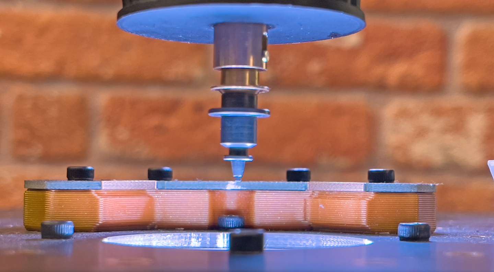

# Bottom Camera Position

Now that you have confirmed the top camera and nozzle tip locations are perfectly aligned, **you must immediately set the bottom camera position by following the steps below**.

Do **NOT** home the machine at this point. If you have already homed it, return to the previous steps and re-validate that the top camera to nozzle tip offsets are still 100 percent accurate before continuing.

**It is critical that the bottom camera position is set directly after the top camera to nozzle tip offset has been fully and accurately calibrated**. This ensures the bottom camera position itself is correct.

All subsequent calibrations depend on the bottom camera being in the correct location. For this reason, this step must be performed in this order, and the bottom camera position should not be adjusted again once it has been set.

---

1. **Select Nozzle: N1**.
    * From the machine controls dropdown, select `Nozzle: N1 - N045 (Head:H1)`. This ensures the left nozzle is used for positioning.  
     
  

1. **Position Nozzle: N1 at Datum Board Height**.
    * Go to `Machine Setup > Heads > ReferenceHead H1 > Primary Fiducial`  
        

    * Click the button to bring the **N1 nozzle tip** to the Homing Fiducial's location.  
        

2. **Align Nozzle Tip Over the Bottom Camera**.
    * Without changing the Z-height or nozzle rotation, jog the Nozzle: N1 (left toolhead) over to the bottom camera and use the machine controls to center the nozzle tip in the image.  
     
     
    !!! Tip "Fine-Tuning Focus"
        The bottom camera’s focus is pre-adjusted before shipping, but you can fine-tune it if needed. The lens is secured with friction grease, so apply light pressure while twisting the top portion of the side of the lens until the image appears sharp. Avoid excessive force. The important thing is that it is in focus at the same height as your primary fiducial's Z-height.
  

1. **Open the Bottom Camera Settings**.
    * Navigate to `Machine Setup > Cameras > OpenPnpCaptureCamera Bottom`.  
     
  

1. **Access the Position Tab**.
    * Click on the `Position tab` to begin setting the bottom camera’s location.  
     
  

1. **Capture the Bottom Camera Position**.
    * Once the nozzle tip is sharp and centered, click the `Capture Toolhead Location` button to save the position. Keep in mind that **this is a very important calibration step, and it is vital that it is properly captured**.
    !!! note "Blurry or Pixelated?"
        If you are zoomed in very close to the nozzle tip, what may appear as blurriness could actually be pixelation. Try zooming out to check if this is the case.
     
  

1. **Apply and Save the Captured Nozzle Position**
    * Click `Apply` in the lower right corner to save the bottom camera position in OpenPnP.  
       
    * Save your OpenPnP configuration now. `File > Save Configuration`.  
        

---

!!! note "Reminder: Do not change the bottom camera position."
    The bottom camera position should not be changed after the bottom camera location is set   
    All other calibrations are based on the bottom camera's accurate location, which is why it is crucial that this step is performed directly after calibrating the top camera to the nozzle tip. If you crash the nozzle, it is important to ensure the bottom camera's saved coordinates are still accurate before continuing.

---

## Next Steps

Next is [Nozzle Tip Calibration](../8-nozzle-tip-calibration/nozzle-tip-calibration.md). 
