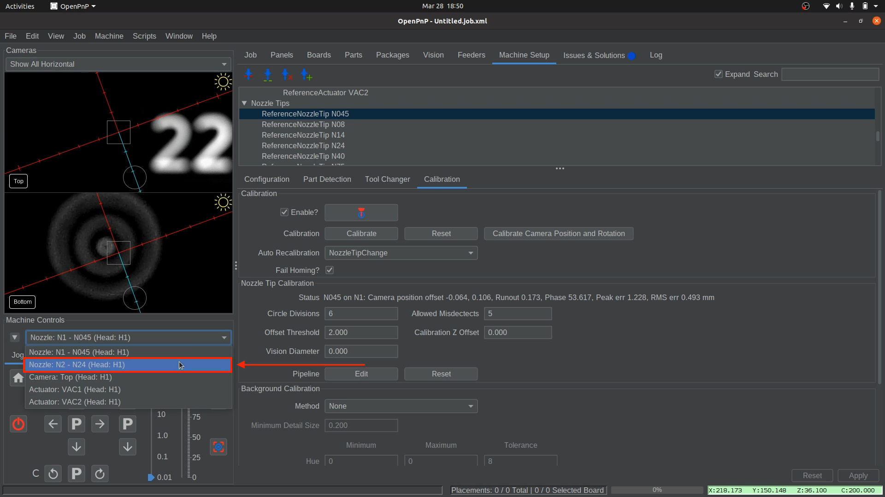
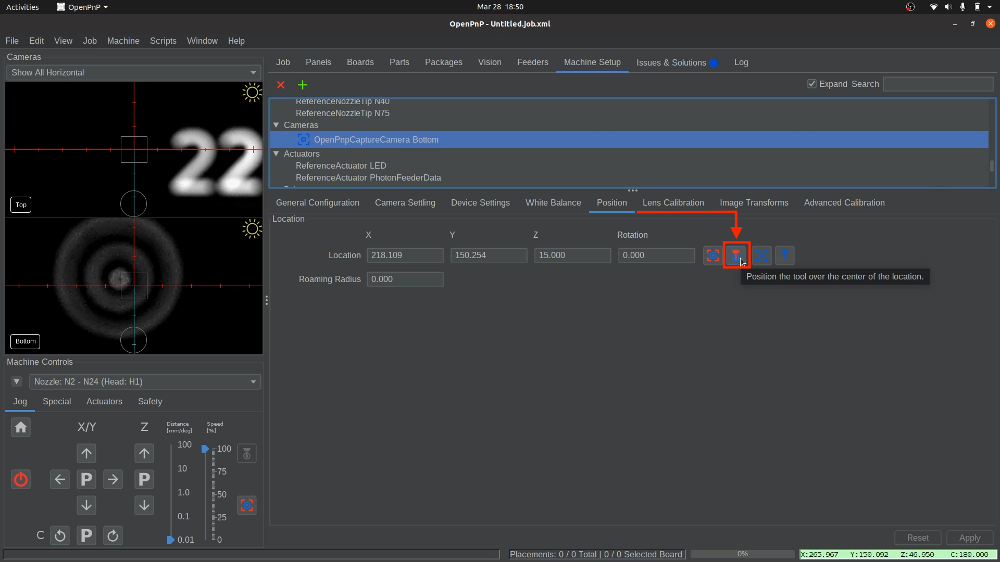

# Nozzle Tip Runout Compensation

Nozzle Tip Runout Compensation measures how the nozzle tip's position shifts when the nozzle rotates. This shift is detected using the bottom camera. The compensation algorithm adjusts for any misalignment, ensuring more accurate placement. This process eliminates errors caused by runout, which can occur from either the nozzle tip or the nozzle itself. The calibration system automatically compensates for any combination of these factors. This section will be walking you through calibrating the `N045` and `N24` Nozzle Tips.  

**To better visualize what nozzle tip runout is and how the compensation helps, here is an example**:

* **Without** Compensation:  
       
* **With** Compensation:   
     

!!! note
    Runout can originate from either the nozzle tip or the nozzle it is attached to. The calibration system automatically handles both. 
  

---

## Nozzle Tip Runout Compensation for Nozzle: N1 (left toolhead)

!!! note "🚨Important!🚨 Read this if you're continuing from the previous steps."  
    If you have just completed the previous steps, **Nozzle: N1 should already be centered over the bottom camera**.  
    **Do not move the nozzle position**.  
    Skip to Step 4 to continue.

1. **Select Nozzle: N1**.
    * If `Nozzle: N1` is already centered over the bottom camera, skip to `Step 4`.
    * From the `Machine Controls` dropdown, select `Nozzle: N1 - N045 (Head:H1)`.  
     
  

1. **Open the bottom Camera Settings**.
    * Navigate to `Machine Setup > Cameras > OpenPnPCaptureCamera Bottom`.  
     
  

1. **Position Nozzle: N1 over the Bottom Camera**.
    * Open the **"Position"** tab, then click the `Position the tool over the center of the location` button.  
     
  

1. **Calibrate the N045 Nozzle Tip**.
    * Navigate to `Machine Setup > Nozzle Tips > N045 > Calibration`, and click the `Calibrate` button.  
     
     

    !!! warning
        If calibration fails with an error message stating, "...Too many vision misdetects...", click the Pipeline `Edit` button to [adjust the nozzle tip vision pipeline](../../vision-pipeline-adjustment/4-nozzle-calibration-pipeline.md)for Nozzle Tip N045, then retest.
         
         
  

1. **Set Auto Recalibration**.
    * After successfully calibrating, Auto Recalibration should be set to `NozzleTipChange`. If it is set to `Manual`, change the Auto Recalibration setting from `Manual` to `NozzleTipChange`. This ensures that OpenPnP automatically recalibrates any loaded `N045` nozzle tips after homing or swapping tips.  
     
  

1. **Confirm Final Exposure Settings for Nozzle: N1**.
    * If further exposure adjustments were necessary, update your saved exposure value for Nozzle: `N1` . You'll need it when restarting OpenPnP.
  

1. **Apply and Save**
    * Click `Apply` in the lower right corner to save your changes. *(`Apply` may be greyed out. That's fine. Continue to save your configuration)*.  
       
    * Save your OpenPnP configuration now. `File > Save Configuration`.  
       

---

## Nozzle Tip Runout Compensation for Nozzle: N2 (right toolhead)

1. **Select Nozzle: N2**.
    * From the `Machine Controls` dropdown, select `Nozzle: N2 - N24 (Head:H2)`.  
     
  

1. **Open the bottom Camera Settings**.
    * Navigate to `Machine Setup > Cameras > OpenPnPCaptureCamera Bottom`.  
     
  

1. **Position Nozzle: N2 over the Bottom Camera**.
    * Open the **"Position"** tab, then click the `Position the tool over the center of the location` button.  
     
  

1. **Confirm the Correct Exposure**.
    * The exposure settings from the first nozzle should be close to what Nozzle Tip `N24` requires. If minor adjustments are needed, they will be refined in the **vision pipeline** for Nozzle Tip `N24` in the next steps.

2. **Calibrate the N24 Nozzle Tip**.
    * Navigate to `Machine Setup > Nozzle Tips > N24 > Calibration`, and click the `Calibrate` button.  
     
     

    !!! warning
        If calibration fails with an error message stating, "...Too many vision misdetects...", click the Pipeline `Edit` button to [adjust the nozzle tip vision pipeline](../../vision-pipeline-adjustment/4-nozzle-calibration-pipeline.md)for Nozzle Tip N24, then retest.
         
         
  

1. **Set Auto Recalibration**.
    * After successfully calibrating, Auto Recalibration should be set to `NozzleTipChange`. If it is set to `Manual`, change the Auto Recalibration setting from `Manual` to `NozzleTipChange`. This ensures that OpenPnP automatically recalibrates any loaded `N24` nozzle tips after homing or swapping tips.  
     
  

1. **Apply and Save**
    * Click `Apply` in the lower right corner to save your changes. *(`Apply` may be greyed out. That's fine. Continue to save your configuration)*.  
       
    * Save your OpenPnP configuration now. `File > Save Configuration`.  
        

---

## Final Check

!!! danger "🚨 Critical Warning: Level Nozzles 🚨"
    ⚠️ **You must ensure that your nozzles are level**.  
    **Failure to do this can cause crashes and potentially damage your machine.**  
    Use the `P` between the Z-axis up/down arrows to ensure the nozzle tips are out of the way. The `P` stands for **Parking** the nozzle out of the way into a safe height that won’t collide with any objects.  
      

1. **Retest the N045 Calibration**.
    * If you made any changes to the bottom camera exposure settings when calibrating Nozzle: `N2`, **retest the** `N045` **nozzle calibration** to ensure the settings are compatible and the calibration works with the new exposure.
  

1. **Home the LumenPnP**.
    * Level the nozzles to prevent collisions before homing.
    * Perform a homing of the LumenPnP to ensure that fiducial detection and nozzle tip calibration finish successfully for the `N1` and `N2` nozzles without errors.
    * The homing sequence will first scan the homing fiducial, then proceed to scan and calibrate both nozzle tips.  
      
  

1. **Record Final Exposure Settings for Nozzle: N2**.
    * Once you've finalized your exposure setting for the bottom camera, **record the exposure value. You'll need it when restarting OpenPnP**. We recommend saving these values to a text file and storing it somewhere convenient.
  

---

Next is configuring the [vacuum sensor](../10-vacuum-sensor/index.md).
