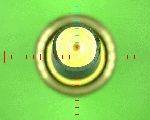
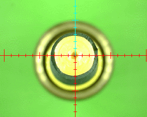

# Nozzle Tip Runout Compensation ([Video Guide](https://youtu.be/h3mtEQfGMlM?si=FHauQ0aEZQaOBkxV&t=1661))

Nozzle Tip Runout Compensation measures how the nozzle tip's position shifts when the nozzle rotates. This shift is detected using the bottom camera. The compensation algorithm adjusts for any misalignment, ensuring more accurate placement. This process eliminates errors caused by runout, which can occur from either the nozzle tip or the nozzle itself. The calibration system automatically compensates for any combination of these factors. This section will be walking you through calibrating both nozzles.

!!! note
    Runout can originate from either the nozzle tip or the nozzle it is attached to. The calibration system automatically handles both.

* **Before** Nozzle Tip Runout Compensation.   
     
* **After** Nozzle Tip Runout Compensation.   
     

(Image source found [here](https://github.com/openpnp/openpnp/wiki/Nozzle-Tip-Calibration-Setup))

---

## Nozzle Tip Runout Compensation for Nozzle N1 (left toolhead)

1. **Select the N1 Nozzle**.
    * From the `Machine Controls` dropdown, select `Nozzle: N1 - N045 (Head:H1)`.
     
  

1. **Open the bottom Camera Settings**.
    * Navigate to `Machine Setup > Cameras > OpenPnPCaptureCamera Bottom`.
     
  

1. **Position the N1 Nozzle over the Bottom Camera**.
    * Open the **"Position"** tab, then click the `Position the tool over the center of the location` button.
  

1. **Adjust Camera Exposure Settings**
    * Switch to the `Device Settings` tab, and toggle the auto-exposure to manual exposure by checking and unchecking the "**Auto**" checkbox that is beside the "**Exposure**" slider. Doing this ensures you are in manual exposure mode.
     
  

    !!! warning "Other Camera Settings"
        In the next step, **only adjust the exposure setting. Do not change any other settings**, as the default values are optimal.

1. **Set the Correct Exposure**.
    * Adjust the exposure slider to ensure the camera can clearly detect the dark hole in the nozzle tip for calibration. The exposure should be balanced—bright enough to distinguish the nozzle tip from the background but not so bright that the hole becomes difficult to detect. Aim for a setting where the brightest areas are visible but do not appear completely white, and the darker areas remain well-defined. Use the following images as a reference for adjusting exposure:
     
     
     
  

1. **Calibrate the N045 Nozzle Tip**.
    * Navigate to `Machine Setup > Nozzle Tips > N045 > Calibration`, and click the `Calibrate` button.

     

    !!! warning
        If calibration fails with an error message stating, "...Too many vision misdetects...", click the Pipeline `Edit` button to [adjust the nozzle tip vision pipeline](../../vision-pipeline-adjustment/4-nozzle-calibration-pipeline.md), then retest.
     
     
  

1. **Set Auto Recalibration**.
    * After successfully calibrating, change the Auto Recalibration setting from `Manual` to `NozzleTipChange`. This ensures that OpenPnP automatically recalibrates any loaded `N045` nozzle tips after homing or swapping tips.
     
  

1. **Record Final Exposure Settings for N1 Nozzle**.
    * Once you've finalized your exposure setting for the `N1` nozzle, **record the exposure value**. You'll need it when restarting OpenPnP.
  

1. **Save Your Changes**.
    * Click the `Apply` button to save your changes.

---

## Nozzle Tip Runout Compensation for Nozzle N2 (right toolhead)

1. **Select the N2 Nozzle**.
    * From the `Machine Controls` dropdown, select `Nozzle: N2 - N24 (Head:H2)`.
     
  

1. **Open the bottom Camera Settings**.
    * Navigate to `Machine Setup > Cameras > OpenPnPCaptureCamera Bottom`.
     
  

1. **Position the N2 Nozzle over the Bottom Camera**.
    * Open the **"Position"** tab, then click the `Position the tool over the center of the location` button.
  

1. **Adjust Camera Exposure Settings**
    * Switch to the `Device Settings` tab, and toggle the **auto-exposure** to **manual exposure** by checking and unchecking the "**Auto**" checkbox that is beside the "**Exposure**" slider. Doing this ensures you are in manual exposure mode.
     
  

    !!! warning "Other Camera Settings"
        In the next step, **only adjust the exposure setting. Do not change any other settings**, as the default values are optimal.

1. **Set the Correct Exposure**.
    * Adjust the exposure slider to ensure the camera can clearly detect the dark hole in the nozzle tip for calibration. The exposure should be balanced—bright enough to distinguish the nozzle tip from the background but not so bright that the hole becomes difficult to detect. Aim for a setting where the brightest areas are visible but do not appear completely white, and the darker areas remain well-defined. Use the following images as a reference for adjusting exposure:
     
     
     
  

1. **Calibrate the N24 Nozzle Tip**.
    * Navigate to `Machine Setup > Nozzle Tips > N24 > Calibration`, and click the `Calibrate` button.

     

    !!! warning
        If calibration fails with an error message stating, "...Too many vision misdetects...", click the Pipeline `Edit` button to [adjust the nozzle tip vision pipeline](../../vision-pipeline-adjustment/4-nozzle-calibration-pipeline.md), then retest.
     
     
  

1. **Set Auto Recalibration**.
    * After successfully calibrating, change the Auto Recalibration setting from `Manual` to `NozzleTipChange`. This ensures that OpenPnP automatically recalibrates any loaded `N24` nozzle tips after homing or swapping tips.
     
  

1. **Save Your Changes**.
    * Click the `Apply` button to save your changes.

---

## Final Check

1. **Retest the N045 Calibration**.
    * If you made any changes to the exposure settings for the `N2` nozzle, **retest the** `N045` **nozzle calibration** to ensure the settings are compatible and the calibration works with the new exposure.
  

1. **Home the LumenPnP**.
    * Perform a homing of the LumenPnP to ensure that fiducial detection and nozzle tip calibration finish successfully for the `N1` and `N2` nozzles without errors.
  

1. **Record Final Exposure Settings for N2**.
    * Once you've finalized your exposure setting for the bottom camera, **record the exposure value. You'll need it when restarting OpenPnP**. We recommend saving these values to a text file and storing it somewhere convenient.
  

---

Next is configuring the [vacuum sensor](../10-vacuum-sensor/index.md).
