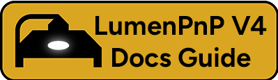

# LumenPnP V4 Calibration - Introduction

---

## What you'll learn

This guide is focused on performing basic calibration for your LumenPnP V4. Specifically, it will test the motion system, calibrate the cameras to identify objects, and apply offsets to the toolhead for precise part picking and placing. These steps are usually only necessary when first setting up a LumenPnP V4 for the first time.

Pick-and-place machines are complicated and require extensive calibration to work correctly. OpenPnP is a large piece of software that can take time to learn. Please note that learning the software and calibrating your machine can take many hours, and that time should be set aside for getting everything honed in.

We provide these docs and default configuration files to make the process as straightforward as possible, but if you notice things that we can be doing to make the process easier, please do not hesitate to let us know by making a [Github Issue](https://github.com/opulo-inc/docs/issues).

!!! danger "Important"
    You must complete these calibration steps **in order**. Each calibration step relies on the steps that come before, so it's imperative that you complete them in the order we have them listed.

---

## Save Your Settings

Save your settings after each calibration step. OpenPnP may not remember your settings if you close the application without saving them, so save them every time you adjust your calibration.

---

## Different calibration methods

OpenPnP has a feature called `Issues and Solutions` that tries to identify calibration tasks that need to be performed. Some users have reported success using this tool, but it is incongruent with the rest of these calibration steps and provided configuration files. This documentation explicitly aims to use the provided configuration files. **We highly recommend using the provided configuration files and following this documentation.** If you choose to use the `Issues and Solutions` tool instead, we recommend using the [OpenPnP Wiki](https://github.com/openpnp/openpnp/wiki) for reference.

If you'd like to start from scratch with your setup, community member Qwertymodo has posted a [very helpful video](https://www.youtube.com/watch?v=vuFalyzcCZA) showing his process of doing calibration on his machine from scratch. This video is outdated, but it can help see how OpenPnP operates.

---

## **What you'll need**

- A LumenPnP V4 with the mechanical and electrical build completed.
- A smooth, flat surface on which to operate your machine. Your LumenPnP V4 should **always** be used on a flat and hard surface.

---

## **Next Steps**

First, we'll [connect to your LumenPnP V4 and configure your bottom camera](2-connect-to-machine/index.md).
