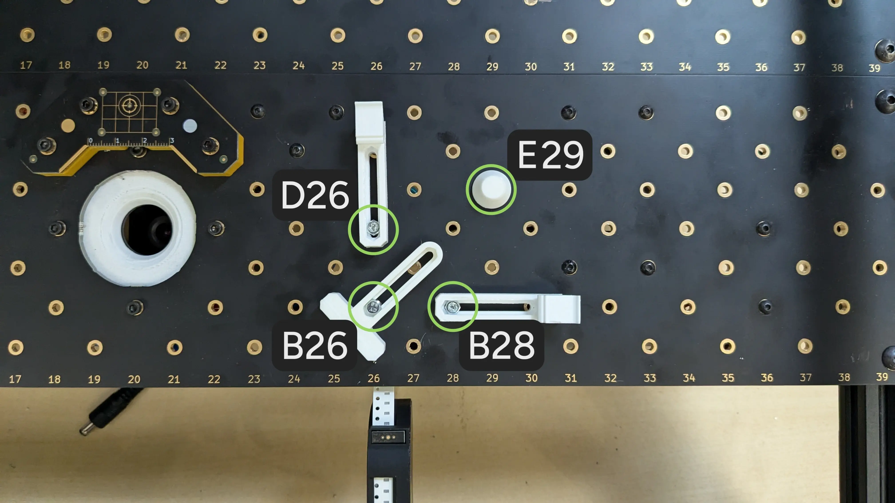
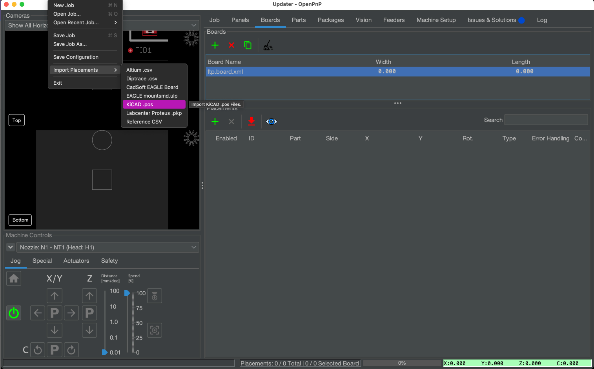
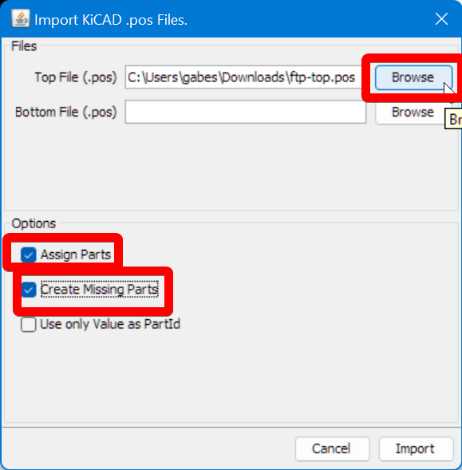
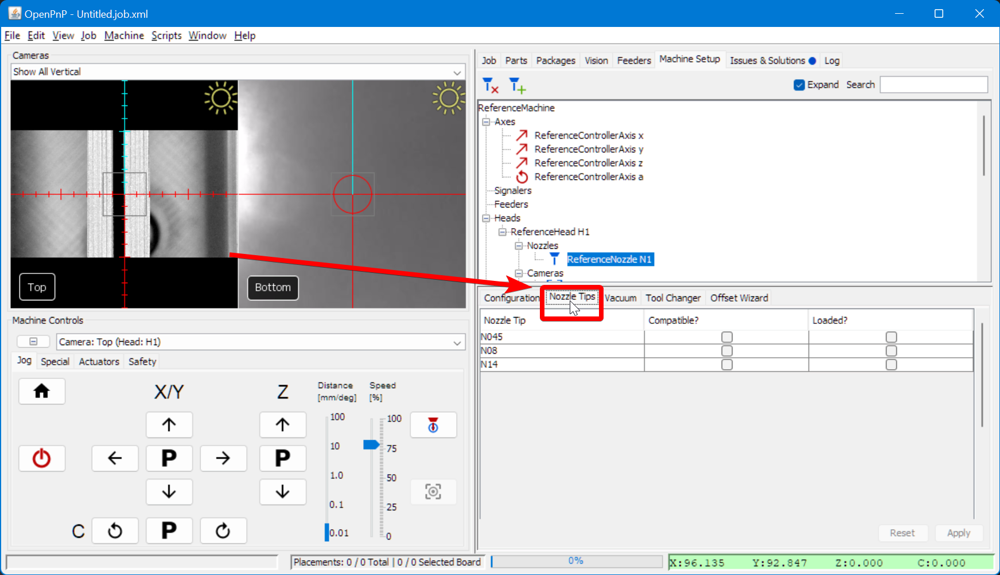
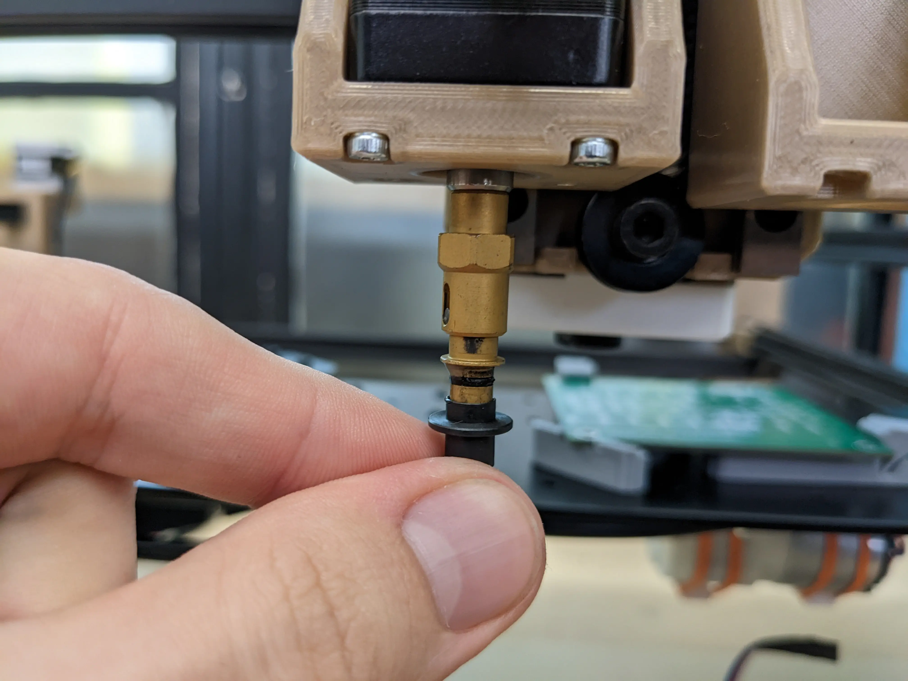
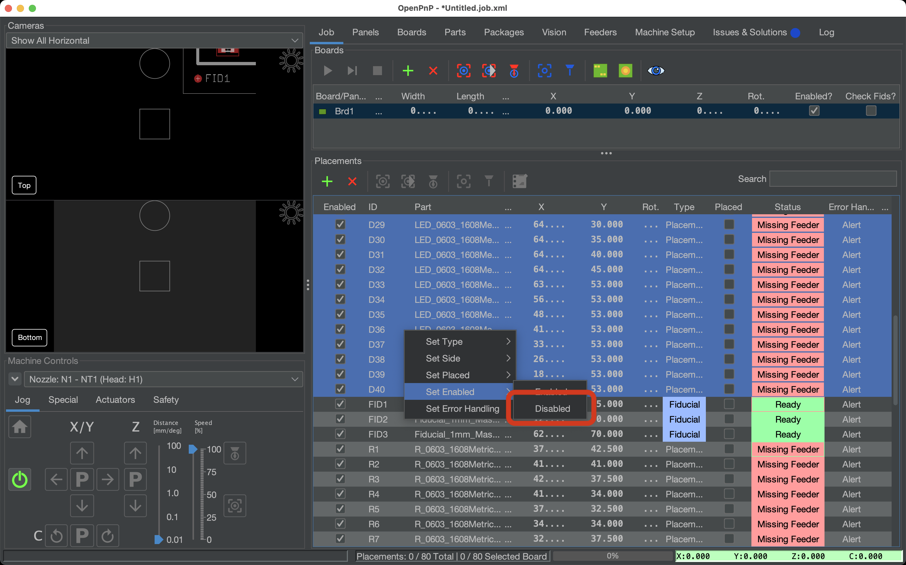

# Setting Up Your FTP PCB for Assembly ([Video Guide](https://youtu.be/W0kdrxkkXUw?si=XuRVICYYymUc9Aoq&t=42))

The first step in starting the FTP PCB is physically mounting the FTP PCB onto the LumenPnP's staging plates.

---

## Mounting the FTP PCB

1. **Loosely screw in the universal mounting components in the following locations on the staging plates**.
    * Static Board Mount positioned diagonally, screwed into B26
    * Dynamic Board Mount positioned vertically, screwed into D26
    * Dynamic Board Mount positioned horizontally, screwed into B28
    * Board Support placed in E29  
     
  

1. **Apply double-sided tape to the FTP PCB**.
    * Place four strips between the two white horizontal lines on the FTP board.
    * Avoid covering fiducial markers (used for calibration).
    * The tape holds the components onto the PCB without using solder paste, making testing easier.  
     
  

1. **Place the PCB board into the mounts**.
    * Place the FTP board in the board mounts and push them so that they're snug against the sides of the board.
    * The top edge of the board should line up with the ridge in the dynamic board mount's tab.
    * Gently press the board against the mounts while slightly bending back the dynamic mount tab. This allows the PCB to slip past the tabs hump to lock into place.
    * Once in place, the board should fit snugly with no noticeable movement or wiggle to speak of.  
     
  

1. **Tighten the mounting hardware**.
    * Once the board is positioned correctly, tighten the mounts. You shouldn't be able to easily move the board except when pressing on the dynamic board mount tab.

---

## Importing the Position File

1. **Download the FTP board position file**.
    * Get the latest `ftp-top.pos` file from the [LumenPnP GitHub Releases Page.](https://github.com/opulo-inc/lumenpnp/releases/)
  

1. **Create a New Board in OpenPnP**.
    * Navigate to the `Boards` tab.
    * Click the green "plus" icon (+) and select "Create New Board."  
       
    * When the save window pops up, save it as `ftp.board.xml` on your computer  
     
  

1. **Import the Position data**.
    * From the "Boards" tab, select the newly created board and click `File > Import Placements > KiCAD .pos`  
       
    * Select the `ftp-top.pos` file you downloaded earlier as the "**Top File (.pos)**".
    * Enable the `Assign Parts` checkbox.
    * Enable the `Create Missing Parts` checkbox.
    * Click `Import` to load component placements.\<3>   
     
  

1. **Set Part Height**.
    * We need to tell OpenPnP how tall the part is so it can take that into consideration when picking that part.
    * In the `Parts` tab, find `R_0603_1608_Metric-R_Small`.
    * Find the `Height` column and change the height value from `0.0` to `0.5`mm by double-clicking the cell.   
     
  

1. **Save your job file**.
    * Go to `File > Save Job As` and save your FTP job.
    * A pop-up window will appear asking if you want to save your changes to the ftp.board.xml. Select `Yes`.  
     
  

---

## Installing the N045 Nozzle

1. **Select the correct nozzle to control**.
    * In the bottom left of OpenPnP, select `Nozzle: N1 - N045 (Head:H1)` from the **machine controls** dropdown.  
     
  

1. **Lubricate the brass Nozzle: N1**.
    * Apply a small amount of **SuperLube** to the brass nozzle on the left side. This prevents damage to the rubber O-rings when mounting nozzle tips. We pre-lubricate them before shipping, but adding extra ensures longevity.  
       
    * Wipe off any excess grease.  
     
  

1. **Mount the `N045` Nozzle Tip**.
    * In OpenPnP, navigate to `Machine Setup > Heads > ReferenceHead H1 > Nozzles > ReferenceNozzle N1`.  
       
    * Select the `Nozzle Tips` tab, and check the `Compatible` and `Loaded?` checkboxes for the `N045` row.  
     
       
    * **Your machine will jog the head to the front of the machine** for easy tip loading.
    * Slide the **N045 nozzle tip** onto the **left nozzle** (red tubing). Rotate the nozzle tip as you mount it to the brass nozzle to evenly distribute the lubricant around the O-rings. It should slide on and off smoothly after working it in.  
     
  

1. **Assign the Nozzle Tip to Parts**.
    * In the `Packages` tab, select `R_0603_1608Metric`.  
     
       
    * In the lower-right pane, you'll be in the `Nozzle Tips` tab. Click the `Compatible` on the `N045` row.  
       

1. **Save Your Configuration**
    * Save your OpenPnP configuration now. `File > Save Configuration`.  
        

---

## Finding the FTP Board's Location

Next, OpenPnP needs to know exactly where the board is. We will find and set the physical location of the FTP board.

1. **Add the board to the job**.
    * Navigate to the `Job` tab in the top-right pane.  
       
    * Click the green "plus" icon (+)
    * Select "**Existing board**" and choose the previously created board, named ftp.board.xml.
    * Click `OK` to add ftp.board.xml to the **Job** tab.
  

1. **Identify Fiducial Markers**.
    * In the bottom-right pane, you'll see the `Placements` panel. Locate the fiducials, `FID1`, `FID2`, and `FID3`, within there. You can sort the list by `Part` to find them easily.
    * Change their Type from `Placement` to `Fiducial` so OpenPnP recognizes them as reference points adn not actual components.  
     
     
  

1. **Home the LumenPnP**.
    * Level the nozzles to prevent collisions before homing.
    * Perform a homing of the LumenPnP to ensure that fiducial detection and nozzle tip calibration finish successfully for the `N1` and `N2` nozzles without errors.
  

1. **Set the Board’s Origin**.
    * Move the top camera so that it's centered on the bottom-left corner of the PCB.  
       
    * Select the **board** in the `Job` tab and click `Capture Camera Position` to save the current camera position and set the board's origin point.
  

1. **Set the Board’s Height**.
    * Jog the N1 Nozzle so that it's just barely touching the top surface of the FTP PCB. 
    * Enter the current Z position (visible in the green bar in the bottom right of the UI) into the board's `Z position` field.
    * In Machine Controls, click the letter `P` between the Z up/down arrows to “**Park**” the nozzle at a safe height to prevent unwanted collisions.  
     
  

1. **Run a Fiducial Scan**.
    * Click on the `Fiducial Scan` button to automatically align the board. The machine will move to the fiducial locations and use the camera to identify the center of the fiducial. Then, it calculates and adjusts for any angular offset.  
       
    * If the fiducial check fails for any reason, check out our instructions for adjusting the [PCB fiducial vision pipeline](../../vision-pipeline-adjustment/3-pcb-fiducial-pipeline.md).
  

1. **Verify Alignment**.
    * To confirm that the fiducial calibration was successful, select any placement in the `Placements` table and select the `jog camera to position` button. If the center of the camera is perfectly centered on the footprint, your fiducial calibration was successful.  
     
  

---

## Disable the LED components

Disabling components on a board is a helpful feature in OpenPnP for DNP (Do Not Populate) parts, alternate parts, or other irregularities. We'll disable the LEDs in this job as an example.

1. **Steps to Disable Components**.
    * Click on the first placement in the "Job" tab with the LED part assigned to it.  
       
    * Scroll down and find the last placement with the LED part assigned to it. Hold SHIFT and select the last LED placement to highlight all of them.  
       
  

1. **Disable the LEDs**.
    * Right click the selected parts, and choose `Set Enabled > Disabled`.
    * These parts will no longer be populated in the job.  
     
  

---

## Next Step

Your board is now set up in OpenPnP! The next step is to [set up a feeder](../2-feeder-setup/index.md) so components can be loaded for assembly.
