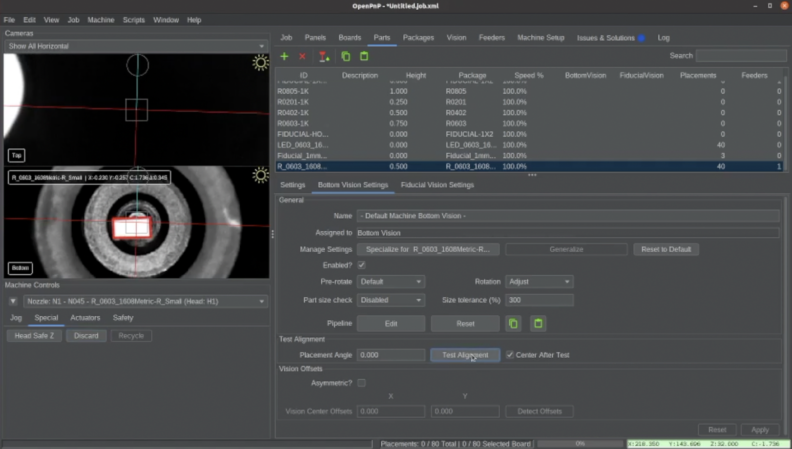
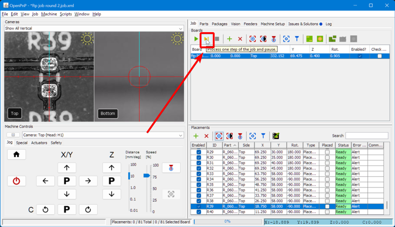

# Test Run ([Video Guide](https://youtu.be/W0kdrxkkXUw?si=lrCTfUXihKnD1p4D&t=993))

Before running the job, you'll want to test the bottom vision pipeline, which uses the bottom camera to align components for more accurate placement.

---

## Test Bottom Vision

1. **Pick a component**.
    * In the `Feeders` tab, select the feeder and click the `Feed and pick` button as seen in the photo below. This will have the machine pick a resistor.
  

1. **Test alignment**.
    * Switch to the `Parts` tab, select the part you just picked and click the "Test Alignment" button.  
     
  

1. **Verify the bottom vision output**.
    * Watch the bottom camera feed. A red rectangle should outline the component perfectly before disappearing once the part has been checked. 
    * If the rectangle is misaligned on the part, adjust your [part identification pipeline](../../vision-pipeline-adjustment/5-part-identification-pipeline.md) before proceeding.  
     
  

1. **Recycle component**.
    * Once part identification is confirmed to be working, switch to the `Special` Tab in the `Machine Controls` pane.  
       
    * Click the `Recycle` button to instruct the LumenPnP to recycle the picked component.  
     
  

---

## Step Through the Job

!!! danger "Home Your Machine"

    It is crucial that you home your LumenPnP before starting each job. The stepper motors in the LumenPnP de-power and lose position after being idle for a while. Rehoming ensures accurate placement again.

1. **Start Placing Components**.
    * Ensure the `Check Fids?` box in the `Job` tab is checked before proceeding.
    * Click the green `Play` button. This initiates fiducial calibration. **Once it is done checking the fiducials, click `Pause`**.
    * You can now use the yellow `Single job step` button, located beside the `Play` button, to proceed through the job one step at a time to ensure everything is going smoothly.
    * The LumenPnP will step through picking a component, align it using the bottom camera, and place it on the board.
    * Step through until a few parts are populated.  
       

---

## Next Steps

* With your feeder configured and the first components placed successfully, **congratulations**, your LumenPnP is now operational! If placements appear accurate, you’re ready to continue populating your board. However, if components are misaligned or not picking correctly, proceed to the [debugging guide](../../debugging/index.md) to refine your calibration. Debugging will help you diagnose what is needing fine-tuned and walk you through fixing other key parameters to ensure consistent and reliable placements.
