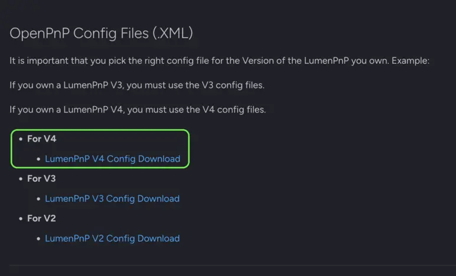

# Importing V4 Configuration Files

**To properly use OpenPnP with the LumenPnP V4**, you need to configure the software with your machine's specifications, such as size, camera setup, and other essential settings. To simplify this, we provide a set of pre-configured files. Follow the steps below to import them correctly.

---

## General Instructions

We will be doing the following steps for the OS you have chosen.

* Ensure OpenPnP is fully closed before proceeding.

* Download the latest V4 Config Files from the Software Updates Page.

* Extract the contents of the downloaded .zip file to a location you can easily access.

* Backup your current configuration files before replacing them.

* Follow the OS-specific instructions below to locate and replace the necessary configuration files.

---

## Linux Instructions

1. Before continuing, **it is imperative to ensure OpenPnP is not running** and fully closed.

2. Download the zipped OpenPnP V4 Config Files for the `LumenPnP V4` by going to the [Software Updates Page](../../../../software-updates/index.md) and returning to this page after.
    * 

3. Unzip the V4 config files to a location you will remember, while confirming it contains a `machine.xml` and a `vision-settings.xml`.

4. Locate OpenPnP’s hidden configuration folder (.openpnp2)
    * Open Ubuntu's file manager, named **(Nautilus)**
    * Navigate to /home/[username]/ (depending on your setup, you may not have a /[username]/ folder. In this case, stay in /home/)
    * Press `CTRL` + `H` to reveal hidden folders. (Alternatively, go to the `View` menu and **select Show Hidden Files**.)
    * There should now be additional folders and files that are visible within the folder you are viewing.
    * Locate and open the `.openpnp2` folder that is now visible.

5. In the `.openpnp2` folder, backup the existing files `machine.xml`, `packages.xml`, `parts.xml`, and `vision-settings.xml` by copying them to a safe location.

6. **Replace** the old `machine.xml` and `vision-settings.xml` files in the `.openpnp2` folder with the new `machine.xml` and `vision-settings.xml` files you unzipped earlier.

---

## Windows Instructions

1. Before continuing, **it is imperative to ensure OpenPnP is not running** and fully closed.

2. Download the zipped OpenPnP V4 Config Files for the `LumenPnP V4` by going to the [Software Updates Page](../../../../software-updates/index.md) and returning to this page after.
    * 

3. Unzip the V4 config files to a location you will remember, while confirming it contains a `machine.xml` and a `vision-settings.xml`.

4. Locate OpenPnP’s hidden configuration folder (.openpnp2)
    * **Enable hidden files** by following [these instructions](https://support.microsoft.com/en-us/windows/show-hidden-files-0320fe58-0117-fd59-6851-9b7f9840fdb2).
    * Navigate to:
        * Windows Vista or Newer: `C:\Users\[username]\.openpnp2`
        * Windows XP or Older: `C:\Documents and Settings\[username]\.openpnp2`
    * Locate and open the `.openpnp2` folder that is now visible.

5. In the `.openpnp2` folder, backup the existing files `machine.xml`, `packages.xml`, `parts.xml`, and `vision-settings.xml` by copying them to a safe location.

6. **Replace** the old `machine.xml` and `vision-settings.xml` files in the `.openpnp2` folder with the new `machine.xml` and `vision-settings.xml` files you unzipped earlier.

---

## MacOS Instructions

1. Before continuing, **it is imperative to ensure OpenPnP is not running** and fully closed.

2. Download the zipped OpenPnP V4 Config Files for the `LumenPnP V4` by going to the [Software Updates Page](../../../../software-updates/index.md) and returning to this page after.
    * 

1. Unzip the V4 config files to a location you will remember, while confirming it contains a `machine.xml` and a `vision-settings.xml`.

2. Locate OpenPnP’s hidden configuration folder (.openpnp2)
    * Open Finder and navigate to /Users/[username]/.
    * Reveal hidden files by following [these instructions](https://www.macworld.com/article/671158/how-to-show-hidden-files-on-a-mac.html).
    * There should now be additional folders and files that are visible within the folder you are viewing.
    * Locate and open the `.openpnp2` folder that is now visible.

3. In the `.openpnp2` folder, backup the existing files `machine.xml`, `packages.xml`, `parts.xml`, and `vision-settings.xml` by copying them to a safe location.

4. **Replace** the old `machine.xml` and `vision-settings.xml` files in the `.openpnp2` folder with the new `machine.xml` and `vision-settings.xml` files you unzipped earlier.

---

## Next Steps

**The next step is** [**LumenPnP V4 calibration**](../../calibration/index.md) ✅
  

ℹ️ *If you have an older LumenPnP V3, click [here](../../../../misc/calibration/index.md) to be taken to the V3 calibration specific for your machine.*
