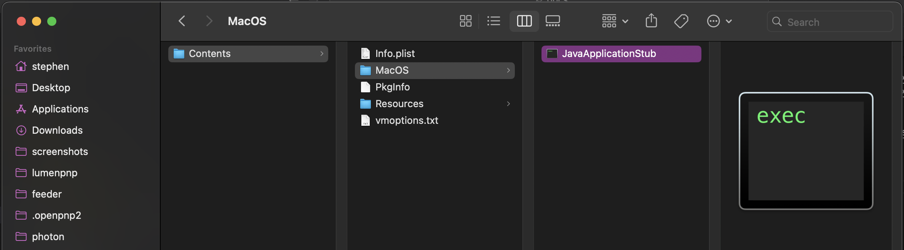

# Install OpenPnP

OpenPnP is open-source software designed to control pick and place machines. It supports a wide range of machines, with many features found in high-end commercial software. You can find out more about it [here](https://openpnp.org/).

---

## Recommended Hardware and Operating System

OpenPnP is designed to run on many different kinds of host computers. However, USB drivers and internal USB hub bandwidth can vary between computers. For reliable connectivity and exposure control with the LumenPnP cameras, we recommend using a **Lenovo Thinkpad** (any model should be fine) **running Ubuntu 20.04 LTS or Ubuntu 22.04 LTS**.
  

---

## Download and Install OpenPnP

**Only use the OpenPnP version linked in the instructions below.** OpenPnP undergoes frequent updates that **can alter, break, or eliminate functionality**. Sticking to our suggested version **(the 2023-04-05 release)** guarantees that everything operates correctly and that this documentation remains reliable. This version is also compatible with the LumenPnP feeders.

Because OpenPnP has recently started creating stable releases, we will be adapting to the newest version that we can confirm works without issue. This page will be updated to reflect that change when it happens. Until then, please use the version recommended on this page.

!!! note "Use Linux if possible"
     We highly recommend using Ubuntu Linux as the OS for running OpenPnP due to how well it handles communication with the cameras.

---

### Linux ([Ubuntu Install Guide](https://ubuntu.com/tutorials/install-ubuntu-desktop#1-overview))

1. **Download and install OpenPnP for Linux**.
    * ([Download .deb](https://openpnp.s3-us-west-2.amazonaws.com/test/2023-04-05_08-24-36.0aa4ae8/OpenPnP-linux-test.deb)) or ([Download .tar.gz](https://openpnp.s3-us-west-2.amazonaws.com/test/2023-04-05_08-24-36.0aa4ae8/OpenPnP-unix-test.tar.gz))
    * Use this version of OpenPnP. It is the version we use and based all of these docs on.

    !!! alert "Linux Users"
        **Linux requires two quick configuration steps** to allow OpenPnP to run:

        1. For OpenPnP to communicate to the machine, the **user must be added** to the `dialout` group. This can be done by entering `sudo adduser [USERNAME] dialout` (where `[USERNAME]` is the user you're logged in as) into terminal and restarting the computer.
        2. OpenPnP requires that Java is installed. This can easily be done by entering `sudo apt-get install openjdk-17-jdk` into terminal.

        Please note that if Java is not installed, OpenPnP will fail silently when you attempt to start it by clicking on the icon.

1. **Launch OpenPnP** and make sure it loads fully. Doing this will ensure that OpenPnP creates a configuration folder on your computer, which we'll need in the next step.

1. OpenPnP might prompt you to download a new version. Click `Cancel` and then `Exit` to this prompt.

1. **Completely shut down the OpenPnP software.**

---

### Windows (Not Recommended)

1. **Download and install OpenPnP for Windows**.
    * ([Download 32 Bit .exe](https://openpnp.s3-us-west-2.amazonaws.com/test/2023-04-05_08-24-36.0aa4ae8/OpenPnP-windows-x32-test.exe))
    * ([Download 64 Bit .exe](https://openpnp.s3-us-west-2.amazonaws.com/test/2023-04-05_08-24-36.0aa4ae8/OpenPnP-windows-x64-test.exe))
    * Use this version of OpenPnP. It is the version we use and based all of these docs on.

1. **Launch OpenPnP** and make sure it loads fully. Doing this will ensure that OpenPnP creates a configuration folder on your computer, which we'll need in the next step.

1. OpenPnP might prompt you to download a new version. Click `Cancel` and then `Exit` to this prompt.

1. **Completely shut down the OpenPnP software.**

---

### MacOS (Not Recommended)

1. **Download and install OpenPnP for Mac**.
    * ([Download .dmg](https://openpnp.s3-us-west-2.amazonaws.com/test/2023-04-05_08-24-36.0aa4ae8/OpenPnP-macos-test.dmg))
    * Use this version of OpenPnP. It is the version we use and based all of these docs on.

1. **Launch OpenPnP** and make sure it loads fully. Doing this will ensure that OpenPnP creates a configuration folder on your computer, which we'll need in the next step.

1. OpenPnP might prompt you to download a new version. Click `Cancel` and then `Exit` to this prompt.

1. **Completely shut down the OpenPnP software.**

    !!! danger "Mac Users - Trouble Instaling?"
        Because of [a bug with how OpenPnP signs their releases](https://github.com/openpnp/openpnp/issues/1559), Mac users with ARM processors might experience a crash on boot, or not be able to access the cameras. You can still run OpenPnP by navigating to `Applications -> OpenPnP` and right clicking on the OpenPnP app and selecting "Show Package Contents":
        
        Then navigate to `Contents -> MacOS` and double click on `JavaApplicationStub` to run OpenPnP.
        
        NOTE: We do not recommend using MacOS with the LumenPnP. Please only use if there is no other option.

---

## Next Step

## **LumenPnP V4 Users**

[![Import V4 config files][1]][2]

[1]:  ../../calibration/images/lumenpnp-v4-docs-logo-small.png
[2]:  ../../install-config/import-config/index.md "Redirect to V4 config files"

* If you are setting up a LumenPnP V4, ensure you downloaded the `V4 Config Files` by following these steps for [importing the LumenPnP V4 configuration files](../../install-config/import-config/index.md).
  
  

## **LumenPnP V3 Users**

[![Import V3 config files][3]][4]

[3]:  ../../../../misc/calibration/img/lumenpnp-v3-docs-logo-small.png
[4]:  ../../../../misc/import-config/index.md "Redirect to V3 config files"

* If you are setting up a LumenPnP V3, ensure you download the `V3 Config Files` by following these steps for [importing the LumenPnP V3 configuration files.](../../../../misc/import-config/index.md)
