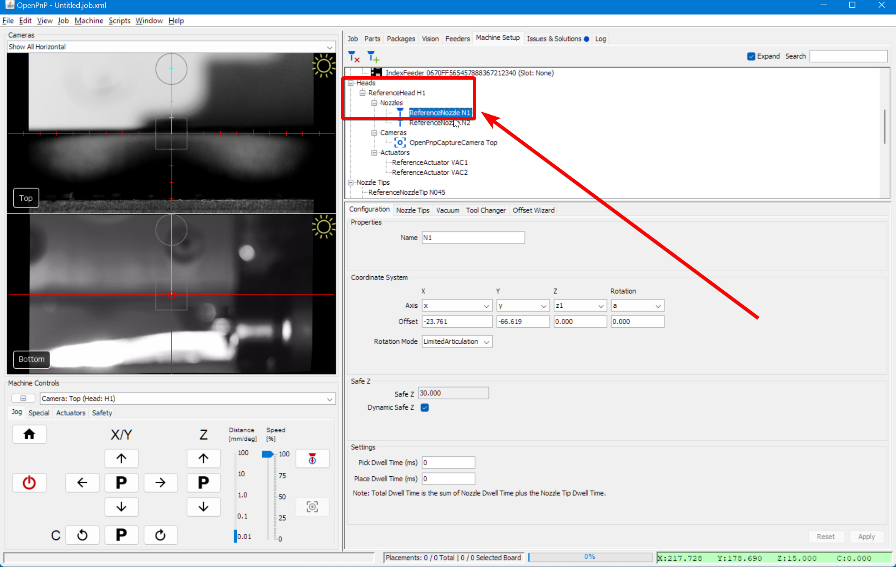
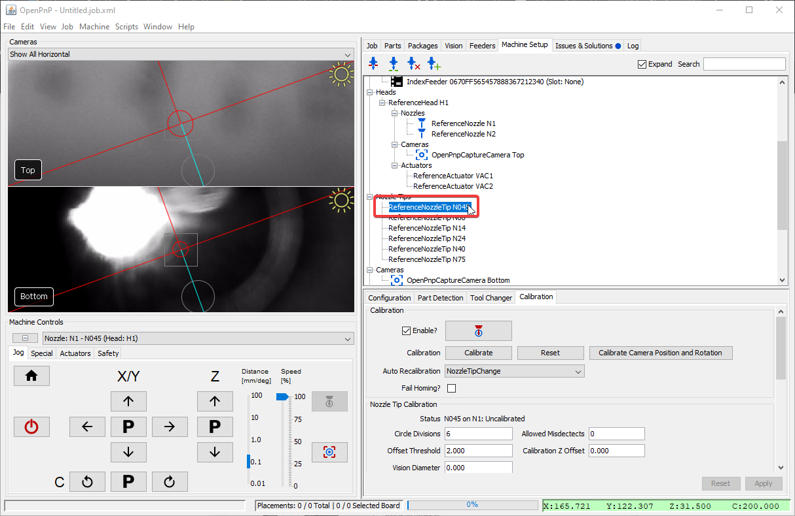
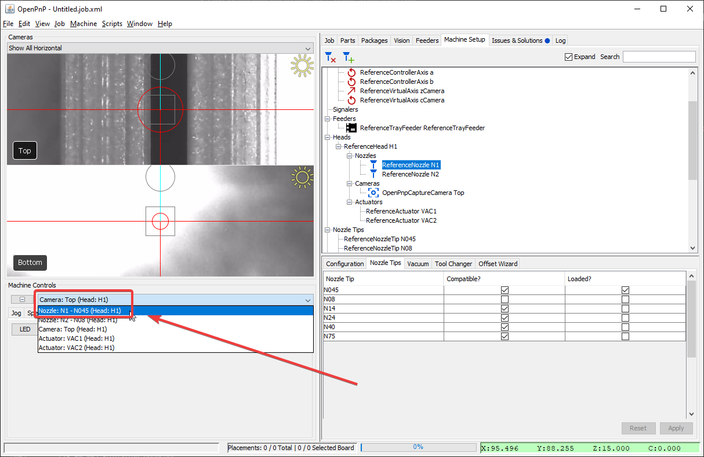
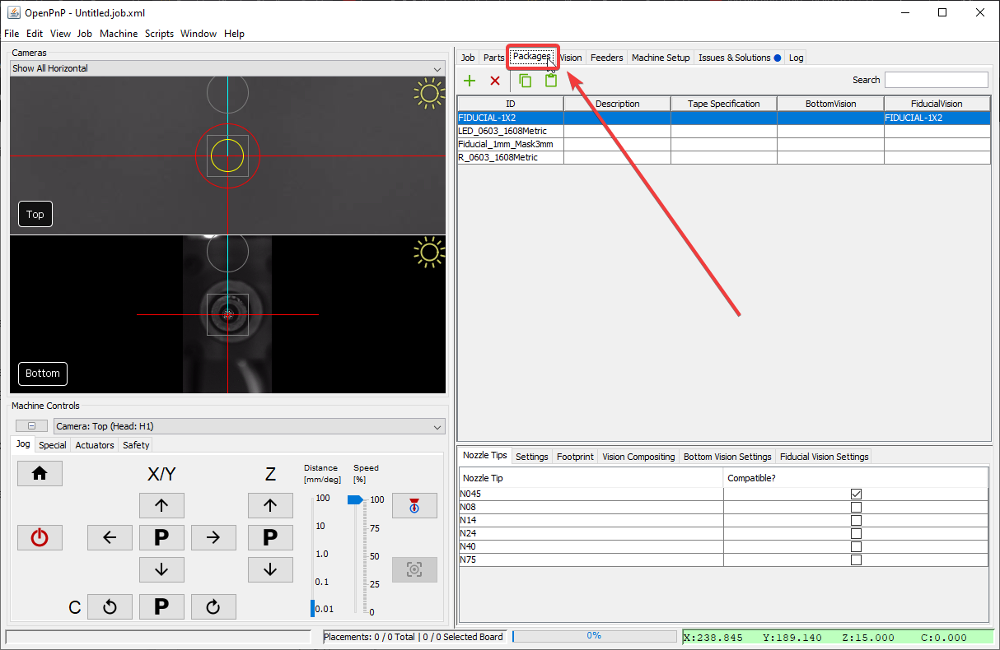
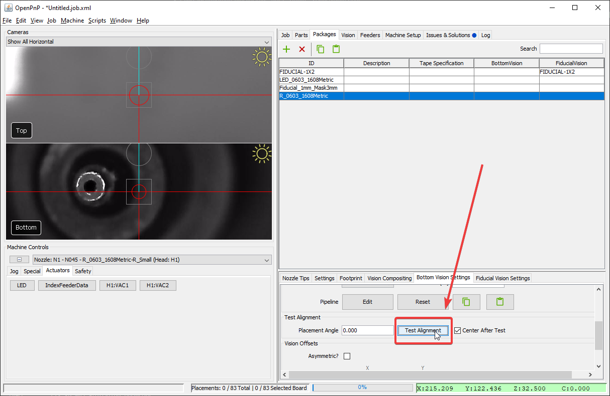

# Part Identification Pipeline ([Video Guide](https://youtu.be/RVMS6vJzJyU?si=rRQs_61cFfH24sVC&t=432))

Part identification is the most difficult pipeline to tune because it needs to accomodate every part in your job.

If you receive an error after picking a component about `No Results Found`, you need to tune your vision pipeline.


---

## Setup nozzle

1. Install a nozzle tip on your first toolhead. In this example we'll work with the N045 nozzle tip.<br/><br/>
     
<br/><br/>

2. Navigate to the `Machine Setup` tab in the top right pane.<br/><br/>
     
<br/><br/>

3. Click on the "Expand" checkbox.<br/><br/>
     
<br/><br/>

4. Navigate to `Heads > ReferenceHead H1 > Nozzles > ReferenceNozzle N1`<br/><br/>
     
<br/><br/>

5. Click on the `Nozzle Tips` tab.<br/><br/>
     
<br/><br/>

6. Click the `Loaded?` checkbox for the nozzle you're tuning.<br/><br/>
     
<br/><br/>

7. Navigate to `Nozzle Tips > ReferenceNozzleTip N045` (or whichever nozzle you're working with).<br/><br/>
     
<br/><br/>

8. Verify that the correct toolhead is selected is selected in the `Machine Controls Tab`.<br/><br/>
     
<br/><br/>

---

## Pick a Component

To fine-tune the part identification pipeline, first pick up the component you want to adjust. You can [setup a feeder](../ftp/2-feeder-setup/index.md) and use the `pick` button.


---

## Open the pipeline

1. Once a part is picked and on the nozzle, navigate to the `Packages` tab.<br/><br/>
     
<br/><br/>

2. Select the package corresponding to the component you are tuning.<br/><br/>
     
<br/><br/>

3. Ensure your nozzle tip is compatible with the selected package.<br/><br/>
     
<br/><br/>

4. Click on the `Bottom Vision Settings Tab`.<br/><br/>
     
<br/><br/>

5. Click the `Edit` button in the Pipeline.<br/><br/>
    
<br/><br/>

    !!! warning "Affects all other parts"
        Clicking the "Edit" button directly will modify the vision pipeline for **every package assigned to this pipeline**. To adjust the pipeline **only for this package**, click on the "Specialize for `PACKAGE_NAME`" button before making changes.

1. Allow OpenPnP to jog the nozzle to the bottom camera position.
<br/><br/>

---

## Edit the pipeline

!!! warning "Reset pipeline to default"

      If you want to reset your part identification pipeline to the clean default configuration, you can easily update your vision pipeline as follows.

      

      1. Click the "Copy" button in the code block below to save the vision pipeline to your clipboard.

          ```xml
          <cv-pipeline>
            <stages>
                <cv-stage class="org.openpnp.vision.pipeline.stages.ImageCapture" name="CaptureImage" enabled="true" default-light="true" settle-option="Settle" count="1"/>
                <cv-stage class="org.openpnp.vision.pipeline.stages.ImageWriteDebug" name="SaveDebugImage" enabled="false" prefix="bv_source_" suffix=".png"/>
                <cv-stage class="org.openpnp.vision.pipeline.stages.MaskCircle" name="MaskCircle" enabled="true" diameter="250" property-name=""/>
                <cv-stage class="org.openpnp.vision.pipeline.stages.ConvertColor" name="ConvertToGray" enabled="true" conversion="Bgr2Gray"/>
                <cv-stage class="org.openpnp.vision.pipeline.stages.BlurGaussian" name="InitialBlur" enabled="true" kernel-size="9" property-name="BlurGaussian"/>
                <cv-stage class="org.openpnp.vision.pipeline.stages.Threshold" name="Threshold" enabled="true" threshold="230" auto="false" invert="false"/>
                <cv-stage class="org.openpnp.vision.pipeline.stages.BlurGaussian" name="SecondBlur" enabled="true" kernel-size="3" property-name="BlurGaussian"/>
                <cv-stage class="org.openpnp.vision.pipeline.stages.MinAreaRect" name="results" enabled="true" threshold-min="149" threshold-max="256" expected-angle="0.0" search-angle="45.0" left-edge="true" right-edge="true" top-edge="true" bottom-edge="true" diagnostics="false" property-name="MinAreaRect"/>
                <cv-stage class="org.openpnp.vision.pipeline.stages.ImageRecall" name="RecallOriginal" enabled="true" image-stage-name="CaptureImage"/>
                <cv-stage class="org.openpnp.vision.pipeline.stages.DrawRotatedRects" name="DrawRectangle" enabled="true" rotated-rects-stage-name="results" thickness="2" draw-rect-center="false" rect-center-radius="20" show-orientation="false"/>
                <cv-stage class="org.openpnp.vision.pipeline.stages.ImageWriteDebug" name="SaveDebugWithCV" enabled="false" prefix="bv_result_" suffix=".png"/>
            </stages>
          </cv-pipeline>
          ```

      2.  Click the "Clipboard" icon in the vision pipeline window to insert the new pipeline into OpenPnP.

          

1. Click on the `DrawRotatedRects` stage.<br/><br/>
     
<br/><br/>

1. Review the rectangle around your component's silhouette:
    1. If the rectangle is not precise around your component, then we need to more clearly distinguish the real component from the toolhead.
    2. If there is no rectangle, we need to loosen the threshold to make the component easier to identify.
    3. If the image looks like the good one above, your pipeline is properly tuned. If you've still been getting failures when homing, you may need to slightly adjust the filtering parameters.
<br/><br/>

---

## Threshold tuning

The `Threshold` stage is the most frequently adjusted stage. It converts the camera image to black and white, ensuring a sharp contrast between the nozzle tip and the component. This step is critical, as the camera's upward-facing LEDs should illuminate the component fully, making it appear bright white in the image. We need to detect both the position and rotation of the picked component, so a tight, precise rectangle identifying its body is very important. Raise or lower the `threshold` parameter as necessary until the picked component is outlined precisely.

* If the image is too dark, lower the `threshold` value.
* If the image is too bright, raise the `threshold` value.

!!! danger "Exposure settings"
    If you’re struggling to achieve the "Good Threshold" result below, your bottom camera’s exposure might be too high. This can make it difficult for OpenPnP to distinguish the part from the nozzle tip.  [Adjust your bottom camera's exposure](../calibration/8-nozzle-tip-calibration/nozzle-tip-calibration.md), then retry tuning your threshold value.


---

## Test part identification

1. Click the `Test Alignment` button to evaluate your pipeline.<br/><br/>
  
<br/><br/>

!!! NOTE
    If you receive the `Part height unknown and camera Bottom does not support part height sensing.` error, you need to set your part's height. This lets OpenPnP position it appropriately above the bottom camera.

     1. Go to the `Parts Tab`
     2. Select your Component
     3. Double-click the Height Column to modify it.

    
    
